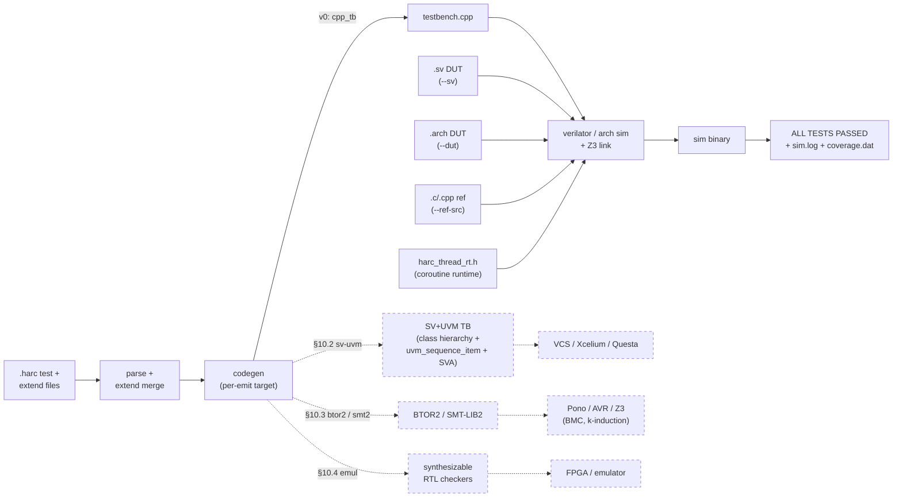

# HARC

**HARC** (*Harness of ARCh*) is a verification language compiler — sister to **ARCH**, the hardware description language at [`arch-hdl-lang/arch-com`](https://github.com/arch-hdl-lang/arch-com). From a single high-level test description, HARC compiles a C++ testbench that drives the DUT through one of two paths today:

- **Verilator-compiled SystemVerilog** (`harc sim --sv`) — the canonical path for hand-written or arch-built SV
- **ARCH co-simulation** (`harc sim --dut`) — pipes through `arch sim` against ARCH's built-in cpp simulation model; fastest iteration for ARCH-authored DUTs

The language has first-class support for transactions, constraint-randomized stimulus, transactors (synthesizable BFMs), scoreboards, covergroups, concurrent assertions, `extern function` references to C/C++ reference models, and a heartbeat-based replacement for UVM's objection mechanism (per-agent `watchdog` + `wait until` with per-predicate timeout diagnostics).

The same source is designed to retarget without rewrites: spec §10 documents the SV+UVM transpile path (`harc -emit sv-uvm` — class hierarchy + `uvm_sequence_item` + SVA), the formal export path (`harc -emit btor2` / `-emit smt2`), and synthesizable-checker emulation. None of those backends ship in v0 — they're roadmap. The full language reference is in [`spec.md`](spec.md).

## Why a new HVL?

The three established choices for testbench authoring each have a specific cost:

- **UVM (SystemVerilog + UVM library)** — verbose factory boilerplate (`uvm_component_utils`, `build_phase`, `connect_phase`, `new()` super-call chains) around every component, and a 9-phase elaboration model + 12-step run-phase pre/post fan-out each component has to slot into. The dominant runtime pain point is **`uvm_config_db`**: cross-component configuration travels through *string-keyed wildcard paths* (`"*.driver"`, `"top.env.*"`), type-erased — a typo in the path or a mismatched type parameter at `get()` silently falls back to the default value, with no compile-time check and no runtime error. `set()` must precede the consumer's `get()` in phase order; one phase too late and the value silently has no effect. No static tool can audit "this `set` has no `get`" or vice versa, because the keys resolve at runtime against the component hierarchy. Combined with the distributed objection-counting termination story (`Drain time expired with N objections still raised` when a test hangs — no information about *which* component or *what* condition), runtime debugging is dominated by "wrong value, no error, find out 30 minutes into the sim." The SV constraint solver is implementation-defined per simulator, so behavior drifts between vendors. The vendor simulators that run UVM well (VCS / Xcelium / Questa) are paid.
- **Cocotb (Python + RTL cosim)** — every signal access crosses the Python ↔ VPI/VHPI boundary; per-cycle throughput is orders of magnitude below Verilator at the kernel level. No built-in constraint solver, no typed bus / transaction abstractions, no SVA-style concurrent properties — these are all roll-your-own on top of the Python event loop. Production verification at large scale is rare.
- **Raw C++ + Verilator** — Verilator-class speed but no verification library: no constraint solver, no covergroups, no transactions, no concurrent assertions, no scoreboard primitives. Each TB is bespoke C++; reusability and refactor cost scale poorly with project size.

HARC's bet is that you can get UVM's language affordances (transactions, constraints, scoreboards, properties, covergroups) at Verilator's speed, on an open-source toolchain (Verilator + Z3), with a positive termination story (heartbeat-tracked `watchdog` + `wait until` per-predicate diagnostics) instead of objection accounting.

## Status

Pre-1.0. Stimulus → observation → scoreboard → properties/coverage → reference-model comparison → watchdog termination are all usable end-to-end. 56 fixtures pass against real Verilator-compiled SystemVerilog DUTs in CI. The ARCH cosim path (`--dut`) shares the same C++ TB emission and runs alongside `arch sim` for ARCH-authored DUTs.

## Install

HARC needs:

- **Rust** (stable; uses Cargo)
- **Verilator** ≥ 5.0 — `brew install verilator` on macOS, `apt install verilator` on Debian/Ubuntu
- **Z3** ≥ 4.15 — `brew install z3` on macOS, `apt install libz3-dev` on Debian/Ubuntu

Build:

```sh
git clone git@github.com:arch-hdl-lang/harc-com.git
cd harc-com
cargo build --release
```

The binary lands at `target/release/harc`. Add it to your `PATH` or invoke via `cargo run --bin harc -- ...`.

## A first test

Given a SystemVerilog DUT — `tests/dut/sync_fifo.sv`, a 16-deep single-clock FIFO — write a HARC test:

```harc
covergroup FifoCov @(posedge dut.clk)
    cp_empty : cover dut.empty
        bins
            yes = {1}
            no  = {0}
        end bins
    cp_full : cover dut.full
        bins
            yes = {1}
            no  = {0}
        end bins
    cross cp_empty, cp_full
end covergroup FifoCov

// Covergroups may also sample on hookable transaction events, e.g.
// `covergroup TxnCov @(mon.observed(t) post)`, so transaction coverage
// does not have to be oversampled every clock.
//
// `cross cp_empty, cp_full` records bin combinations from the same sample
// event. It is not a post-sim mix of unrelated hits from different cycles.

test SyncFifoTest
    let dut : TxQueue
    let cov : FifoCov
end test SyncFifoTest

impl sim for SyncFifoTest
    run
        // Reset.
        dut.rst = 1
        dut.push_valid = 0
        dut.pop_ready = 0
        wait 2 cycles
        assert dut.empty == 1 else fail("after reset, empty should be 1")
        dut.rst = 0

        // Push 16 items (fill to capacity).
        for i in 0 .. 16
            dut.push_valid = 1
            dut.push_data = i + 1
            wait 1 cycle
        end for
        dut.push_valid = 0
        wait 1 cycle
        assert dut.full == 1 else fail("FIFO should be full after 16 pushes")

        // Pop all 16 items and verify FIFO order.
        for i in 0 .. 16
            dut.pop_ready = 1
            let expected = i + 1
            assert dut.pop_data == expected
                else fail("pop ${i}: got ${dut.pop_data}, expected ${expected}")
            wait 1 cycle
        end for
        log(info, "PASS: 16 items round-tripped in FIFO order")
    end run

    check
        cov.report()
        assert cov.cp_empty.yes > 0 else fail("empty=1 coverage hole")
        assert cov.cp_full.yes  > 0 else fail("full=1 coverage hole")
    end check
end impl SyncFifoTest
```

Two top-level constructs:

- **`test SyncFifoTest`** declares the test's lets (DUT pointer, covergroup instance, env, etc.) — what to *instantiate*.
- **`impl sim for SyncFifoTest`** declares the per-target phases (`run`, `check`, `setup`, `teardown`, user `phase <name>`) — what to *do*. Multiple impls per test can target different backends (`impl sim`, `impl emu`, `impl formal` — only `sim` lowered today). The split lets the same instantiation feed different backends without rewriting the body.

Run it:

```sh
harc sim --sv tests/dut/sync_fifo.sv tests/fixtures/sync_fifo_test.harc --top TxQueue
```

HARC compiles the test to C++, links Verilator's compiled DUT, runs the binary, and prints cycle-stamped log lines plus a coverage report.

## Compile flow

Solid = ships in v0. Dashed = spec §10 roadmap (same compiler IR, alternate emit target).



One `harc sim` invocation drives the v0 path (solid): it parses the `.harc` source (folding any sibling `extend test T` files), emits a single C++ testbench via the `cpp_tb` codegen, then chains through either Verilator (`--sv`) or `arch sim` (`--dut`) to compile the DUT alongside the TB, the runtime header, and any `--ref-src` reference models. The resulting binary self-tests at run time, exits zero on `ALL TESTS PASSED`, and writes per-test logs + an optional coverage database. CI runs [`tests/run_fixtures.sh`](tests/run_fixtures.sh) which does this for all 56 fixtures.

The dashed paths share the same parser + AST + IR; they branch at codegen by emitting a different target representation. Spec §10 documents the contracts (what survives the transpile cleanly, what's lossy) and the lowering tables. None of the three ship in v0 — the diagram exists so the reader can see where the language is going, not what it does today.

## CLI

| Command | What it does |
|---|---|
| `harc check <files…>` | Parse + lint; reports problems. No output on success. |
| `harc fmt <file>` | Pretty-print to stdout (round-trip target — output re-parses to a structurally equivalent AST). |
| `harc sim --dut <arch-source> [--top T] [--test N] <test-files…>` | Build the DUT through `arch sim` (uses ARCH's cpp simulation model), then run. |
| `harc sim --sv <verilog-files…> [--top T] [--test N] <test-files…>` | Run Verilator on the SV directly, then run. |
| `harc advise <query>` | Retrieve past error→fix pairs from the local learning store. |

Common `harc sim` flags:

- `--seed N` — PRNG seed for `randomize` calls (env: `HARC_SEED`)
- `--outdir <dir>` — build artifact directory (default `harc_sim_build/`)
- `--emit-only` — emit C++ but don't compile/run
- `--ref-src <file>` (repeatable) — C/C++ source file(s) providing implementations for `extern function` reference models (spec §9.1)
- `--coverage` — enable DUT coverage collection. Works on both DUT paths: `--sv` passes `--coverage` to Verilator; `--dut` passes `--coverage` + `--coverage-dat=<outdir>/coverage.dat` to `arch sim`. The Verilator-compatible `coverage.dat` lands in `<outdir>/` on both paths so downstream tools (`verilator_coverage`, the CVDP scorer) see a uniform shape
- `--record-trace <file.jsonl>` — write a semantic JSONL trace for the run. The trace includes metadata, `sim_start` / `sim_end`, `log` events, assertion-failure events derived from `fail` logs, and concrete `randomize` results. This is intended for debugging and post-run analysis without scraping stdout
- `--mt` — opt into the per-actor multi-OS-thread runtime (default is cooperative single-thread, typically faster on real fixtures)

Z3 is required for constraint-randomized tests (`randomize(t) with ...` and transaction `keep` constraints). System installs are auto-detected, and custom installs can be selected with a root prefix or explicit include/lib directories:

```sh
HARC_Z3_ROOT=/path/to/z3 harc sim --sv dut.sv test.harc --top Top
harc sim --z3-root /path/to/z3 --sv dut.sv test.harc --top Top
harc sim --z3-include-dir /path/to/z3/include --z3-lib-dir /path/to/z3/lib --sv dut.sv test.harc --top Top
```

The resolver checks CLI flags first, then `HARC_Z3_INCLUDE_DIR` / `HARC_Z3_LIB_DIR`, then `--z3-root`, `HARC_Z3_ROOT`, `third_party/z3`, and finally common system paths.

## Examples

[`tests/fixtures/`](tests/fixtures/) holds 56 runnable HARC TBs targeting DUTs vendored under [`tests/dut/`](tests/dut/). Each fixture compiles, runs through Verilator, and asserts `ALL TESTS PASSED`. A non-exhaustive tour:

| Fixture | DUT | Demonstrates |
|---|---|---|
| `rom_lut_test.harc` | `rom_lut.sv` | covergroup + helper functions |
| `sync_fifo_test.harc` | `sync_fifo.sv` | single-clock FIFO, full/empty asserts |
| `async_fifo_test*.harc` | `async_fifo.sv` | dual-clock FIFO, multi-file scope split |
| `axilite_seqdrv_test.harc` | `AxiLiteRegs.sv` | unbound transactor with `on event(t)` handler |
| `axilite_env_test.harc` | `AxiLiteRegs.sv` | `env` composing a transactor + scoreboard |
| `axilite_bus_send_test.harc` | `AxiLiteRegs.sv` | typed bus binding + `bus.<ch>.send/recv` |
| `axilite_bound_mon_test.harc` | `AxiLiteRegs.sv` | bound monitor (`on bus.<ch>.handshake(t)`) |
| `axilite_constraint_test.harc` | `AxiLiteRegs.sv` | `randomize(t) with …` through Z3 |
| `keep_constraints_test.harc` | `top_counter.sv` | transaction `keep` constraints (range, modulus, enum exclusion) |
| `relation_inlining_test.harc` | `top_counter.sv` | `relation` inlining — block + alias + composite forms |
| `heartbeat_idle_test.harc` | `top_counter.sv` | per-agent `_last_in_cycle` heartbeats + `idle(N)` predicate |
| `wait_until_quiesce_test.harc` | `top_counter.sv` | `wait until all of …, … timeout N cycles fail("…")` |
| `watchdog_quiesce_test.harc` | `top_counter.sv` | built-in `watchdog` block (period / max_idle / debug body) |
| `extern_fn_ref_test.harc` | `top_counter.sv` | `extern function` calling a C/C++ reference model (CRC-8) |
| `aes_cipher_top_test.harc` | `aes_cipher_top.sv` | wide-bus (128b) signal access + multi-file SV DUT |

See [`spec.md`](spec.md) for the full language reference and [`tests/run_fixtures.sh`](tests/run_fixtures.sh) for the complete fixture manifest.

## Layout

```
src/
  ast.rs                  AST types
  lexer.rs                Logos-based tokenizer
  parser.rs               Recursive-descent LL(1) parser
  pretty.rs               Pretty-printer (round-trip target)
  diagnostics.rs          miette-based error reporting
  learn/                  Local learning store (`harc advise`)
  codegen/
    cpp_tb.rs             C++ TB emitter (single file; drives both --sv and --dut paths)
    merge.rs              Multi-file `extend test T` merging
  main.rs                 CLI

runtime/
  harc_thread_rt.h        Coroutine scheduler header; baked into each emit

tests/
  fixtures/               Runnable HARC tests
  dut/                    Vendored .sv DUTs + .cpp reference models
  snapshots/              insta snapshots for round-trip / codegen tests
  round_trip.rs           Parse → pretty-print → reparse equivalence tests
  codegen.rs              Codegen pin-tests (asserts emitted C++ shape)
  run_fixtures.sh         End-to-end fixture runner (used in CI)

spec.md                   Language reference
```

## Running the test suite locally

```sh
cargo test --release          # 80 cargo tests (lib + codegen + round-trip)
./tests/run_fixtures.sh       # 56 fixtures end-to-end via Verilator
```

The fixture runner builds harc, then for each entry in its manifest: runs Verilator on the vendored `.sv` DUT (linking any `--ref-src` C/C++ files), builds against the HARC-generated C++ testbench, and asserts the binary prints `ALL TESTS PASSED`. CI runs the same script on every push and PR.

## Relationship to ARCH

HARC and ARCH share a lexer/parser style and several constructs (`domain`, `wait N cycles`, `=` blocking assignment, soft-keyword conventions). A test references the DUT through either:

1. **`harc sim --dut <arch-source>`** — pipes through `arch sim` against ARCH's built-in cpp simulation model. Fastest iteration for ARCH-authored DUTs.
2. **`harc sim --sv <verilog>`** — invokes Verilator on hand-written or arch-built SystemVerilog. The canonical path; matches what synthesis would produce.

Bug coverage rule of thumb: if the same test passes under `--dut` but fails under `--sv`, the divergence is an ARCH backend bug — file it against `arch-com`.

## License

LGPL-3.0-or-later — full text in [`LICENSE`](LICENSE). Matches the sister ARCH compiler so HARC and ARCH source can be combined into a single tool without license-compatibility ceremony.

Contributions are accepted under the [`Contributor License Agreement`](CLA.md). GitHub's CLA Assistant prompts for sign-off on the first PR; subsequent PRs from the same contributor pass automatically.
