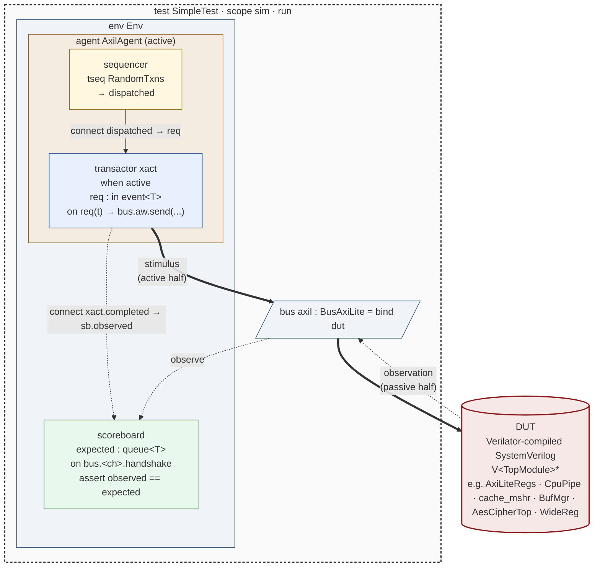
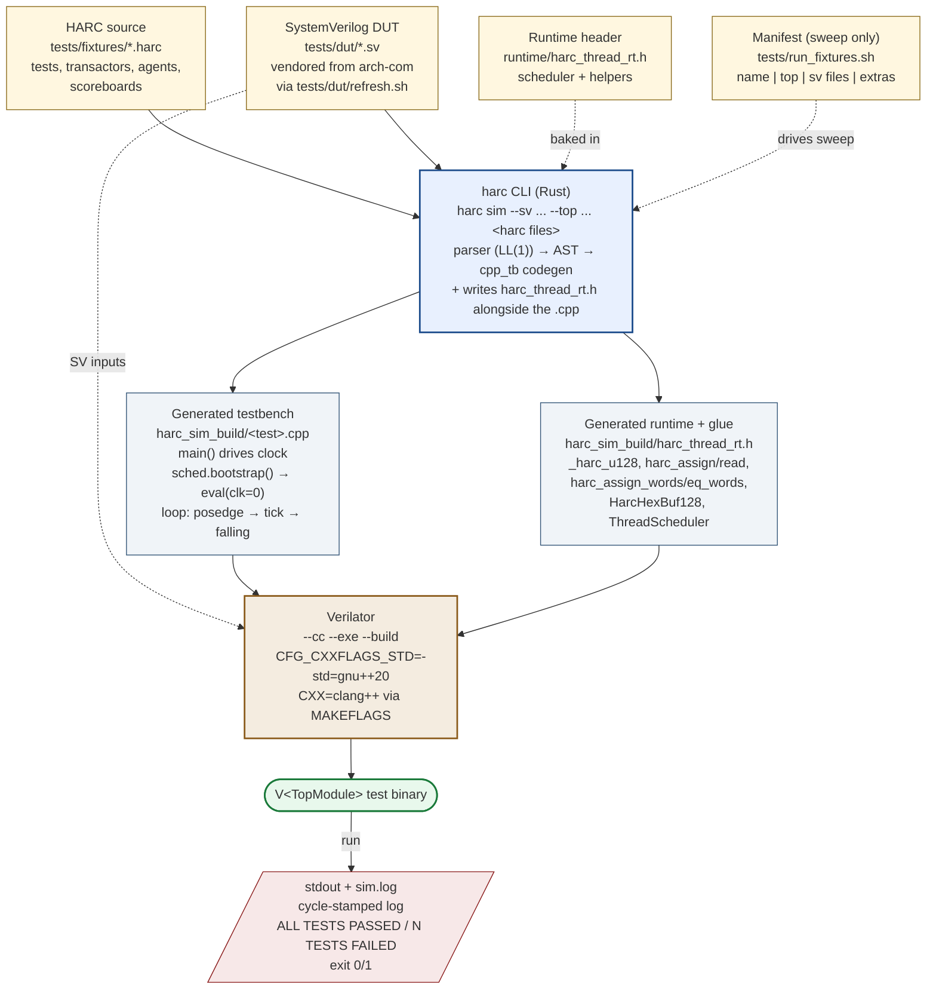

# Resume State — HARC + ARCH

*Last refreshed: 2026-05-10. v0 in a strong shape; 50/50 fixtures, all major
codegen items shipped, CI green on Linux + macOS.*

## Repos

| Repo | Remote | Local |
|---|---|---|
| **HARC** (verification language compiler) | `git@github.com:arch-hdl-lang/harc-com.git` (private) | `~/github/harc-com` |
| **ARCH** (sister HDL) | `git@github.com:arch-hdl-lang/arch-com.git` (private) | `~/github/arch-com` |

## Where v0 stands

| Surface | State |
|---|---|
| Transactor + mode subtyping (recursive: env → agent → transactor) | ✓ shipped |
| Driver/monitor migration + removal | ✓ shipped |
| Wide bit-vector value type (`_harc_u128` for 65..128b) | ✓ shipped |
| Whole-signal access for `VlWide<N>` ports (any width) | ✓ shipped |
| Hex literals at any width (≤64b plain / 65..128b composite / >128b word-list) | ✓ shipped |
| Wide-hex printf interpolation (`${x:032x}`) | ✓ shipped |
| `const` codegen → file-scope `static constexpr` | ✓ shipped |
| Log severity test-result semantics (§7.7) | ✓ shipped |
| Run-coroutine bootstrap semantic (each `wait` ⇔ 1 posedge) | ✓ shipped |
| Fixtures | 50/50 PASS |
| CI on Linux (Verilator 5.034 from source) + macOS | ✓ green |

## Testbench architecture

The **transactor** is the bus boundary unit — a synthesizable BFM that absorbs
both stimulus and observation under one declaration, with mode subtyping
(`active | passive`) selected at instantiation. Above it optionally sit the
**agent** (sugar for sequencer + transactor + their connect bridge) and the
**env** (the static composition root for multi-bus tests).



**Mode reuse.** The same transactor declaration covers active and passive
contexts via mode inheritance from the let-instantiation:

```harc
let act : E active     // act.ag.xact gets active body
let pas : E passive    // pas.ag.xact gets passive body — same decl
```

Mode flows all the way down: env → agent → transactor field. Field-level
explicit modes (`drv : T active`) win over inherited ones at any depth.

## Compiler use model

HARC is invoked as `harc sim --sv <dut.sv> <test.harc> --top <TopModule>`. It
parses HARC source, lowers to a single `.cpp` testbench (plus the runtime
header), and chains through Verilator to produce a self-contained binary.
Run the binary to see `ALL TESTS PASSED` or `N TESTS FAILED`.



## Recent merged work

This session added ~25 PRs. Highlights, newest first:

| PR | What |
|---|---|
| #47 | spec sync — wide-vector + bootstrap landings |
| #46 | printf interpolation prints full ≤128-bit hex values |
| #45 | wide bit-vector support beyond 128b — word-list helpers |
| #44 | wide bit-vector support — `_harc_u128` + 128-bit literals (also dropped AES wrapper SV) |
| #43 | CI: install Verilator 5.034 from source (Ubuntu apt has 5.020 which rejects `<=` array assignment in for loops) |
| #41 | run-coroutine bootstrap semantic — initial comb settle + reordered loop |
| #40 | fixture port: buf_mgr (256-queue shared buffer manager, 128-bit data) |
| #37, #38, #36, #35, #32, #27, #26, #20 | fixture ports: aes, buf_mgr_sm, cam_dual/value, mac_table, noc_credit, if_wait/inst_vec_port, mshr cocotb, linklist_doubly, cpu_pipeline, dma_engine |
| #33 | `const` codegen → `static constexpr` |
| #31, #30, #29 | recursive mode propagation env→agent→transactor; agent mode inheritance; passive-only regression |
| #28 | log severity test-result semantics for ERROR/FATAL |
| #25, #24, #23, #22 | driver/monitor migration → transactor; T-1, T-2 transactor codegen |

## Out-of-v0 items (deferred)

- `tlm_method`, `credit_channel` codegen — parsers accept; codegen no-ops.
- Env-composed bound sub-components — only top-level `let xact : T mode = bind axil` supported today; nested bound forms follow.
- Multi-input-event transactors — active transactors with multiple `in event<T>` fields fall back to the synchronous subscriber-callback path.
- Decimal printf for >64-bit values — `__int128` lacks native printf support; needs custom formatter.
- Per-word printing of >128-bit signals — would need a word-array variant of `HarcHexBuf128`.
- OS-thread parallelism beyond `--mt` — Phase 3b cycle batching deferred.
- ARCH-side `generate_if ACTIVE` lowering — T-3 in the transactor roadmap, post-v0 (waits for emulator work).
- SCE-MI vendor transport — T-4, out-of-v0.

## Key commands

```bash
# Build the harc binary
cargo build --release --bin harc

# Run a single fixture
./target/release/harc sim \
  --sv tests/dut/<dut>.sv \
  tests/fixtures/<test>.harc \
  --top <TopModule>

# Multi-clock — pull in the *_domains.harc next to the test
./target/release/harc sim \
  --sv tests/dut/<dut>.sv \
  tests/fixtures/<test>.harc \
  tests/fixtures/<test>_domains.harc \
  --top <TopModule>

# Full sweep
./tests/run_fixtures.sh

# Cargo test suite (round-trip + codegen + lib)
cargo test --release

# Refresh vendored DUTs from a sibling arch-com clone
ARCH_REPO=../arch-com ./tests/dut/refresh.sh

# Inspect what HARC emits for a given fixture
./target/release/harc sim --sv ... <test>.harc --top ...
ls harc_sim_build/<test>.cpp                    # the generated TB
```

## Paths

| What | Where |
|---|---|
| HARC source tree | `~/github/harc-com/src/` |
| HARC fixtures | `~/github/harc-com/tests/fixtures/` |
| Vendored SV DUTs | `~/github/harc-com/tests/dut/` |
| Runtime header (baked into every emit) | `~/github/harc-com/runtime/harc_thread_rt.h` |
| HARC spec | `~/github/harc-com/spec.md` |
| cpp_tb codegen | `~/github/harc-com/src/codegen/cpp_tb.rs` |
| Codegen tests (cargo) | `~/github/harc-com/tests/codegen.rs` |
| Round-trip / parser tests | `~/github/harc-com/tests/round_trip.rs` |
| ARCH examples + SVs | `~/github/arch-com/examples/` |
| ARCH cpp model emitter (reference for wide-vector model) | `~/github/arch-com/src/sim_codegen/mod.rs` |

## Tools

- **Verilator** 5.034 (macOS Homebrew; Linux CI builds from source — apt's 5.020 rejects `<=` in array-init for loops).
- **Z3** 4.15+ (Homebrew, `/opt/homebrew/include` + `/opt/homebrew/lib`).
- **clang++** on both platforms — emitted `.cpp` uses `#pragma clang optimize off` to work around a C++20 lambda-coroutine miscompile at `-Os`; GCC's equivalent pragma doesn't propagate through coroutine codegen.
- **Rust** stable via Cargo (`rust-toolchain.toml` in HARC root).

## Conventions / preferences

- Commit message style mirrors arch-com: `fix(sim):` / `feat(codegen):` / `test(fixtures):` / `docs(spec):` / `cleanup(...):`.
- Per `~/CLAUDE.md`: ask before fixing arch-com compiler bugs; don't autonomously work around them. Same applies to HARC compiler bugs that surface in fixture ports — pause and ask.
- One PR per logical change. Feature branches off `main`; rebase rather than merge if the base moves.
- Fixtures use the passive-transactor + hookable-method pattern by default. See `cpu_pipeline_test.harc`, `linklist_doubly_test.harc`, `mshr_cocotb_test.harc` for canonical examples.
- When introducing language/codegen features, add a cargo test in `tests/codegen.rs` pinning the lowering shape AND a runtime fixture exercising it end-to-end against Verilator.
