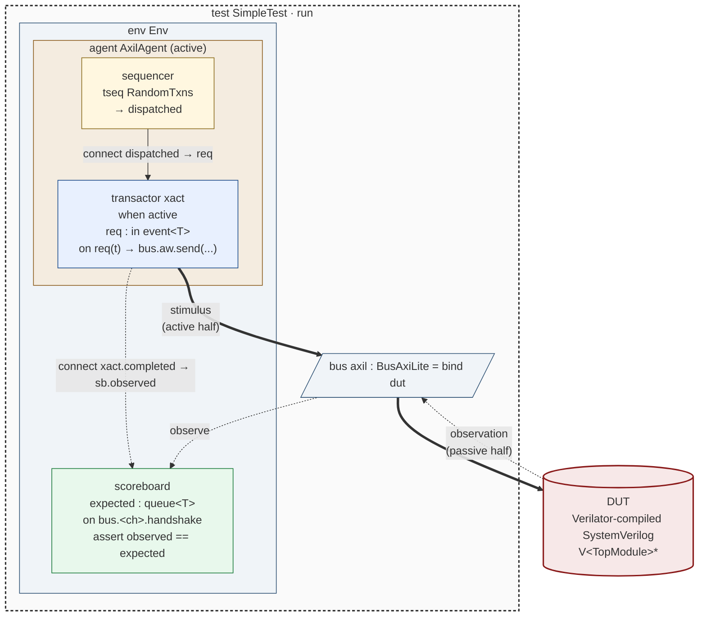
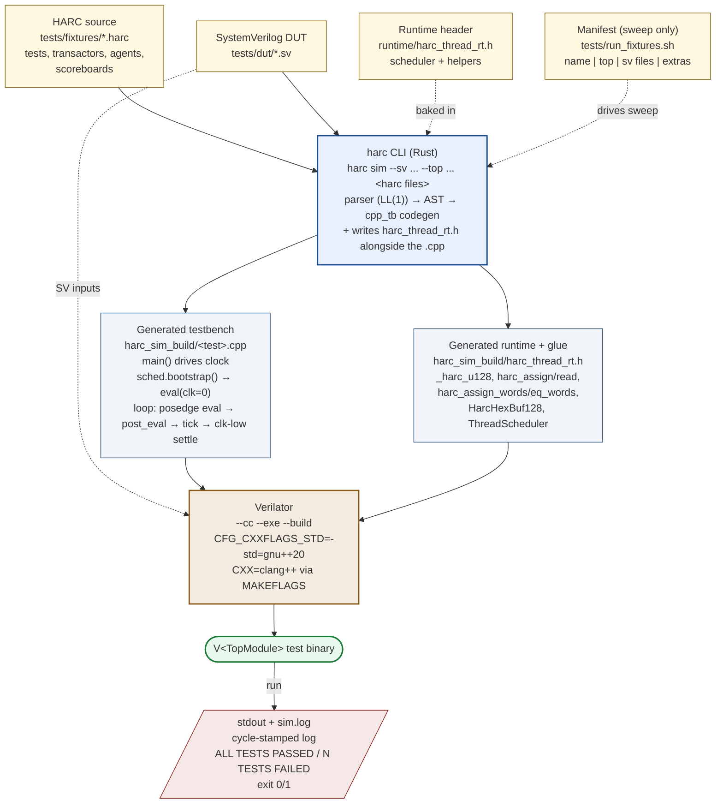

# HARC v1 Specification

*A verification language paired with the ARCH HDL — the **harness** for stimulus, properties, coverage, and testbench architecture.*

> **HARC** = "harness of ARCh". File extension `.harc`, CLI `harc`. Pronounced as a single syllable.

---

## 0. Goals and Non-Goals

**In scope (v1):**
- Temporal properties, assertions, assumptions, cover points (replaces SVA + PSL)
- Compositional formal contracts (assume/guarantee at module boundaries)
- Constrained-random stimulus with relational constraints
- Functional coverage — type-derived and explicit
- UVM-equivalent testbench architecture as native language constructs (env, agent, transactor, sequencer, tseq, scoreboard)
- Reference model embedding (ARCH functional modules, C functions, Sail-imported semantics)
- Native cycle-based simulator runtime, co-compiled with ARCH (Verilator-class throughput)
- **DUT backend abstraction** — HARC TB binds to ARCH-compiled DUTs (primary, fastest path) *or* SV-via-Verilator-compiled DUTs (interop path; raw signal access in v1)
- SIMD batch CRV (N-lane stimulus parallelism on a single compiled TB) — staged for v1.1
- SV + UVM + SVA transpile for sign-off and tool portability
- Direct BTOR2 / SMT-LIB2 formal export

**Out of scope (v1):**
- Wave / coverage GUI tooling — interoperate via standard formats (FSDB / VCD / UCDB)
- Power / UPF verification — defer to ARCH side
- Mixed-signal / AMS
- Emulation backend beyond a synthesizable assertion subset (full TB-on-emulation deferred to v2)
- Commercial-simulator DUT backends (VCS / Xcelium / Questa via DPI-C co-sim) — v1.1+; same DUT abstraction layer extended with simulator-owned-time adapter shims
- VHDL DUTs — v1.1+ via GHDL or Verilator's experimental VHDL path; the DUT abstraction layer admits this without redesign
- Protocol-typed grouping of raw SV signals — v1 ships raw signal access; convention-based or explicit binding for `bus`-typed access deferred to v1.1 once real DUT integration experience informs the design

**Non-goals on principle:**
- Backward source compatibility with SV/UVM testbenches (transpile is *output* only)
- A class-based object model
- Phase-driven lifecycle as a first-class user concept

---

## 1. Design Principles

The language inherits five constraints from being a sister to ARCH; everything else follows:

1. **One frontend.** HARC and ARCH share lexer, parser, expression grammar, type system, and elaboration. A `.harc` file and a `.arch` file compile in one invocation; cross-references are typed.
2. **One IR.** HARC lowers to the same IR as ARCH. Properties, coverage, transactions, and TB components are IR-level constructs. The native simulator and the SV/UVM transpiler are both IR consumers.
3. **Co-elaboration.** A parameterized port and the assertions / coverage on it are emitted in the same elaboration pass, by the same type substitution. The April-15 verification-co-generated-with-ports problem becomes structural rather than aspirational.
4. **One coherent semantics.** Properties have one meaning across simulation, formal, and the synthesizable subset. The backend chooses *which* meaning is realized — never *what* is meant.
5. **Constructs over framework.** Anything UVM achieves through library convention (factory, config DB, phase macros, field macros, virtual interfaces) is either a first-class language construct or eliminated as unnecessary given a real type system.
6. **Ride on ARCH primitives, don't parallel them.** Where ARCH already provides a primitive, HARC reuses it as the lowering target rather than reinventing one. Sequences lower to ARCH `thread`s. Transactors bind to ARCH `bus` declarations and dispatch through the existing `handshake_channel` / `credit_channel` / `tlm_method` machinery. Tests lower to ARCH `testbench`. Properties extend ARCH's `assert` / `cover` / `assume` plus the planned temporal sugar (`a |=> b`, `past(e, N)`, `rose(a)`, `##N e`). HARC adds the missing verification-side abstractions (transactions, constraints, coverage, env/agent/scoreboard, aspects) on top — it does not duplicate the primitives ARCH already ships. See §16 for the lowering map.
7. **LL(1) grammar.** HARC inherits ARCH's LL(1) commitment (ARCH §2.4): every production is decidable from one token of lookahead, no backtracking. This is what makes both languages tractable for AI codegen — a parser can commit to a parse tree from the leading token of every construct, which is the same property that lets an LLM emit syntactically valid code without seeing the trailing context. Every HARC keyword has a distinct FIRST set in every position it can appear; ambiguous compound forms like `cover sequence` vs `cover property` vs `cover propname` resolve by single-token lookahead after the leading keyword. New language features must preserve LL(1); see §2 for the disambiguation rules at potentially-ambiguous sites.

---

## 2. Relationship to ARCH

**File layout.** `.arch` for design, `.harc` for verification. Mixed projects compile both in one pass.

**Module visibility.** A `.harc` file uses an ARCH module or package the same way ARCH files do (`use`, per ARCH §29) and gets typed access to its ports, parameters, internal signals (with `internal` access modifier), and protocol-typed interfaces.

```
use arc.dut.AxiSlave        // an ARCH module

module AxiSlaveTb
    let dut: AxiSlave#(AW=32, DW=64) = bind ...
    on dut.axi_s.aw.handshake
        ...
    end on
end module AxiSlaveTb
```

**DUT backend.** ARCH-compiled DUTs are the primary path — same IR, same compiler pass, no marshaling. HARC also supports SV DUTs compiled through Verilator (§10.5), so existing SV codebases can be driven by HARC TBs without a full HDL migration. The TB code is identical regardless of DUT backend; only the elaboration-time `bind` differs:

```
// ARCH DUT (default, fastest path):
use arc.dut.AxiSlave
let dut: AxiSlave#(AW=32, DW=64) = bind ...

// SV DUT via Verilator:
module my_axi_slave kind verilator
    src: "rtl/axi_slave.sv"
    top: my_axi_slave_top
    param ADDR_W: int = 32
    param DATA_W: int = 64
    clocks: { aclk: tb_clk }
    resets: { aresetn: tb_rst_n }
end module my_axi_slave
let dut: my_axi_slave = bind ...
on dut.s_axi_awvalid
    ...                          // raw signal access — protocol grouping is v1.1
end on
```

The cycle-based runtime (§7.1, §10.1) calls `dut.eval_domain(D)` on every cycle regardless of backend; the binding generates the right C++ glue at compile time. See §10.5 for the full DUT backend spec.

**Shared types.** Everything ARCH defines is available in HARC:
- Bitvectors `bits<N>`, `uint<N>`, `sint<N>` with width arithmetic
- Struct, ADT (sums-of-products), enum, vector
- Pipeline, FSM, FIFO, counter, regfile
- Clock-domain types
- Protocol-typed interfaces (AXI / AXIS / etc. with handshake sequencing in the type)

**Shared elaboration.** Generics, traits, type-level naturals — same machinery. A protocol type's handshake sequencing is what the HARC transactor is *derived from*; you do not re-author the protocol.

**What HARC adds, lexically.** New keywords, reserved only in `.harc` files (so existing ARCH code is unaffected):

```
assert assume cover property pseq
solve_before solve_after dist
transaction agent env transactor
sequencer tseq scoreboard ref phase weight active passive
on after fork join_any join_all join_none emit
scope setup run check teardown test
blocking comb across with default
keep extend when hookable pre post apply
parallel schedule select                  // tseq composition operators (§17.1)
buffer stream state                       // flow object types (§17.2)
```

The composition operators (`parallel`, `schedule`, `select`) are scoped to `tseq` bodies — borrowed from PSS activity composition (§17.1). The flow object types (`buffer<T>`, `stream<T>`, `state<T>`) are first-class types alongside `event<T>` (§17.2).

Attribute syntax `[name]` and `[name(args)]` annotates declarations: `[cyclic]`, `[unique]`, `[dist {...}]`, `[range(...)]`, etc. On field declarations attributes follow the type, introduced by the `with` keyword (`name : type [default <value>] [with [attr]+]`); on other declarations they prefix. Attributes are extensible without grammar changes.

**Keywords shared with ARCH** (same primitive, same meaning, used in HARC files where the construct applies): `module`, `bus`, `port`, `param`, `let`, `reg`, `comb`, `seq`, `assert`, `assume`, `cover`, `use`, `function`, `package`, `domain`, `Clock`, `Reset`, `thread`, `wait`, `lock`, `testbench`, `task`, `init`, `repeat`, `log`, plus all primitive types (`UInt`, `SInt`, `Bool`, `Vec`, `struct`, `enum`).

Note in particular that `seq` retains its ARCH meaning of *registered logic block* — and the bareword `sequence` is not a HARC type or stand-alone keyword. The temporal sequence type is `pseq` (§3.4); the test sequence construct is `tseq` (§8.4). The bareword `sequence` reappears as a keyword in exactly one compound form: `cover sequence` for behavioral sequence coverage (§17.3) — the linguistic fit there is strong enough to merit the carve-out. HARC has three kinds of sequences with deliberately symmetric names:

- **`tseq`** — *test sequence*. Stimulus generators that yield transactions to a sequencer (§8.4). Lower to ARCH `thread`s.
- **`pseq`** — *property sequence*. Temporal patterns used inside `assert property` / `cover property` / `assume property` blocks (§3.4, §5). Lower to ARCH temporal sugar (`a |=> b`, `##N e`, etc.) plus shadow registers for multi-cycle relations.
- **`cover sequence`** — *behavioral sequence*. Coverage patterns over orderings of events (§17.3). Lower to compile-time-constructed FSMs over event observations.

The `t` / `p` prefix on the first two tells you immediately which side of verification you're looking at: stimulus or properties. Behavioral coverage is its own thing and uses the explicit two-word form.

And `use` is the ARCH-style namespace import (§3.6), distinct from `apply` which activates an aspect within a scope.

`bus` and `dut` are conventional, not reserved.

**LL(1) disambiguation at potentially-ambiguous sites.** HARC is LL(1) (per §1, principle 7). The places where multiple constructs share a leading keyword resolve by single-token lookahead:

| Leading token | Next token decides production |
|---|---|
| `cover` | `sequence` → behavioral sequence (§17.3); `property` → property cover; IDENT → cover named property |
| `module Name` | `#(` → parameters first; `kind` → external backend variant (§10.5); newline → ARCH-source body opens directly |
| `agent Name` (and `transactor`/`env`) | `#(` → parameters; `bound` → bound-to clause; newline → body opens |
| `name : type` (field decl) | `default` → default clause; `with` → attributes; newline / `,` → end of field |
| `on event-expr` | `pre` → pre-hook; `post` → post-hook; newline → main handler body |
| `assert`/`assume` | IDENT (followed by `;` or end-of-line) → named property; expression → inline boolean or temporal property (the temporal operators `|=>`, `##N`, etc. are part of the expression grammar, not separate productions) |
| `end` | `module` / `transaction` / `agent` / etc. → close that named declaration; `on` / `fork` / `when` / etc. → close anonymous compound block |

New language features must preserve this property. The check is mechanical: for every keyword that introduces a construct, FIRST sets of all possible continuations must be pairwise disjoint.

**Block syntax: end-construct style throughout.** HARC follows ARCH's `end <kind> [<name>]` convention for all block bodies — no curly braces for declaration bodies, statement-block bodies, or compound expressions. A named declaration closes with `end <kind> <name>` (e.g., `end module AxiSlaveTb`); an anonymous compound block closes with `end <kind>` (e.g., `end on`, `end fork`, `end when`). The named-end form is the parser-validating, AI-codegen-friendly shape that ARCH §2.4 commits to, and HARC mirrors it. Curly braces are reserved for *value literals* — set literals (`{READ, WRITE}`), distribution literals (`dist {[0..0xFF] :/ 80}`), record/struct literals — never for blocks.

**Discard pattern `_` in binding positions.** A lone underscore is a binding name that says "I need to introduce a binding here but don't intend to read it." It is not an identifier — it cannot be referenced from the body, and reusing the same `_` in nested binders does not collide. v1 admits `_` in discard-capable binders:

- Let bindings: `let _ = expr` — evaluate `expr` and intentionally discard the result.
- Function, hookable, and event-handler parameters: `function f(_: uint<8>)`, `hookable h(_: T)`, `on ev(_)` — accept the value while signaling that the body does not read it.
- Loop variables: `for _ in 0 .. N ... end for` and `keep for _ in items ... end for` — repeat or quantify without naming the index/item.
- The randomize-result discard (planned, Phase 1b): `randomize(_) with ...` — when the call is for its constraint side-effect rather than the produced value.

```
let _ = consume(1)

for _ in 0 .. 10
    wait 1 cycle             // common idiom: just spin N cycles
end for
```

A bare `wait N cycles` (§7.4) is the cleaner form when the loop body is *only* the wait. Use a real loop variable name (`for i in 0..N`) when the body actually consumes the index; use `_` when the body does not. Borrowed from Rust and Python.

**Ternary `cond ? then : else`.** A C/SystemVerilog-style conditional expression. Right-associative; precedence is just above implication (`|->`, `|=>`) and below every other operator, so `a + b ? x : y` parses as `(a + b) ? x : y` and `a ? b : c ? d : e` parses as `a ? b : (c ? d : e)`. There is no `if`-as-expression in HARC; for value selection inside an expression context, use ternary.

```
let h = dut.alloc_resp_valid ? dut.alloc_resp_handle : 255
let bound = i < hi ? i : hi - 1
```

Lowers to a parenthesized C++ ternary in the generated TB.

---

## 2.5 Source-level documentation comments

Three lexical surfaces attach natural-language design intent to HARC
source. The compiler reads these into the AST verbatim — no
interpretation — so downstream tooling (RAG indexer, doc generator,
spec-link checker) can consume them.

### 2.5.1 `///` outer doc comments

A run of `///` lines attaches to the **next construct** in the file:

```harc
/// AXI4 write arbiter, round-robin priority.
///
/// Picks among threads holding the lock using a rotating priority pointer.
transactor AxiWrXactor
    ...
end transactor AxiWrXactor
```

Attachment rule: accumulated `///` lines (consecutive, prefix-stripped
text joined by `\n`) attach to the next syntactic item — top-level
declarations (`use`, `package`, `const`, `domain`, `struct`, `enum`,
`transaction`, `tseq`, `agent`, `env`, `scoreboard`, `sequencer`,
`transactor`, `test`, `impl`, `extend`, `covergroup`, `property`,
`pseq`, `cover sequence`, `module`, `function`, `bus`). `////` (four
or more slashes) is a regular line comment, not a doc comment —
matches Rust's escape hatch for ASCII art / banners.

Stored on each construct's AST node as `doc: Option<String>`.

### 2.5.2 `//!` inner doc comments

A `//!` block at the **top of a file**, before any item, documents the
file as a whole — stored on `SourceFile.inner_doc`:

```harc
//! AXI4 write-arbitration utilities.
//!
//! All arbiters in this file use round-robin scheduling unless
//! explicitly marked priority.

transactor AxiWrXactor
    ...
end transactor AxiWrXactor
```

**Per-construct inner doc.** A `//!` run **immediately after** a
construct's opening keyword (+ name + params + `bound to` clause,
where applicable) and **before** the first body item attaches to that
construct's `inner_doc` field. Documents the construct *from the
inside* — useful for invariants, internal-state notes, or spec
references that wouldn't sensibly hang off the opening line:

```harc
transactor AxiWrXactor
    //! Active half drives the AW/W/B handshake; passive half
    //! observes for the scoreboard. Both halves share the
    //! pending-id queue declared below.
    dut : AxiSlave
    pending : queue<uint<4>>
    ...
end transactor AxiWrXactor
```

Covered constructs (any `Item::*` variant with a body):
`package` / `struct` / `transaction` / `tseq` / `agent` / `env` /
`scoreboard` / `sequencer` / `transactor` / `test` / `impl` /
`extend` / `covergroup` / `property` / `pseq` / `cover sequence` /
`bus` / `function`.

Inner-doc text shows up under `Construct::inner_doc()` and feeds the
feature harvester's `src_after` field, so `harc advise --feature
<query>` finds it.

### 2.5.3 `//! ---` YAML frontmatter

A `---`-fenced block at the top of the `//!` run carries structured
metadata that's awkward to express as prose:

```harc
//! ---
//! spec_md: doc/specs/axi_wr_arb.md#round-robin
//! tags: [arbitration, axi, axi4]
//! refs:
//!   - "AXI4 spec §A3.3.1"
//!   - "TICKET-1234"
//! ---
//!
//! 4-channel round-robin AXI write arbiter, used by all DMA channels
//! in the SoC. See `spec_md` above for the authoritative behavior.

transactor AxiWrXactor
    ...
```

Rules:
- The opening fence is a line whose `//!`-prefix-stripped content is
  exactly `---`. The closing fence is the next such line.
- The block must be at the very top of the `//!` run — any prose
  before the opening fence disqualifies the file from having a
  frontmatter.
- The compiler does **not** parse the YAML body in v0. It stores the
  raw text on `SourceFile.frontmatter: Option<String>`. Downstream
  tooling (RAG indexer, doc generator) interprets it.
- The frontmatter is also retained inside `SourceFile.inner_doc` for
  fidelity (raw inner-doc round-trips byte-perfect).

Conventional fields downstream tooling looks for:

| Field      | Type             | Meaning |
|------------|------------------|---------|
| `spec_md`  | string           | Relative path to authoritative markdown spec, with optional `#anchor` |
| `tags`     | list of strings  | Feature tags for retrieval |
| `refs`     | list of strings  | Citations / ticket IDs / URLs |

Tooling may add fields; the compiler is forwards-compatible by virtue
of not interpreting them.

Mirrors arch-com's `plan_arch_doc_comments.md` lexical design — same
attachment rules, same field conventions — so HARC and ARCH sources
can be indexed by the same harvester.

## 2.6 Local learning store — `harc advise`

HARC ships an always-on, on-device store of error→fix pairs. Every
`harc check` / `harc sim` invocation records its outcome; over time,
the store accumulates examples of "thing that failed → diff that
fixed it" that can be retrieved by the user (or an LLM agent) on a
later compile failure. Ports arch-com's `src/learn.rs` (sister
implementation; see `arch-com/doc/plan_arch_learning_system.md`).

**Capture loop** (automatic, no flag):

  1. **On failure** of `harc check` / `harc sim`: classify the error
     message into a short `error_code` (`parse_error`,
     `missing_test`, `missing_dut`, `width_mismatch`, …), stash
     `(error_code, error_message, src)` in
     `~/.harc/learn/pending/<file_hash>.json`.
  2. **On the next success** for the same file: diff `src` against
     the now-successful source, append an `error_fix` event to
     `~/.harc/learn/events.jsonl`, delete the pending record, print
     `📚 Learned: [<code>] <one-line diff>`.
  3. **On every failure**, also `peek` the store for similar past
     fixes (zero-side-effect, doesn't bump retrieval counts) and
     print `💡 harc advise found N similar past fixes — run 'harc
     advise "<code>"' to see them.` when the store has matches.

**Retrieval**: `harc advise <query>` returns top-K matches via BM25
scoring over `(error_code, error_message, diff_summary)`. Build the
index once with `harc learn-index`; subsequent `advise` calls reuse
it. Each match's `retrieved_count` increments on retrieval so
frequently-cited fixes float up.

**Subcommands:**

| Command | Effect |
|---|---|
| `harc advise <query> [-k N]` | top-K past fixes ranked by BM25 |
| `harc advise --feature <query>` | top-K **feature** events (spec→source provenance from `///` / `//!` / `//! ---`) instead of error→fix pairs |
| `harc advise --from-stderr` | read query from stdin (pipe `harc sim … 2>&1` into it) |
| `harc learn-index` | rebuild the BM25 index over `events.jsonl` |
| `harc learn-stats` | event count + breakdown by error_code |
| `harc learn-clear` | wipe `~/.harc/learn/` |
| `harc learn-prune --code C \| --contains S \| --older-than-days D [--dry-run]` | remove matching events |
| `harc learn-bootstrap <dir>` | recursively parse `*.harc` under `<dir>`, harvest one feature event per top-level construct that carries `///` / `//!` / `//! ---` doc text. Idempotent: re-running replaces existing feature events for each file. Build the index afterwards with `harc learn-index`. |

**Feature events** (harvested automatically on every successful
`harc check` / `harc sim`, or bulk-seeded via `harc learn-bootstrap`):

Each top-level construct that carries any doc-comment text (outer
`///`, file-level `//!`, or `//! ---` frontmatter) emits one
`kind: "feature"` event. Schema repurposes the `Event` fields:

  - `error_code` = construct kind label (`"transactor"`, `"test"`,
    `"impl"`, `"struct"`, `"transaction"`, …) — used by BM25 as a
    faceted token
  - `error_message` = concatenated doc text (construct outer + file
    inner_doc + frontmatter) — the bulk of the indexed content
  - `diff_summary` = construct's identifier name (so `advise --feature`
    surfaces it as `construct:` in the result)
  - `src_before` = file frontmatter (verbatim, for tooling that
    parses the YAML)
  - `src_after` = construct inner_doc (currently empty; reserved for
    when HARC adds per-construct inner-doc parsing)

This is the **spec → source** retrieval surface: agents looking for
"how do I build X" can pull annotated examples from the local corpus
without ever leaving the machine. Pairs naturally with PR A's
frontmatter: `///` + `//! ---` make the spec-link explicit; the
harvester makes it retrievable.

**Privacy + opt-out**: all data stays on-device under `~/.harc/learn/`.
`HARC_NO_LEARN=1` disables capture and retrieval. `HARC_LEARN_MAX_MB`
caps the store (default 100 MB; warns at 90%, hard-skips writes at
100%). One-time privacy notice prints on the first capture-enabled
invocation.

**Data layout:**

```
~/.harc/learn/
  ├── events.jsonl            append-only capture stream
  ├── index.json              BM25 index (built by `harc learn-index`)
  ├── pending/<hash>.json     in-flight failure per source file
  ├── retrieval_counts.json   per-event retrieval counter
  └── .first_run_notice       marker file for one-time privacy notice
```

Designed deliberately minimal: hand-written JSONL serde, pure-Rust
BM25, no embeddings, no network, no sharing mechanism. Embedding-
backed semantic retrieval is a planned upgrade (arch-com's plan §v2
is the reference); the BM25 baseline already discriminates well
across the kinds of error/diff text the HARC compiler produces.

---

## 3. Type System Extensions

HARC adds a small set of types on top of ARCH's:

### 3.1 Default-rand fields with attributes

Fields in `transaction` and `struct` types are **random by default**. The `rand` keyword does not exist; instead, opt out with `!` for non-random fields, append `default <value>` after the type for a default value, and append `with [attr]+` for randomization modifiers.

```
transaction AxiWrite
    addr  : uint<64>                                                    // rand by default
    data  : Vec<bits<64>, 256>
    len   : uint<8>
    burst : BurstType

    id    : uint<4>  with [cyclic]                                      // cycles through values; randc semantics
    size  : uint<8>  with [dist {[0..0xFF] :/ 80, [0x100..] :/ 20}]     // distribution attribute
    tag   : uint<8>  with [unique within tseq]                          // distinct across this tseq's emissions

    !mode : AxiMode default NORMAL                                      // not random; default settable in code
end transaction AxiWrite
```

**Field syntax:** `[!] name : type [default <value>] [with [attr]+]`. The field name and type lead. Two optional clauses follow, each keyword-introduced: `default <value>` for the value when not randomized (or pre-randomize for random fields), and `with [attr]+` for randomization modifiers. Both clauses are independently optional; when both are present, `default` precedes `with`.

```
addr : uint<64>                                                  // random, no default, no attrs
size : uint<8> default 0                                         // random, with default
size : uint<8> with [cyclic]                                     // random, with attrs
size : uint<8> default 0 with [dist {[0..0xFF] :/ 80, [0x100..] :/ 20}]
!mode : AxiMode default NORMAL                                   // non-random with default
```

Multi-attribute under one `with`:

```
size : uint<8> default 0 with [dist {[0..0xFF] :/ 80, [0x100..] :/ 20}] [weighted(zero_bias)]

// or, when attributes are long:
size : uint<8> default 0 with
    [dist {[0..0xFF] :/ 80, [0x100..] :/ 20}]
    [weighted(zero_bias)]
```

**Why keyword-introduced clauses, not `=`.** The `=` token is overloaded across many contexts (type aliases, expression assignment, comparison-derived constraints). Keyword-introduced clauses make every field declaration self-documenting: see `default`, expect a value; see `with`, expect attributes; see neither, the field is plain random. Searchability is also direct — `grep "default "` finds every default-bearing field, `grep "with \["` finds every attributed field.

**The prefix modifier `!` (non-random):** storage-class marker, conceptually the inverse of randomization. Use for fields that are settable in code but never randomized — config knobs, mode bits with explicit values, sideband state.

**No `const` inside transactions.** A transaction is a randomizable value record; constants don't belong to its body. For test-bench-wide constants — protocol versions, magic numbers, table sizes — use package-level or module-level `const` declarations (per ARCH §29) and reference them by name from inside the transaction. This keeps the transaction body to its two purposes: fields and constraints. Anything that isn't either of those lives elsewhere.

```
// at package scope:
const AXI_VERSION : uint = 1
const MAX_BURST_LEN : uint = 256

transaction AxiTxn
    addr : uint<64>
    len  : uint<8>
    keep len <= MAX_BURST_LEN          // refers to package-level const
end transaction AxiTxn
```

The `with` keyword here is the same one used in `randomize(t) with { ... }` (§4.4) — both introduce additional randomization properties attached to the surrounding context. At field-declaration time the properties are baked into the type; at call time they're scoped to that randomize call. The shared keyword reflects shared semantics.

Rationale for default-rand: in real transactions the overwhelming majority of fields are random; opting *in* to randomness everywhere is noise. Borrowed from Specman e (`!` prefix for non-random). Attributes are extensible — `[range(...)]`, `[weighted(...)]`, etc. can be added without new keywords.

#### `[unique]` scoping

`[unique]` constrains a field's randomized value to be distinct from prior assignments. The scope of "prior" varies; HARC makes this explicit:

```
[unique]                       // unique within one randomize() call (default; SV-equivalent)
[unique within tseq]           // unique across all emissions from this tseq instance
[unique within sequencer]      // unique across all transactions a sequencer ever drives
[unique within test]           // globally unique within this test instance
```

The bareword `[unique]` matches SystemVerilog's per-call `unique` semantics — a single `randomize` against a list/array produces distinct values within that one call. The `within X` clauses extend the lifetime: the runtime maintains a used-value set tied to the named scope; new randomizations sample from the complement.

**Lowering:**

| Form | Runtime cost | Notes |
|---|---|---|
| `[unique]` | free — a solver-side constraint within one call | No persistent state |
| `[unique within tseq]` | per-tseq-instance bitset (or hash for wide types) | State tied to tseq lifetime |
| `[unique within sequencer]` | per-sequencer bitset | State tied to sequencer lifetime |
| `[unique within test]` | per-test bitset | State tied to test instance lifetime |

**Compile-time check.** For `[unique within X]`, the compiler verifies the field's value space is bounded enough that uniqueness is sustainable over the scope's expected emission count. A `uint<4>` field with `[unique within tseq]` has 16 possible values; if the static checker can prove the tseq emits more than 16 transactions, the program is rejected with an "unique exhaustion" error pointing at both the attribute site and the emission site. For dynamically-bounded emission counts, the compiler emits a runtime warning at exhaustion rather than failing compile.

### 3.2 Time

```
type time
let t: time = 100ns      // also: 5ps, 3us, 4cycles
```

`time` is a tagged type, not an integer. Mixed-unit arithmetic requires explicit conversion. `cycles` is resolved against the enclosing `clocking` scope.

### 3.3 Transactions

A `transaction` is a typed record with built-in conveniences for randomization, packing, and scoreboard comparison.

```
transaction AxiWrite
    addr  : uint<64>
    data  : Vec<bits<64>, 256>
    len   : uint<8>
    burst : BurstType
    id    : uint<4>
    strb  : Vec<bits<8>, 256>

    keep len in [1..256]
    keep addr % (1 << size) == 0
    keep len * (1 << size) <= 4096 - (addr % 4096)
end transaction AxiWrite
```

Transactions are **value types** (ADT under the hood). They have structural equality, deep-copy by default, and pack/unpack methods derived from the protocol type they're associated with.

There is no class hierarchy. Reuse and parameterization are via composition, ARCH's traits, and `extend` aspects (§3.6) — not inheritance.

#### Inline `keep` constraints

`keep` declares a constraint that always applies to instances of this transaction. It is inline because the constraint is intrinsic to the type. For external, parameterized, composable constraint sets, use a `relation` (§4); for cross-cutting test-specific constraints, use `extend` (§3.6).

#### `when` subtypes for conditional fields

Borrowed from Specman e. A discriminator field gates which fields exist in the transaction:

```
transaction AxiTxn
    op   : AxiOp
    addr : uint<64>
    len  : uint<8>

    when op == WRITE
        data : Vec<bits<64>, 256>
        strb : Vec<bits<8>, 256>
    end when
    when op == READ
        expected_data : Vec<bits<64>, 256>
    end when

    keep op in {READ, WRITE}    // discriminator value space — single-field, Phase 1a OK
    keep len in [1..256]
end transaction AxiTxn
```

The consumer accesses `t.addr` and `t.len` unconditionally; conditional fields require a refinement (pattern match, `if`, or guarded access) — the compiler enforces this at use-site.

`when` subtypes are the right model when you want a flat-record API with conditional presence. ADTs (sums-of-products from ARCH) are the right model for closed sums where each variant has fundamentally different shape (FSM states, protocol message types). Both are available; pick per use case.

The constraint solver reasons about `when`-conditional fields naturally — they participate in the SAT problem only when their discriminator selects them.

#### Encoding: tagged ADT with per-variant constraint subproblems

`when` subtypes lower to a tagged ADT: discriminator field + per-variant payload. The constraint solver sees the type via Z3's native algebraic-datatype theory (`(declare-datatypes ...)`); each `when` variant is a constructor, and field accesses inside a `when` clause become accessor functions guarded by the discriminator.

The constraint problem decomposes per-variant: at solve time, the discriminator's constraints are satisfied first, then only the active variant's fields and `keep`s enter the SAT/SMT problem. Inactive variants' fields are never allocated in the solver's representation for that solve. This gives:

- **Solver pruning** — unsat variants are eliminated as whole branches, not searched field-by-field
- **Clean composition with `extend`** (§3.6) — adding `when X { keep ... }` via aspect extends only that variant's subproblem; the ADT declaration is unchanged
- **Tractable lane divergence for v1.1 SIMD batch CRV** — lanes group by discriminator, each group solves its variant subproblem in parallel; scatter via AVX-512 lane masking

The cost is a one-time per-type elaboration setup (ADT declaration to the solver, per-variant constraint tree). This is amortized across all `randomize` calls of that type.

### 3.4 Properties as first-class types

```
type prop                    // a temporal property
type pseq                    // a temporal sequence (used inside properties)
type event<T>                // typed event channel — reactive, cycle-aligned
```

`prop` and `pseq` are first-class. You can store them, pass them to generics, build property combinators.

`event<T>` is HARC's reactive primitive. For other dataflow patterns — queued producer/consumer, continuous streams, persistent shared state — see the flow object types in §17.2 (`buffer<T>`, `stream<T>`, `state<T>`), borrowed from PSS.

### 3.5 Coverage carried by types

```
enum BurstType { FIXED, INCR, WRAP }
                 // implicit coverage bins for each variant
```

Any value of type `BurstType` automatically participates in coverage when sampled in a `cov` group. `bits<N>` with `range(...)` annotations get implicit bins. This eliminates the bin-restating problem and lets coverage hit-counts be type-checked against the value space.

### 3.6 `extend` aspects with two-stage `use` + `apply` activation

Borrowed from Specman e, with the AOP-too-magic critique addressed by separating two concerns: making an aspect *visible* and making it *active*. HARC inherits ARCH's `use` keyword (ARCH §29) for namespace import and adds `apply` for scope-local activation.

`extend` adds constraints, fields, or `when` subtypes to an existing type from a separate file, without modifying the original definition. Multiple extensions compose.

```
// file: tests/aspects/short_bursts.harc
package ShortBursts
    extend AxiTxn
        keep len < 16
        keep burst == INCR
    end extend AxiTxn
end package ShortBursts

// file: tests/aspects/aligned_writes.harc
package AlignedWrites
    extend AxiTxn
        keep addr % 64 == 0
    end extend AxiTxn
end package AlignedWrites

// file: tests/test_small_aligned.harc
use tests.aspects.short_bursts        // names visible; aspect NOT yet active
use tests.aspects.aligned_writes

test SmallAligned
    apply ShortBursts                 // active in this test only
    apply AlignedWrites
    ...
end test SmallAligned
```

**Two-stage rationale.**
e applies aspects globally based on file load order, which is the legitimate "where did this come from" critique. HARC splits the two questions:

- `use` — same as ARCH (§29): brings package names into scope. Pure name resolution; no compile-time effect on which extensions are active. Two `use` lines never conflict.
- `apply` — activates the named aspect's `extend` blocks within the enclosing scope (`test`, `env`, or `scope`). The activation is textually visible at the activation site; `grep -n "apply ShortBursts"` finds every site where the aspect takes effect.

This is a strict win over e: the `use` line tells you the aspect *exists*; the `apply` line tells you where it *takes effect*. Aspects defined in a `use`d package but not `apply`d in any scope have no observable effect.

**Composition rules.**
- An `apply` activates the named package's `extend` blocks for the lexical extent of the enclosing scope.
- Multiple `apply` lines in the same scope compose by intersection of constraints (all `keep`s must hold) and union of fields / `when` clauses.
- Conflicts at the field level (two extensions adding the same field name with different types) are compile errors. Conflicts at the constraint level (unsatisfiable composed constraints) are runtime solver failures with both sources reported.
- Nested scopes inherit applies from their enclosing scope; nested `apply` adds to the inherited set, never removes.

**Depth-1 rule: `extend` targets base type declarations only.**

This is the single most important constraint on the aspect system, and it's what addresses the "where does this come from" critique of unrestricted AOP. An `extend` block must name a type declared with `transaction`, `struct`, `agent`, `env`, etc. — never another `extend` or aspect package.

```
transaction AxiTxn ... end transaction AxiTxn   // base declaration

package ShortBursts
    extend AxiTxn                                // OK — extends the base
        keep len < 16
    end extend AxiTxn
end package ShortBursts

package StrictBursts
    extend ShortBursts.AxiTxn                    // ERROR — would be depth 2
        ...
    end extend ShortBursts.AxiTxn
end package StrictBursts
```

What this rules out: extension chains. What it allows (and is sufficient): multiple flat extensions of the same base. Composition is realized at `apply` sites by stacking activations, not by chaining extension definitions:

```
extend AxiTxn keep A end extend AxiTxn          // package A, depth 1
extend AxiTxn keep B end extend AxiTxn          // package B, depth 1
extend AxiTxn keep C end extend AxiTxn          // package C, depth 1

test T
    apply A; apply B; apply C                   // effective type: AxiTxn ∧ A ∧ B ∧ C
end test T
```

The "chain" lives at activation sites. `grep -n "apply"` recovers the entire composition for any test; `grep -n "extend AxiTxn"` enumerates every contributor to the type. Both queries are linear, both are textually visible, neither requires walking a graph.

**Why depth 1 is sufficient.** Specman e allows arbitrary extension depth, and real e codebases routinely have transactions whose effective constraint set is assembled from chains across many files. Reading any single file in such a chain reveals only a partial picture, and the composition order matters subtly. Depth-1 forfeits no expressivity: every multi-level chain in e can be rewritten as multiple depth-1 extensions composed via `apply` stacking. What it forfeits is the ability to *partially* extend an extension, which is precisely the source of the auditability problem.

**Edge case: extension B references a field that extension A adds.** If `apply B` is activated without `apply A`, B's reference to A's field is a runtime error at the activation site, with both source locations reported. Restructuring is the escape hatch — merge A and B into one package, or split the field-adding extension from the field-constraining one such that the constraint extension is conditional on the same `apply` set. v1 ships this as the rule; v1.1 may add an explicit `requires` clause on packages for declarative dependency capture (§13).

**What can be extended.**
- `transaction` — add fields, `keep` constraints, `when` subtypes
- `struct` — same
- `agent` / `env` / `transactor` / `scoreboard` — add fields, `connect` clauses, `on` handlers
- `ref module` — not extendable (refs are spec-derived; extension would defeat the purpose)
- ARCH design modules — not extendable from HARC (design-side extensions require ARCH-side changes)
- Other aspect packages — not extendable (the depth-1 rule above)

**What cannot be extended.**
Free-form method body replacement is explicitly out (see §12). Extensions add to types and components; they do not rewrite existing methods. To intercept method calls, use `pre`/`post` hooks (§7.3).

---

## 4. Stimulus and Constraints — Three Forms

The April-13 principle holds: **constraints are relations, not directives**. HARC provides three syntactic forms for declaring them, all sharing the same underlying semantics:

| Form         | Where it lives                | Use for                                              |
|--------------|-------------------------------|------------------------------------------------------|
| `keep` block | Inline in `transaction`/`struct` (§3.3) | Constraints intrinsic to the type            |
| `relation`   | Free-standing, named, composable | External, parameterized, reusable constraint sets |
| `extend`     | Imported aspect (§3.6)        | Test-specific, cross-cutting constraints             |

A free-standing `relation`:

```
relation AxiBurstLegal(t: AxiWrite)
    t.burst != WRAP || (t.len in {2, 4, 8, 16})
    t.addr % (1 << t.size) == 0
    t.len * (1 << t.size) <= 4096 - (t.addr % 4096)
end relation AxiBurstLegal
```

is used in three contexts, regardless of which form declared it:

1. **Stimulus generation** — `randomize(t) with AxiBurstLegal(t)` — the solver finds satisfying values.
2. **Observation checking** — `assume AxiBurstLegal(t_obs)` checks the DUT honored the protocol; `assert AxiBurstLegal(t_gen)` checks legality of generated stimulus.
3. **Formal** — exported to SMT-LIB2 directly; participates in compositional contracts.

No stimulus/observation duplication. No inheritance ladder to add a constraint.

### 4.1 Solve hints, distributions, and auto-lowering

```
randomize(t) with
    solve_before(t.burst, t.len)
    t.addr dist { [0..0xFFFF] :/ 80, [0x1_0000..] :/ 20 }
end randomize
```

#### Auto-lowering simple `keep` to attribute-equivalent code

Phase 1a does not link the SMT solver. Single-field constraints whose right-hand side is a constant expression auto-lower to attribute-equivalent code at elaboration — they generate the same PRNG sampling code that `[range(...)]`, `[weighted(...)]`, `[dist {...}]`, or `[cyclic]` would. The user can write whichever form is more natural:

| `keep` form | Auto-lowers to | Phase |
|---|---|---|
| `keep f in [a..b]` (constants) | `[range(a, b)]` — uniform PRNG sampling | 1a |
| `keep f == c` (constant) | constant assignment — no PRNG call | 1a |
| `keep f in {a, b, c}` (constants) | `[weighted(a, b, c)]` — equal-weight PRNG choice | 1a |
| `keep f != c` (single hole over wide range) | runtime rejection-sample | 1a (with warning) |
| `keep <multi-field constraint>` | requires solver — Phase 1b error | 1b |
| `keep f != g` (cross-field) | requires solver — Phase 1b error | 1b |
| `keep f * g <= K` (arithmetic, multi-field) | requires solver — Phase 1b error | 1b |

The static checker rejects multi-field constraints in Phase 1a with a clear error pointing at the offending term and citing the field count. Single-field constants-only forms compile without the solver linked.

**Implementation status (v0 codegen).** Transaction-level `keep` constraints are honored by **every** call to `randomize(t)` — bare or with an explicit `with` body — by merging the transaction's keep list into the same Z3 solver block at the call site. Specifically:

- `randomize(t)` on a transaction with `keep`s emits the full Z3 solver block, with each `keep` expression added as a constraint alongside per-field width bounds.
- `randomize(t) with <user-body>` merges `<user-body>` with the transaction's keeps; the solver finds a satisfying assignment over the combined constraint set.
- `randomize(t)` on a transaction with **no** keeps stays on the fast PRNG path (per-field uniform sampling).

The Phase 1a/1b distinction is preserved as a design intent (single-field constants-only could in principle compile without Z3), but v0 collapses both phases into the always-Z3 path now that the solver is linked. The simplification keeps a single code path for correctness; the per-attribute fast paths (`[range]`, `[dist]`) remain available for users who want to express stimulus shape at field-declaration time rather than via `keep`.

This eliminates the historical footgun where keeps appeared to constrain but didn't — the parser accepted `keep len in [1..256]` but earlier codegen visited only `TxnBodyItem::Field`, dropping the keep silently and producing unconstrained random values across the field's full width.

This makes `keep` and attributes equivalent for simple cases, and the attribute form a *concrete syntactic alternative* rather than a separate Phase 1a-vs-1b feature gate. Style guidance: use attributes when the constraint is intrinsic to the field (always applies, part of the type's contract); use `keep` when the constraint is composed with others or expresses a relationship even if currently constant. Attributes are declaration-style, `keep` is constraint-style — same lowering for the simple cases.

#### `[dist]` attribute vs. `dist` directive — when to use which

Two ways to specify a weighted distribution. They differ in scope:

**Field-level `[dist]` attribute** — distribution is intrinsic to the type. Every randomization of any instance of this transaction uses it.

```
transaction AxiTxn
    size : uint<3> with [dist {6 :/ 90, [0..5] :/ 10}]   // 90% size=6 (cache-line aligned)
end transaction AxiTxn
```

**`dist` directive inside `randomize ... with`** — distribution is ad-hoc, scoped to one call. Doesn't affect the type.

```
let t: AxiTxn
randomize(t) with
    t.size dist { [0..2] :/ 100 }    // this call wants only small sizes
end randomize
```

When both are present, the directive wins for that specific call. A worked example showing both — typical AXI verification mix where most stimulus is cache-line aligned but targeted regressions hit unaligned cases:

```
transaction AxiTxn
    size : uint<3>
    addr : uint<64>

    // Intrinsic: 90% of generated traffic is cache-line-aligned
    size with [dist {6 :/ 90, [0..5] :/ 10}]
end transaction AxiTxn

// Normal regression: uses the intrinsic distribution
tseq Regression(n: int) -> TSeq<AxiTxn>
    for _ in 0 .. n
        let t: AxiTxn
        randomize(t)                                // 90% size=6, 10% spread across 0..5
        yield t
    end for
end tseq Regression

// Targeted: hit unaligned cases harder
tseq UnalignedStress(n: int) -> TSeq<AxiTxn>
    for _ in 0 .. n
        let t: AxiTxn
        randomize(t) with
            t.size dist { [0..2] :/ 100 }            // override: small sizes only
        end randomize
        yield t
    end for
end tseq UnalignedStress
```

**Style guidance.** Use the attribute when the distribution reflects the field's natural skew everywhere it occurs (protocol-level realism, traffic shaping). Use the directive when the test wants to override or focus on a sub-range (targeted regression, edge-case stress). The attribute is the default; the directive is the override.

### 4.2 Composability

```
relation AxiAlignedBurst(t: AxiWrite) = AxiBurstLegal(t) && t.addr % 64 == 0
```

Relations are values. They can be passed, intersected (`&&`), unioned (`||`), and parameterized.

**Implementation status (v0 codegen).** A relation call `R(args)` inside a `randomize(t) with …` body (or inside a transaction's `keep` block, via the merge from §4.1) is inlined at codegen time: the formal parameters substitute for the actual arguments, and each body expression is added to the Z3 solver block as its own constraint. Recursive — relations of relations (`relation A(t) = B(t) && t.x == 0`) flatten in one pass before reaching the solver.

The two body forms expand differently:
- `relation R(p) <e1> <e2> … <eN> end relation` — block form. Each `e_i` becomes one constraint at the call's position; nesting a block-form call inside a `Binary &&` expression joins them with `&&` so the embedding still type-checks as one expression.
- `relation R(p) = <e>` — alias form. The single expression substitutes into the body; one constraint contributed per call.

A relation called with a target whose type doesn't match the formal parameter is not currently rejected at elaboration — the downstream solver path produces a constraint-translator error if the substituted body references unknown fields. v0 leans on that error rather than adding a type-check pass.

### 4.3 Solver

Z3 by default; Bitwuzla available for pure-bitvector workloads (per April-13). Solution diversity is via blocking clauses + stratified sampling — implementation detail, not user-facing.

### 4.4 Execution model — queued by default, `blocking` opt-in

`randomize` does not stall the simulator cycle by default. The compiler enqueues the request to an off-cycle solver pool; the result is delivered through an implicit single-shot channel that the consuming `tseq` awaits at use-site.

```
tseq RandomWrites(n: int) -> TSeq<AxiWrite>
    for _ in 0 .. n
        let t: AxiWrite
        randomize(t) with AxiBurstLegal(t)   // queued; solver runs off-cycle
        yield t                              // implicit await on the result
    end for
end tseq RandomWrites
```

Queue depth is a per-tseq parameter (default 16). Steady-state, the solver pool stays ahead of consumption; sim cycles do not block on Z3.

For closed-loop stimulus where the next transaction depends on observed runtime state, use `blocking randomize`:

```
on dut.error_irq
    let t: ErrorRecoveryTxn
    blocking randomize(t) with t.error_id == dut.last_error_id
    drv.send(t)
end on
```

`blocking` stalls the cycle while the solver returns. The keyword is mandatory whenever the constraint references runtime DUT state — the compiler detects this dependency and rejects un-annotated calls with a compile-time error pointing at the offending term. (Conservative dataflow analysis; false positives can be silenced by binding the runtime expression to a snapshot variable before the call.)

The default-queued model is what makes the cycle-based simulator (§10.1) keep its perf in the presence of a heavyweight SMT solver. Z3 calls in tight loops would otherwise dominate.

### 4.5 List operations and quantifiers

Borrowed from Specman e. Lists (and ARCH `Vec`s) carry rich functional operators that compose with constraint expressions. ARCH already provides `map` / `fold` / `zipWith` / `scan` (per April-17 thread); HARC adds verification idioms:

```
let total_bytes = all_writes.sum_of(.len)
let pending     = all_writes.count_of(.op == WRITE && !.completed)
let oldest      = all_writes.first_of(.timestamp < t_threshold)
let any_failed  = all_writes.any(.error)
let all_aligned = all_writes.all(.addr % 64 == 0)
```

The `.field` shorthand inside the predicate refers to the iterating element. These compose into constraints:

```
keep all_writes.all(.addr % (1 << .size) == 0)        // every burst aligned
keep all_writes.count_of(.burst == FIXED) <= 8        // bound on FIXED bursts
```

The constraint solver lowers quantifiers over bounded list types into expanded constraint sets at elaboration. Unbounded lists are not constrainable; the compiler errors with a pointer to the unbounded type.

---

## 5. Properties — One Syntax, Three Roles

Temporal property syntax mirrors SVA but tightened:

```
clocking dut.axi_s.aclk

property aw_valid_stable
    dut.axi_s.aw.valid && !dut.axi_s.aw.ready |=>
        stable(dut.axi_s.aw.payload) && dut.axi_s.aw.valid
end property aw_valid_stable
```

Operators: `|->`, `|=>`, `##N`, `##[m:n]`, `[*N]`, `[*m:n]`, `throughout`, `within`, `intersect`, `and`, `or`, `not`, plus the temporal helpers `rose(e)`, `fell(e)`, `stable(e)`, and `past(e[, N])`.

The temporal helpers are spelled **without** the SVA `$` prefix — same as ARCH (which already supports `past(e, N)` etc.). This keeps source-level syntax consistent across the two languages. The SV+UVM transpiler (§10.2) lowers `past`/`rose`/`fell`/`stable` to their `$`-prefixed SVA equivalents at emission time; the source language (both ARCH and HARC) uses the bare names. The only `$`-prefixed identifier that survives at source level is `$clog2`, which is a compile-time function rather than a temporal helper and matches ARCH's spelling.

A property is used in one of three roles by attaching a verb:

```
assert aw_valid_stable          // DUT obligation
assume aw_valid_stable          // env constraint (formal)
cover  aw_valid_stable          // witness for sim/formal
```

### 5.1 Module contracts (compositional formal)

```
module AxiSlave
    contract
        assume    input_valid_after_reset
        guarantee response_within_n_cycles(N=16)
    end contract
    ...
end module AxiSlave
```

Contracts elaborate at module instantiation: the *consumer* gets `assume guarantee_*`; the module body proves `guarantee` under `assume`. This is the only way to make formal scale — built into the language, not bolted on as methodology.

### 5.2 Backends per role

| Role        | Native sim                    | SVA transpile     | BTOR2 / SMT export       |
|-------------|-------------------------------|-------------------|--------------------------|
| `assert`    | runtime check                 | `assert property` | proof obligation         |
| `assume`    | runtime check (warn-on-fail)  | `assume property` | constraint               |
| `cover`     | sim coverage                  | `cover property`  | witness query            |
| `contract`  | runtime (consumer assume, body assert) | bind + SVA | compositional decomposition |

---

## 6. Coverage

### 6.1 Type-derived

`enum`, ranged `uint<N>`, struct fields with `cov` modifier — all participate. No restating bin sets that already exist in the type definition.

### 6.2 Explicit cover groups

```
covergroup AxiOps @(posedge dut.axi_s.aclk)
    cp_burst : cover dut.axi_s.aw.payload.burst    // type-derived bins
    cp_len   : cover dut.axi_s.aw.payload.len
        bins
            single = {1}
            short  = {[2:8]}
            long   = {[9:256]}
        end bins
    cross cp_burst, cp_len
end covergroup AxiOps
```

The `@(...)` clause defines the semantic sample event for the covergroup.
Clocked covergroups sample on the named edge:

```
covergroup FifoCov @(posedge dut.clk)
    cp_empty : cover dut.empty
        bins
            yes = {1}
            no  = {0}
        end bins
end covergroup FifoCov
```

Covergroups can also sample at a hookable component method boundary:

```
agent AxiMonitor
    hookable observed(t: AxiWrite)
    end observed
end agent AxiMonitor

covergroup AxiTxnCov @(mon.observed(t) post)
    cp_burst : cover t.burst
    cp_len   : cover t.len
        bins
            single = {1}
            short  = [2..8]
            long   = [9..256]
        end bins
end covergroup AxiTxnCov
```

`pre` samples immediately before the hookable method body; `post` samples
immediately after it. The trigger target must resolve to a `hookable` method on
a known component instance, and trigger argument names must match the hook
parameters. This keeps coverage sampling tied to the semantic transaction event
instead of repeatedly sampling stable transaction fields on every clock.

The v0 C++ backend also derives capped pairwise auto-crosses for binned
coverpoints in a covergroup. Auto-crosses are updated only from bins hit during
the same sample invocation, so `cp_a.bin1 x cp_b.bin2` is counted only when both
bins occur in the same clock edge or hook call. The report prints auto-cross
summaries and missing bin combinations. Explicit `cross cp_a, cp_b` is parsed
and round-trips today; first-class declared-cross reporting is planned to reuse
the same sample-local machinery.

### 6.3 Coverage as data

A coverage group is a typed value. You can:
- Merge groups across runs: `g1.merge(g2)`
- Query bin hit counts programmatically
- Export to UCDB, JSON, or HARC's native format

This unblocks ML-guided coverage closure (the April-13 article use case) without scraping vendor tools.

---

## 7. Execution Model

HARC replaces UVM phases with **scopes + events**, and replaces the SV process model with **cycle-aligned coroutines over a static schedule**. The latter is what makes the cycle-based simulator (§10.1) viable; the language semantics are designed around it, not bolted on.

### 7.1 Cycle-based foundation

There is no runtime event queue. Each clock domain has one statically scheduled C++ loop:

```
for each cycle of domain D:
    solver_dispatch(D)        // pull completed randomize() results into ready channels
    tb_step(D)                // resume coroutines, fire on-blocks, advance sequencers
    dut.eval_domain(D)        // DUT for domain D (ARCH-compiled or Verilator-compiled — see §10.5)
    sample_coverage(D)
    check_assertions(D)
```

`tb_step(D)` is a flat dispatch over coroutine resume points and `on`-handler triggers in domain D, all known at compile time. No dynamic process spawning, no event queue insertion, no NBA region.

This is the same execution shape as `arch sim`, extended with TB state. Co-compilation with the DUT means a single binary, single cache footprint, single optimizer pass.

### 7.2 Lifecycle — inline test phases

A test declares its data — DUT pointer, transactor instances, scoreboards — and its behavior inside one `test` block. Backend selection lives on the CLI (`harc sim --dut ...` / `harc sim --sv ...`), not in a per-test `impl sim` wrapper.

```
test SimpleTest
    let dut  : Dut
    let xact : T passive
    setup
        ...                     // build connections; runs once before clocks start
    end setup
    run
        ...                     // simulation main; clocks tick here
    end run
    check
        ...                     // post-run scoreboard / coverage queries
    end check
    teardown
        ...                     // close handles
    end teardown
end test SimpleTest
```

Each test stands alone — no inheritance, no `super` chain, no shared mutable state across tests.

`setup` / `run` / `check` / `teardown` are *blocks*, not virtual methods. No `super.build_phase()` ceremony, no objection counting, no end-of-test deadlock. `run` ends when its body completes (or when a `stop` is signalled); `check` runs after. **In v0 only `run` actually lowers** — `setup` / `check` / `teardown` parse and reserve the keyword but emit nothing yet (the surface is locked so fixtures don't need migration when codegen catches up).

#### Custom phases — `phase <name>`

A `run` body that gets long can be broken up into named helper blocks scoped to the test:

```
test AesCipherTopTest
    let dut : AesCipherTop

    phase reset_dut
        dut.rst = 1
        wait 2 cycles
        dut.rst = 0
    end phase reset_dut

    phase load_block
        ...
    end phase load_block

    run
        reset_dut()
        load_block()
        wait 14 cycles
        assert dut.text_out == 0x69c4e0d8...
    end run
end test AesCipherTopTest
```

Custom phases are **not auto-fired** by the runtime — only `run` is the runtime entry point. Phases are pure code-organization helpers: the user calls them explicitly by bare name from `run` (or from each other). They lower as `[&]`-capturing void-returning lambdas at main() scope alongside free functions, so `wait N cycles` inside a phase takes the synchronous `tick()` path (cooperative-scheduler safe — same model as `hookable` methods on transactors).

This deliberately stops short of UVM-style phase ordering (`phase X before run`, `phase Y after check`). The named-block surface gets you readability without re-importing the phase-objection deadlocks UVM is famous for; if a test genuinely needs ordered hook firing, attach it via the existing `on <method> pre/post` machinery (§7.3).

### 7.3 Events as cycle-aligned channels

```
event<AxiWrite> txn_observed                 // delivered next cycle (default)
event comb<AxiWrite> txn_observed_comb       // delivered same cycle (combinational)

on txn_observed(t)
    sb.expect(t)                              // reactive subscription
end on
emit txn_observed(t)                          // publish
```

Default delivery is **next-cycle** in the publishing domain — gives the compiler one cycle of slack to schedule subscribers, mirrors how RTL pipeline registers behave, and avoids combinational loops by construction. `event comb<T>` opts into same-cycle delivery; the compiler enforces that comb chains terminate (no `comb` cycles in the dependency graph).

`on` handlers become resume points in their domain's tb_step. Multiple subscribers fan out at compile time — no runtime dispatch.

#### `pre` / `post` hooks on declared methods

Borrowed from Specman e (constrained form). Components can declare hookable methods; subscribers attach `pre` and `post` blocks via `on`:

```
agent AxiAgent#(P)
    hookable send(t: AxiWrite)
        ...                                       // method declared as hookable
    end send
end agent AxiAgent

// elsewhere, possibly via extend (§3.6):
on agent.send pre
    log(info, "dispatching ${t}")
end on
on agent.send post
    stats.txn_count += 1
end on
```

`pre` fires before the method body, `post` after. Both run in the same cycle as the call. Hooks cannot replace the body — only observe and instrument. This is the controlled subset of e's AOP method-extension; it covers the legitimate use cases (instrumentation, debug, coverage glue) without the method-rewriting hazards (see §12).

The `hookable` marker is mandatory on the method declaration — only methods that opt in can be hooked. This makes the surface area for hooks visible at the type definition, not implicit.

### 7.4 Concurrency: fork/join over cycles

`fork / join_any / join_all` lowers to **cycle-aligned coroutines**. Each branch is compiled to a state machine indexed by resume label; `join_*` is a barrier checked once per cycle in tb_step.

```
fork
    branch
        drv.send(t1); drv.send(t2)        // sequence A
    end branch
    branch
        mon.expect(t1); mon.expect(t2)    // sequence B
    end branch
join_all
```

Compiles to one coroutine per branch with explicit suspend points at each cycle boundary (every implicit clock-edge wait inside `drv.send`, `mon.expect`, etc.). No OS thread, no fiber, no scheduler — a switch/case per coroutine.

`after N cycles ... end after` is the suspend primitive; wall-clock units (`100ns`) lower against the bound clock domain. `fork ... join_none` exists for fire-and-forget patterns and lowers to a coroutine without a join barrier.

**Loops.** Four loop forms cover the common cases:

- `for i in lo .. hi ... end for` — bounded count; `i` available in the body, or `_` when unused.
- `repeat <expr> ... end repeat` — fixed iteration count; no induction variable.
- `while <cond> ... end while` — pre-tested loop; the body re-checks `cond` on each iteration.
- `loop ... end loop` — infinite; exit via `break` (typically inside an `if`).

`break` exits the innermost enclosing loop; `continue` skips to its next iteration. Both are statements in their own right and lower to C++ `break` / `continue`, so they also work inside `for` / `repeat` / `loop` bodies.

```
let _w = 0
while !dut.ready && _w < 16
    wait 1 cycle
    _w = _w + 1
end while
if _w == 16
    fail("ready never asserted")
end if
```

The single-statement form `wait N cycles` is the common shorthand. Under multi-clock it advances by N rising edges of the **primary clock** (the first-declared clock in the test). To advance relative to a non-primary clock, use the optional `on <clock>` clause:

```
clock fast_clk = FastDomain      // 200 MHz, primary
clock slow_clk = SlowDomain      //  50 MHz

wait 1 cycle                     // 1 fast_clk rising edge
wait 2 cycles on slow_clk        // 2 slow_clk rising edges; fast_clk
                                 // continues to tick at its natural rate
                                 // (8 fast edges elapse in this span).
```

Cycle counts in `on <clock>` are real-time–correct: every other clock keeps ticking at its declared frequency. Use this form when an assertion is naturally phrased in the destination domain ("after 2 dst cycles, X holds"); use the bare form when reasoning is in the primary domain or when there's only one clock.
### 7.5 Multi-clock domain spanning

Each `on` block has a primary clock domain inferred from its trigger. Reads of signals or events from another domain are allowed but **not silent**: the compiler synthesizes a synchronizer (default 2-FF) and the read evaluates to a typed value with explicit latency.

```
clocking dut.fast_clk

on dut.fast_signal
    let v = across dut.slow_regfile.x        // 2-FF synced into fast domain
    assert v == expected
end on
```

The `across` keyword is required for cross-domain reads — implicit cross-domain access is a compile error. This forces the user to acknowledge metastability latency at the read site, the same discipline ARCH already enforces in design.

For TB cross-domain *writes*, the only mechanism is a typed channel:

```
event<Cmd> fast_to_slow across (fast_clk -> slow_clk) depth=4

// in fast-domain on-block:
emit fast_to_slow(cmd)

// in slow-domain on-block:
on fast_to_slow(cmd)
    ...                                       // fires in slow domain; FIFO underneath
end on
```

Cross-domain channels are async-FIFO-typed; the compiler sizes the FIFO from the `depth` annotation and synthesizes the gray-code pointer crossing. Properties spanning domains (e.g., "request in fast → response in slow within N slow cycles") are translated by the compiler against the synced view, with a documented latency budget added to the bound.

### 7.6 No global config DB

Connection topology is declared statically inside `env`. `uvm_config_db` does not exist. If a TB component needs a parameter, it's a generic parameter on the component.

### 7.7 Logging

`log` is an ARCH primitive HARC layers verification semantics on top of. The base ARCH primitive is `log("text ${expr}")` — printf-style with string interpolation, written to stderr by default, lowers to SV `$display` on transpile. HARC adds severity, verbosity, and component IDs while keeping a single call shape.

**Surface syntax (severity-first, SV-style):**

```
log(info,  "dispatching ${t}")                       // routine progress
log(warn,  "scoreboard depth ${sb.depth} > 1024")    // notable but not failing
log(error, "mismatch: expected ${t_exp} got ${t_obs}")  // counted toward test result
log(fatal, "configuration invalid")                   // aborts this test instance
log(debug, "handshake completed in ${cycles} cycles") // hidden by default verbosity
```

**Severity is an enum**, not a keyword set. The variants (`debug`, `info`, `warn`, `error`, `fatal`) are values of type `Severity`, in scope wherever `log` is callable:

```
enum Severity { debug, info, warn, error, fatal }
```

This means severity composes — you can pass it through generics, store it in a config struct, or thread it through a wrapper function. A `log_per_severity(s: Severity, msg: String) ... log(s, msg) ... end function` helper is just a normal function.

**Optional named arguments** for verbosity and component ID:

```
log(info, "details", verbosity=HIGH)         // override default verbosity
log(info, "...", id="AXI_DRV")               // override implicit component ID
log(info, "...", id="AXI_DRV", verbosity=HIGH)
```

**Default verbosity per severity:**

| Severity | Default verbosity | Prints by default? |
|---|---|---|
| `fatal` | LOW | always |
| `error` | LOW | always |
| `warn` | MEDIUM | yes |
| `info` | MEDIUM | yes |
| `debug` | HIGH | no — must opt in via `--verbosity HIGH` or higher |

The runtime exposes verbosity as a flag (`harc sim --verbosity HIGH`) and per-component overrides (`--verbosity-of env.agent.xact=DEBUG`). Verbosity levels are LOW / MEDIUM / HIGH / DEBUG / FULL — only messages whose verbosity ≤ the runtime threshold print. `error` and `fatal` always print regardless of threshold (they're test-result-bearing).

**Component IDs are implicit** from the enclosing TB component context. A `log(info, ...)` call inside `env.agent.xact` gets `id="env.agent.xact"` automatically. The explicit `id=` override is for cases where the call is in a free function or shared utility.

**Behavioral semantics by severity:**

| Severity | Test result | Simulation behavior |
|---|---|---|
| `debug` | no effect | suppressed by default; informational only |
| `info` | no effect | informational |
| `warn` | no effect | logged, no further action |
| `error` | failure counter incremented | logged; test fails at end of run if any error logged |
| `fatal` | failure | logged; this test instance aborts immediately at end of current cycle. Other instances in the same regression continue. |

This means `log(error, ...)` is the test-failure signal that pairs with `assert` — they share the same runtime path and the same end-of-run failure reporting. `log(fatal, ...)` is the equivalent of an unrecoverable test condition — it terminates *this test instance*, not the whole simulation runtime. On a CPU regression of 10K seeds this means one bad seed doesn't kill the other 9,999; on a SIMD or GPU batch (§10.1, Phase 7), one fatal lane retires from the grid while sibling lanes continue. Per-instance fatal is the right semantic at every scale.

**Output format:**

```
[ 1247 ns | tb_clk:412 | env.agent.xact | INFO ] dispatching AxiTxn { addr=0x..., len=8, ... }
```

Timestamp + cycle in the relevant clock domain + component ID + severity + interpolated message. Structured for grep / awk consumption; a `--log-format json` flag emits one JSON object per line for tooling.

**Determinism.** `log` calls fire at thread cycle boundaries (when emitted from `tseq` / `thread` lowering) or at handler dispatch order within a cycle (when emitted from `on` blocks). Output ordering is fully deterministic per seed.

**Component-scoped instance**, when needed:

```
component AxiDriver
    let log = Logger("AXI_DRV")             // pre-bind ID to this scope
    on req(t)
        log.info("dispatching ${t}")        // method-style; equivalent to log(info, "...", id="AXI_DRV")
    end on
end component AxiDriver
```

`Logger(id)` returns a value whose `.info(msg)` / `.warn(msg)` / etc. methods are sugar for `log(severity, msg, id=id)`. Use when the same component logs frequently and the component-name boilerplate matters.

**Lowering — see §16** for the full ARCH and SV+UVM mapping.

### 7.8 Activity tracking and idle predicates

**The net win over UVM.** The single biggest improvement HARC ships over UVM is the test-termination diagnostic. When a UVM test hangs, the log says:

```
Drain time expired with 17 objections still raised.
```

…and the engineer starts a multi-hour archaeology dig through `raise_objection` / `drop_objection` calls scattered across the testbench source. When a HARC test hangs, the log says:

```
[cycle:10000 FAIL] watchdog: AxiDriver has been idle for >= 5000 cycles
```

— component name, the exact threshold, the cycle it tripped. No counter accounting to reconstruct. **That single line is the net win.** Sections 7.8–7.10 and 8.6 are the layered mechanism that produces it. The four sections, top to bottom:

| Layer | Section | Contract |
|---|---|---|
| Foundation | **§7.8** (this section) | Every component carries auto-bumped `_last_in_cycle` / `_last_out_cycle` fields; `idle(N)` predicates read them |
| User-facing wait | **§7.9** | `wait until <expr> [timeout N cycles fail("…")]` blocks until a positive predicate holds, fails with per-sub-predicate attribution on timeout |
| Primitive | **§7.10** | `on <N> cycles … end on` periodic trigger — the low-frequency monitor pattern |
| Declarative | **§8.6** | `watchdog` agent body item — one-line decl wires together periodic firing + idle check + diagnostic message |

UVM's *objection mechanism* asks every component to vote on when the test is done. Components that forget to drop their objection hang the test; components that drop too eagerly truncate stimulus. The accounting is distributed across the test source, hidden behind macros, and only debuggable by tracing `set_drain_time` / `raise_objection` / `drop_objection` calls in execution order. HARC takes the opposite stance: instead of asking "has every component voted to stop?", it asks "has every component made progress recently?" — a positive predicate the framework can evaluate on demand.

Every `transactor` / `agent` / `env` / `sequencer` / `scoreboard` carries two auto-injected fields:

```
_last_in_cycle  : uint<64>     // last cycle this component saw an "in" event
_last_out_cycle : uint<64>     // last cycle this component drove an "out" event
```

Both default to 0 and are bumped automatically by the framework at every site where the language can attribute activity to a component instance:

| Site | Bumps | Notes |
|---|---|---|
| `on <event_field>(arg) ... end on` body entry | `_last_in_cycle` | The component just received an event over its own field |
| `on bus.<ch>.handshake(arg) ... end on` body entry | `_last_in_cycle` | Bound monitor observed a bus handshake |
| Bound-driver actor pops its input queue | `_last_in_cycle` | The actor consumed a transaction |
| `emit <event>(arg)` inside the component body | `_last_out_cycle` | The component published an event |
| `bus.<ch>.send(args)` completes | `_last_out_cycle` | The component drove a bus handshake |
| `bus.<ch>.recv()` completes | `_last_in_cycle` | The component captured a bus handshake |

Raw DUT pin writes (`dut.sig = value`) are *not* tracked — they're below the framework's awareness. The user opts in by routing through `emit` or `bus.<ch>.send/recv`.

**Idle predicates.** Every component-typed binding exposes three boolean predicates:

```
agent.idle(N)        // both: cycle_count - max(_last_in, _last_out) ≥ N
agent.idle_in(N)     // input only: cycle_count - _last_in_cycle ≥ N
agent.idle_out(N)    // output only: cycle_count - _last_out_cycle ≥ N
```

`N` is any integer expression (cycles). The predicates lower to plain arithmetic on the heartbeat fields — no allocations, no per-cycle bookkeeping cost. They compose with everything that takes a boolean (`if`, `assert`, `wait until`, `while`, etc.). The path before the predicate is any chain that resolves to a component-typed binding through the type system: `env.agent.idle(50)`, `top.scoreboard.idle_in(100)`, etc.

**End-of-test convention.** The recommended termination idiom is positive:

```
wait until all of
    env.agent.idle(100),
    env.scoreboard.queue.is_empty()
timeout 10000 cycles
    fail("test did not quiesce within 10000 cycles")
end wait
```

This says "wait until every interesting component has been idle for 100 cycles AND the scoreboard has drained, but fail with a clear message if that hasn't happened by cycle 10000". The diagnostic on timeout reports exactly which sub-predicate was false — no `objection.depth` tracing.

`wait until` and the per-agent `watchdog` body that fires the idle check periodically are layered features on top of this foundation; see §7.9 and §8.6.

### 7.9 `wait until` with timeout + per-predicate diagnostics

`wait until` is the user-facing wait primitive that consumes the heartbeat predicates from §7.8 (and any other boolean expression). It comes in three forms:

```
wait until <expr>                                          # single predicate
wait until all of <e1>, <e2>, … , <eN>                     # conjunction
wait until any of <e1>, <e2>, … , <eN>                     # disjunction
```

Each form optionally takes an inline `timeout <N> cycles fail("<message>")` tail. The `<message>` is itself optional — `timeout N cycles` (no `fail(…)`) lowers to a default `"wait until [all of|any of] timed out after N cycles"` log.

```
wait until env.agent.idle(100)
wait until dut.ready timeout 500 cycles fail("ready never asserted")
wait until all of
    env.agent.idle(100),
    env.scoreboard.queue.is_empty(),
    dut.done
timeout 10000 cycles
    fail("test did not quiesce within 10000 cycles")
```

(The block-style multi-line form is just the same comma-separated list with newlines between items; the parser is whitespace-insensitive between commas and `timeout`.)

**Lowering.** Without `timeout`, `wait until <cond>` lowers to `co_await harc_rt::wait_until(_slot, [&]{ return <cond>; });` in coroutine context (efficient: the scheduler evaluates the predicate once per cycle and only resumes when true) and to `while (!<cond>) tick();` in synchronous contexts (hookable bodies, free functions).

With `timeout`, **coroutine** context uses the runtime's `wait_until_timeout` awaiter — *one* scheduler round-trip rather than one-per-cycle. The scheduler evaluates the predicate and decrements a per-slot countdown each tick; the coroutine resumes when either pred fires or the countdown hits zero, with the awaiter's return value indicating which:

```cpp
{
    int64_t _wu_budget = (N);
    bool _wu_satisfied = co_await harc_rt::wait_until_timeout(
        _slot, [&]{ return <overall_cond>; }, (uint32_t)_wu_budget);
    if (!_wu_satisfied) {
        sim_log_line("FAIL", "<user msg or default>");
        // Per-sub-predicate breakdown — see below.
        errors++;
    }
}
```

**Synchronous** context has no scheduler to defer to, so timed `wait until` there keeps the explicit polling loop (the only shape available):

```cpp
{
    int64_t _wu_budget = (N);
    int64_t _wu_start  = (int64_t)cycle_count;
    while (!<overall_cond>() && ((int64_t)cycle_count - _wu_start) < _wu_budget) {
        tick();
    }
    if (!<overall_cond>()) { /* same diagnostic + errors++ */ }
}
```

The two shapes are observationally identical: same cycle of resumption, same diagnostic on timeout. The coroutine path is strictly cheaper at runtime — long timeouts (`timeout 10000 cycles`) no longer wake the coroutine 10,000 times to do nothing.

**Per-sub-predicate diagnostics.** On `timeout`, the codegen reports exactly which condition(s) failed to become true:

- `wait until <e>` and `wait until all of <e1>, …, <eN>`:
  - For each `e_i` *still false at timeout*, log `not yet true: <pretty-printed e_i>`.
- `wait until any of <e1>, …, <eN>`:
  - None became true (by definition — that's why the timeout fired), so log a single line `none of: <e1>, <e2>, …, <eN>` listing every predicate that was being awaited.

The pretty-printed source text comes from the same renderer the `harc fmt` command uses, so the diagnostic shows the user's original expression (`env.agent.idle(100)`, `dut.done`) rather than a synthetic index. Example log on timeout of a quiesce wait:

```
[cycle:10000 FAIL] test did not quiesce within 10000 cycles
[cycle:10000 FAIL]   not yet true: env.agent.idle(100)
[cycle:10000 FAIL]   not yet true: env.scoreboard.queue.is_empty()
```

Compare with UVM, where a hung test typically surfaces as a generic "Drain time expired with N objections still raised" — no information about *which* objection, *which* component, or *what* condition was being waited on. The HARC log identifies the offender by source text.

**Non-aborting on timeout.** A `timeout` failure logs `FAIL` and bumps the `errors` counter (same path as `assert … else fail(…)`), but does not abort the run. Execution continues past the `wait until` statement. Use `log(fatal, …)` after a critical-path timeout if you want abort-on-timeout semantics — the runtime treats `fatal` as immediate test-instance termination (§7.7).

### 7.10 Periodic triggers — `on <N> cycles`

`on <N> cycles … end on` fires its body once every `N` primary-clock cycles. The form is dual to `on <bool-expr> … end on` — same `on` keyword, the trailing `cycles`/`cycle` decoration tells the parser to interpret `<N>` as a period rather than a boolean predicate.

```
on 1000 cycles
    log(info, "still running at cycle ${cycle_count}")
end on

on heartbeat_period cycles
    sb.dump_pending()
end on
```

`<N>` is any integer expression. It's re-read on every cycle, so per-test overrides via field assignment (`agent.heartbeat_period = 500`) take effect immediately without re-registering the handler.

**Lowering.** Each periodic handler registers a `_checkers` closure with a per-handler `static int64_t _last` counter:

```cpp
_checkers.push_back([&]() {
    static int64_t _<tag>_last = 0;
    int64_t _<tag>_period = (int64_t)(<N>);
    if (_<tag>_period > 0
        && (int64_t)cycle_count - _<tag>_last >= _<tag>_period) {
        _<tag>_last = (int64_t)cycle_count;
        <body>
    }
});
```

The `_<tag>_period > 0` guard treats a misconfigured zero/negative period as a no-op (rather than spin-firing every cycle). The first firing happens at `cycle_count == N`, not at cycle 0 — "every N cycles" means "after N cycles of waiting", not "now + every N".

**Performance.** A periodic handler costs the same as a level-mode `on <bool-expr>`: one integer comparison per cycle. This is the right primitive for low-frequency monitoring (heartbeats, watchdogs, periodic invariants) — a per-cycle level-mode handler would cost `1+(body cost)` per cycle; a periodic one costs `1 + (body cost / N)`.

`on <N> cycles` is allowed wherever a regular `on` handler is allowed: test-scope (`scope sim/run`), component body, monitor body. Inside a component, the periodic handler's body sees the component's fields via the usual `<instance>.<field>` substitution.

---

## 8. Testbench Architecture — Native Constructs

This is where the "wide" scope decision pays off. Each verification role becomes a language construct with a typed contract.

**Architecture overview.** HARC's testbench layering, from the DUT outward:

| Layer | Construct | Role | Mandatory? |
|---|---|---|---|
| Bus boundary | `transactor` | Pin-touching BFM. Drives + observes the protocol. Synthesizable to RTL — runs in-process under `harc sim`, in the FPGA bitstream under emulation. | Yes for any bus-interfaced DUT |
| Stimulus generation | `sequencer` + `tseq` | Generates transactions. SW-only — `randomize`, file I/O, etc. allowed. | When stimulus is non-trivial |
| Composition | `env` | Multi-transactor composition unit. Holds shared scoreboards, cross-bus checks. | When the DUT has more than one bus / when state is shared across transactors |
| Glue | `agent` | Optional sugar: bundles a sequencer + transactor + their connect bridge as a reusable unit. | Only when the same `(sequencer, transactor, wiring)` triple is reused across tests |
| Top | `test` | Test entry — instantiates the DUT, the env, picks the stimulus, asserts final outcomes. | Always |

**Why the transactor is primary, agent is optional.** UVM made `agent` the mandatory bundling layer because the SW-only world had no place to put driver+monitor as a unit; the DUT-touching code lived in two SW components by tradition. HARC takes a different approach: the BFM is a **single synthesizable unit** — the transactor — that absorbs the active stimulus and passive observation halves under one roof, with `when active|passive` mode subtyping replacing UVM's runtime `is_active` flag. The `agent` then becomes pure SW-side composition sugar; it's useful when you want to package stimulus + BFM + wiring for reuse, but a one-off test should skip it. UVM users coming from `uvm_agent`-mandatory environments will recognize the layering; HARC users starting fresh shouldn't be obligated to it.

**SW/HW boundary.** The transactor is the seam. Everything below it (DUT pins, the protocol BFM threads inside the transactor, possibly the DUT itself) compiles to RTL and runs at HW speed. Everything above it (sequencer, scoreboard, env, test, run coroutine) stays SW. The two sides communicate over **transaction-level pipes** following the Accellera SCE-MI 2.4 standard: input pipes carry transactions from sequencer/test → transactor; output pipes carry observations from transactor → scoreboard/test. Same source-level constructs work in `harc sim` (pipes are shared memory + DPI-C, near-zero overhead) and on emulator backends (pipes are vendor DMA channels). See §8.1 for the lowering.

**Topology at a glance.** A canonical bound-bus test composes as below: the
test holds a bus binding and an env; the env holds an agent and a scoreboard;
the agent bundles a sequencer with its transactor and the connect bridge
between them. Stimulus flows out through the transactor's active half;
observation flows in through its passive half. Both halves share the same
transactor declaration — `when active|passive` selects which body is
codegen-instantiated.



**Mode reuse.** The same transactor declaration covers active and passive
contexts via mode inheritance from the let-instantiation:

```harc
let act : E active     // act.ag.xact gets active body
let pas : E passive    // pas.ag.xact gets passive body — same decl
```

Mode flows all the way down: env → agent → transactor field. Field-level
explicit modes (`drv : T active`) win over inherited ones at any depth.

**v0 lowering status.** `transactor` (§8.1) is the canonical BFM construct. SW-side codegen is complete (T-1 + T-2: parse, AST, pretty-print round-trip, end-to-end lowered by cpp_tb). The legacy `driver`/`monitor` constructs that predated `transactor` have been removed from the language; existing TBs ported their drivers and monitors to transactor form. ARCH-side `generate_if ACTIVE` lowering (T-3) and emulator transport (T-4) remain scheduled for post-v0. The bullets below describe what cpp_tb actually emits.

- `tseq T -> TSeq<X>` → `[&]`-lambda returning `std::vector<X>`. `yield e` pushes to the implicit `_result` accumulator. Iterate the result with `for x in seq`.
- `transactor` / `agent` / `env` / `sequencer` → plain C++ struct of fields. DUT-typed fields lower to Verilator pointers (`V<Name>*`); sub-component fields are by-value structs.
- `hookable name(args) -> T ... end name` on any of the above → free `[&]`-capturing lambda named `<Type>_<name>`. Inside the body, bare references to component fields rewrite to `self.<field>`. `dut.<port>` keeps the arrow-access form. **For a `bound to BusType` transactor/agent**, the parent's bus binding (resolved at codegen from the test's `let drv : T = bind axil` statement) propagates into hookable bodies under the alias `bus`, so `bus.<ch>.send(...)`, `bus.<ch>.recv()`, and `bus.<ch>.<sig>` all resolve identically to the patterns available inside `on T t` handlers. Single-instance per type in v0; multi-instance support requires per-instance hookable emission.
- `obj.method(args)` and arbitrarily-deep field chains like `env.ag.seq.method(args)` rewrite to `<Type>_<method>(<self>, args)`. The call-site dispatcher walks the field-access chain from its leaf to the root, resolving the type at each step against the let-binding's declared type, and looks up the hookable on the leaf type.
- `let drv : T mode` default-constructs the struct; the user assigns DUT pointers and other field values explicitly afterward (`drv.dut = dut`). The mode annotation (`active`/`passive`) selects which body halves get codegen-instantiated.
- **Mode inheritance through agent and env composition.** A transactor field nested inside an `agent` or `env` (e.g. `agent A { drv : T }`) without an explicit mode inherits its mode from the parent's let-instantiation. Same agent declaration + `let act : A active` makes `act.drv` active; `let pas : A passive` makes it passive. Inheritance cascades through any number of nesting layers — `env E { ag : Agent { drv : T } }` flows mode from `let topenv : E passive` all the way down to `topenv.ag.drv`. A field-level explicit mode (e.g. `drv : T active`) wins over the inherited mode at any depth.
- `const NAME : Ty = expr` lowers to a file-scope `static constexpr <c_type> NAME = <expr>;` — visible everywhere (main, hookable lambdas, on-handler closures, struct field defaults).
- **`log` severity test-result semantics** (§7.7) are honored: `log(error, ...)` increments the failure counter so the test fails at end of run; `log(fatal, ...)` additionally aborts this test instance at end of the current cycle. `info` / `warn` / `debug` have no test-result effect. Verbosity filtering, component IDs, and per-component overrides remain deferred — the runtime currently prints all severities unconditionally.
- **`fail("...")` as a standalone statement** — unconditional failure marker. Same emission as the failure arm of `assert ... else fail(...)` (a `sim_log_line("FAIL", ...)` + `errors++;`) just without the surrounding `if (!cond)` guard. Useful when the failure trigger is control-flow-structural rather than expressible as a single boolean predicate (e.g. inside an `if`/`for` body where the condition has already been spelled out by the surrounding code). Supports `${expr}` interpolation in the message string identically to `log`.
- **Wide bit-vector value type.** Any HARC unsigned integer type wider than 64 bits — `uint<128>`, `bits<256>`, etc. — lowers to `_harc_u128` (= `unsigned __int128`) for arithmetic and storage. Mirrors arch-com's `_arch_u128` (arch-com `src/sim_codegen/mod.rs:767`). Native on x86_64 and ARM64; folds to ordinary cast/compare for narrow operands via `if constexpr`. Applies uniformly to `let` locals, hookable parameters, and transaction fields. Beyond 128 bits, value-typed locals still lower to `_harc_u128` (silently truncating the upper bits) — for full > 128b precision, work with the signal directly via `dut.field` whole-signal access (next bullets).
- **Bit-vector width-method intrinsics.** Four explicit width-changing operators (ported from arch-com `src/sim_codegen/mod.rs:2688`): `<expr>.trunc<N>()` narrows to N bits via mask + cast, `<expr>.zext<N>()` zero-extends to N bits, `<expr>.sext<N>()` sign-extends from the source width's MSB into bits N-1..source_width via the shift-left-then-arith-shift-right idiom, `<expr>.resize<N>()` is direction-agnostic (narrows if N < source width, zero-extends otherwise — useful in parameterized code where the direction depends on a `const`). Width N must be a constant integer literal in `1..=64` (wider widths land alongside the existing `_harc_u128` path in a follow-up). When the source width is statically known (from a typed `let : uint<W>` / `sint<W>` / `bits<W>` binding or an explicit `as uint<W>` / `as sint<W>` cast on the receiver), the compiler rejects wrong-direction casts: `.trunc<N>()` errors when N ≥ source width, `.zext<N>()` / `.sext<N>()` error when N < source width. The error message suggests the opposite-direction method. These intrinsics co-exist with `as uint<N>` / `as sint<N>` (today a type relabel that does NOT itself narrow at the storage layer) and are the recommended way to express explicit width changes.
- **Whole-signal access for wide DUT ports.** Verilator lowers ports >64 bits to `VlWide<N>` (an array of N uint32_t words). HARC's runtime helpers — `harc_rt::harc_assign(sig, val)` for writes and `harc_rt::harc_read(sig)` for reads — `if constexpr`-dispatch on the signal's type: narrow integers cast directly; `VlWide<N>` writes/reads the low 128 bits via the four-word path (zero-extended on write, dropping upper words on read for N > 4). The codegen emits these helpers around every `dut.x = expr` and every `dut.x` R-value access, so wide signals look identical to narrow ones at the HARC source level. Indexed access (`dut.x[i]`) bypasses the wrap and reaches `VlWide`'s `operator[]` directly — used as the escape hatch for >128b signals where the user wants per-word writes / reads.
- **Hex literals at any width.** `0x<≤16 hex digits>` lowers to a plain C++ integer literal. `0x<17..32 hex digits>` lowers to a composite `_harc_u128` shifted-OR (`((_harc_u128)<hi>ULL << 64) | (_harc_u128)<lo>ULL`) so 65..128b values flow through the same arithmetic types as smaller ones. `0x<>32 hex digits>` is split into 32-bit words and routed through `harc_rt::harc_assign_words` (for `dut.x = lit`) or `harc_rt::harc_eq_words` (for `dut.x == lit` / `!=`) so the full literal participates word-by-word — matching wide DATA buses (AXI4 256/512/1024-bit, vector lanes, SHA-512 blocks). The assign/eq helpers take `std::initializer_list<uint32_t>` LSB-first; missing high words are treated as zero on both sides.
- **Wide-hex printf interpolation.** `${expr:WWx}` and `${expr:WWX}` with WW > 16 hex digits route through `harc_rt::HarcHexBuf128` — a stack-temporary buffer whose lifetime is the printf's full expression — printed via `%s`. The full ≤128b value renders, no upper-bit truncation. Specs with WW ≤ 16 stay on the legacy `%llx` / `(long long)(...)` path. Decimal `${val:d}` for >64b and per-word printing for >128b values are deferred.
- **Run-coroutine bootstrap semantic** (matches Verilog `@(posedge clk)`): each `wait N cycles` corresponds to N posedges that observe the values set in the segment ending at the wait. After `sched.bootstrap()` runs the first segment to its first wait, the main loop does an initial `dut->eval()` with `clk=0` (combinational settle, no time advance) and then per iteration runs **posedge eval → post-eval services → `sched.tick()` → clk-low settle eval → checkers/coverage** in that order. The first iteration's posedge therefore samples bootstrap's outputs; subsequent iterations sample the previous tick's segment. The clk-low settle is a direct-Verilator implementation detail that lets inputs written by the resumed coroutine settle before the next posedge; it is not an ARCH semantic phase.
- **Post-eval service point.** HARC keeps ARCH's "settled post-edge observation" contract even when the DUT backend is a black-box Verilator model rather than an ARCH-native `eval_comb`/`eval_posedge` split. A post-eval service runs after the DUT has evaluated the selected clock edge and before any HARC test coroutine resumes from `wait`. Reactive monitors, bus responders, and one-cycle pulse collectors should live at this point: they see outputs caused by the just-completed edge, and if they drive DUT inputs the backend may immediately re-evaluate combinational logic before the run coroutine advances. Ordinary run-coroutine code still prepares stimulus for the next edge.
- `on event_field(arg) ... end on` inside a transactor / agent / sequencer body → registers a `[&]`-capturing closure into the corresponding event vector at `let drv : T` time. Event payloads typed `event<MyTxn>` round-trip as the `MyTxn` C++ struct (transactions and enums get their bare name; integer-typed payloads still widen). `emit drv.req(t)` fires every registered subscriber synchronously — the on-handler body runs inside the test's tick scope (so `wait`, `dut.x = ...`, etc. all work).
- `on dut.signal ... end on` (cycle-trigger form) inside any component body → per-cycle bool checker. Used for the observation half of an unbound transactor.
- `connect a -> b ... end connect` inside an `env` or `agent` body → at the enclosing let-instantiation time, installs a generic-lambda bridge subscriber on the appropriately-prefixed path that fans out to every subscriber of the destination path. Connects nested any number of levels deep (e.g. an `agent`'s connect block inside an `env`-composed agent) get prefixed with the sub-instance path — `connect sequencer.dispatched -> drv.req` inside an agent that's a field of `topenv` lowers as `topenv.ag.sequencer.dispatched.push_back([&](auto _t) { for (auto& _s : topenv.ag.drv.req) _s(_t); })`. Edge endpoints are field-access chains; the bridge uses `auto` for the payload so the connect site doesn't have to look up the event's type.
- `TSeq<T>` as a hookable parameter type → `const std::vector<T>&` (pass-by-reference, so iterating a tseq result inside a sequencer's `dispatch` method doesn't copy each transaction).
- `on obj.method pre/post ... end on` (or `on env.sub.method pre/post`) → registers a `[&]`-capturing closure into a per-`(Type, method)` hook vector. Each hookable method's body is wrapped with `for (auto& _h : <Type>_<method>_<side>) _h(args);` before/after the body. Pre and post hooks see the same arg list as the method; both can read and mutate test-scope locals via the lambda capture (e.g. counters, scoreboards). Hooks cannot replace the body — only observe and instrument.
- `bus Name { ... } end bus Name` (mirrors arch-com §19) → protocol-typed bundle of DUT signals. v0 surface: plain signals (`name: in|out Type`), `handshake_channel ch: send|receive kind: valid_ready { payload signals } end handshake_channel ch`, and `tlm_method name(args) -> Ret: blocking;` or `tlm_method name(args) -> Ret: out_of_order tags N;`. `param` and `credit_channel` blocks parse but don't yet contribute to typed access — those follow.
- `let var : BusName = bind <dut-expr>` → bus binding. `var` is a virtual binding (no C++ instance is emitted); subsequent `var.signal` and `var.channel.signal` accesses lower to flat DUT-pointer paths matching arch's port-flattening convention: `<dut>-><var>_<signal>` and `<dut>-><var>_<channel>_<signal>`. Unknown signal/channel names produce a clear HARC-level error before C++ codegen.
- `let var : BusName = bind <dut-expr> with { <ch>.<sig>: "<port>", ... }` → bus binding with per-signal SV port override. The optional `with { ... }` suffix maps individual `<channel>.<signal>` paths to arbitrary SV port names so HARC TBs can drive DUTs whose port names don't fit the `<var>_<channel>_<signal>` convention — e.g. AMBA-style one-word names like `s_axi_awvalid` (vs. the conventional two-word `s_axi_aw_valid`). Entries are comma-separated; trailing comma is allowed. Unmapped channel/signal pairs fall through to the prefix-convention name, so partial remaps are fine. The path must be exactly `<channel>.<signal>` (two segments); deeper paths surface a HARC-level error. Remaps populate the same override table consulted at every signal-emission site — direct test-scope access (`bus.aw.valid`), `bus.<ch>.send/recv` handshake lowering, bound-monitor actor `wait_until` + payload capture — so transactor handlers routed through a bound binding see the same port names as the test body. Example:

  ```harc
  let s_axi : BusAxiLite = bind dut with {
      aw.valid: "s_axi_awvalid", aw.addr: "s_axi_awaddr",
      w.valid:  "s_axi_wvalid",  w.data:  "s_axi_wdata",
      -- ... rest of AXI-Lite channels
  }
  -- now bus.aw.valid lowers to dut->s_axi_awvalid, not dut->s_axi_aw_valid
  ```

  Out of scope (later): prefix-only shortcut (`with { prefix: "axi_lite" }`), channel-name renaming (rename a whole channel — today: remap each signal individually), and multi-segment paths (e.g. `aw.payload.addr`).
- `use BusName;` (or `use foo.bar.BusName;`) → extern import. `harc sim` walks search paths (`$HARC_LIB_PATH` colon-separated; then `<input>/stdlib/`, `./stdlib/`, `<input>/../arch-com/stdlib/`, `<input>/../arch-com/examples/`) for `<BusName>.arch` (or `.harc`) and parses any `bus` items it contains. Unresolved imports silently no-op — the same `use arc.stdlib.X` lines already in pre-bus-typing fixtures keep parsing without behavioral change.
- `transactor T bound to BusType` declares the component's protocol-typed binding. Instantiation pairs with `let drv : T mode = bind <bus_binding>` where `<bus_binding>` is a previously-declared `let X : BusType = bind dut`-style variable. The `bind` clause is type-checked at codegen: passing a `BusBar` binding to a transactor `bound to BusFoo` produces a clear HARC-level error. Inside the transactor's `on T t` handlers, the bare identifier `bus` resolves to the bound binding so `bus.<ch>.send(t.addr, …)` and `bus.<ch>.<sig>` lower through the same paths as test-scope bus access — flat names use the original binding's prefix, not `"bus"` (e.g. `dut->axil_aw_addr`, not `dut->bus_aw_addr`).
- A `bound to BusType` **active** transactor with a single `in event<T>` field (in the `when active` body) plus a matching `on <event_name>(t)` handler additionally lowers as an **independent coroutine actor**: the transactor gets its own `harc_rt::ThreadSlot` registered with the test's scheduler plus a per-instance `std::deque<T>` transaction queue. The actor coroutine loops `co_await wait_until(!queue.empty())` → pop t → run the on-handler body in coroutine context (so internal `wait N cycles` and `bus.<ch>.send/recv` lower to `co_await`) → repeat. `emit drv.req(t)` from the run coroutine just enqueues the transaction (non-blocking); the actor coroutine processes it in parallel with the run coroutine. The main loop terminates when the *run* coroutine finishes — actor coroutines parked in `WaitUntil { queue.empty() }` are abandoned at process exit (intentional: the test is over).
- A `bound to BusType` transactor with `on bus.<ch>.handshake(arg) ... end on` handlers in its always-on body lowers each handler as a **per-channel coroutine actor**: own `ThreadSlot`, registered with the scheduler, and a coroutine that loops `co_await wait_until(<chan>_valid && <chan>_ready)` → captures the channel's first payload signal into `arg` → runs the body in coroutine context → `co_await wait_cycles(1)` to skip past this handshake before re-arming. Multiple handlers on different channels become independent actors that run concurrently. Non-handshake handlers in the same body (event subscribers, cycle triggers on bool expressions) fall through to the existing sync `_checkers`-based path.
- `bus.<ch>.send(p1, …, pN)` → auto valid/ready handshake. Lowers to: drive each payload signal from the matching positional arg, raise `valid`, spin on `ready` (bounded budget of 16 cycles, each cycle = `co_await harc_rt::wait_cycles(_slot, 1)` in run-coroutine context, plain `tick()` in sync method/handler context), final cycle wait, drop `valid`. Arg arity must match the channel's payload signal count; mismatch is a clear HARC-level error.
- `let v = bus.<ch>.recv()` (or bare `bus.<ch>.recv()`) → auto valid/ready handshake. Lowers to: raise `ready`, spin on `valid` (16-cycle budget, same coroutine/sync split as send), capture the **full payload** into `v` as a `<BusName>_<chan>_payload` struct (one field per payload signal), final cycle wait, drop `ready`. Field access: `v.data`, `v.resp`, etc. The struct exposes an implicit conversion to the first payload field's type, so legacy scalar use (`assert v == 0xCAFE`, `field = v`) still compiles without source changes — `v` decays to its first field. Single-payload channels emit a one-field struct (the conversion makes them indistinguishable from a scalar at the use site). Same struct binds the `arg` of `on bus.<ch>.handshake(arg)` in passive transactor bodies.
- `let r = bus.<method>(args)` / `bus.<method>(args)` for a bus-level `tlm_method ... : blocking;` → ARCH-compatible request/response wire protocol. A method `read(addr) -> uint<32>` on binding `mem` lowers through `mem_read_req_valid`, `mem_read_addr`, `mem_read_req_ready`, `mem_read_rsp_valid`, `mem_read_rsp_data`, and `mem_read_rsp_ready`. Void methods omit the response payload but still wait for response completion.
- `let r = fork bus.<method>(args)` / `fork bus.<method>(args)` for a bus-level `tlm_method` → issue only the request side now; `join_all` later drains the pending responses. For `blocking` methods, responses are consumed in issue order. For `out_of_order tags N`, the request path drives `<prefix>_<method>_req_tag` and `join_all` routes each response by `<prefix>_<method>_rsp_tag`, allowing multiple outstanding method calls in the same style as ARCH RHS-fork cohorts.

**Canonical TLM transactor shape.** HARC treats `tlm_method` as the transaction-level view of an ordinary synthesizable ready/valid request/response boundary. The same HARC source shape should work whether the DUT is an ARCH/HARC-authored module reached through `harc sim --dut` or an existing SV module reached through `harc sim --sv`; only the `bind` line changes.

The protocol is declared once as a `bus`:

```harc
bus BurstMem
    tlm_method read_burst(addr: uint<32>, len: uint<4>) -> Vec<uint<32>, 4>: blocking;
    tlm_method read_ooo(addr: uint<32>) -> uint<32>: out_of_order tags 4;
end bus BurstMem
```

An **active initiator transactor** is the preferred HARC sequence-layer shape for driving a target implemented by either DUT backend. It receives transaction objects from a sequencer/test and calls the bus method; the method call lowers to the same req/rsp wires as ARCH TLM:

```harc
transaction ReadReq
    addr: uint<32>
    len: uint<4>
end transaction ReadReq

transactor MemInitiator bound to BurstMem
    when active
        req: in event<ReadReq>
        done: out event<Vec<uint<32>, 4>>

        on req(t)
            let data = bus.read_burst(t.addr, t.len)
            emit done(data)
        end on
    end when active
end transactor MemInitiator
```

At test scope, an ARCH/HARC DUT with conventional flattened TLM ports binds directly:

```harc
let mem : BurstMem = bind dut
let xact : MemInitiator active = bind mem
```

An SV DUT binds through the same `BurstMem` type with explicit remaps when the port names do not follow ARCH's flattening convention:

```harc
let mem : BurstMem = bind dut with {
    read_burst.req_valid: "mem_req_valid",
    read_burst.req_ready: "mem_req_ready",
    read_burst.addr:      "mem_addr",
    read_burst.len:       "mem_len",
    read_burst.rsp_valid: "mem_rsp_valid",
    read_burst.rsp_ready: "mem_rsp_ready",
    read_burst.rsp_data:  "mem_rsp_data"
}
let xact : MemInitiator active = bind mem
```

This is the HARC equivalent of a synthesizable active BFM. The sequence layer sees `emit xact.req(t)` / `on xact.done(...)`; the DUT sees only wires.

For the opposite direction — a DUT initiator that calls a target service — the canonical near-term shape is a **passive target transactor** at the boundary plus a HARC sequence/agent that supplies response data. The passive transactor may be an ARCH/HARC DUT-side module or an SV module exposing the same req/rsp pins; HARC binds it as `BurstMem`, observes `<method>_req_*`, drives `<method>_rsp_*`, and keeps payloads in protocol-shaped types such as `Vec<T, MAX>` or `{ data: Vec<T, MAX>, len, resp }`. Source-level Vec ports are preserved as indexed arrays in the generated C++ API (`rsp_data[0]`, `rsp_data[1]`, ...); flat lane aliases may exist for compatibility but are not the preferred HARC source style.

Target-side TLM responders use `thread bus.method(args)` inside the bound transactor:

```harc
transactor MemTarget bound to BurstMem
    read_count : uint<32> default 0
    prep_acc : uint<32> default 0

    thread bus.read(addr: uint<32>, len: uint<4>)
        let req_seq : uint<32> = read_count
        read_count = read_count + 1
        prep_acc = 0
        for i in 0 .. len
            prep_acc = prep_acc + addr + i
        end for
        wait 1 cycle
        if addr < 0x1000
            return addr + 0x100 + req_seq + prep_acc
        else
            return 0xffff_ffff
        end if
    end thread
end transactor MemTarget

let target : MemTarget passive = bind mem
```

The thread lowers to a responder actor that asserts `read_req_ready`, captures request args on the req handshake, runs the body, drives `read_rsp_data`/`read_rsp_valid`, and holds the response until the DUT raises `read_rsp_ready`. Transactor fields such as `read_count` are ordinary per-instance state, so passive target BFMs can track counters, scoreboards, or backing memory metadata across method calls. For `out_of_order tags N`, the actor captures `read_req_tag` and echoes it on `read_rsp_tag`.

Current shipped limits:

- Direct non-fork calls lower only for `blocking` methods.
- RHS `fork bus.method(...)` plus `join_all` lowers for `blocking` and `out_of_order tags N`.
- Target TLM thread bodies support local `let`s, transactor field reads/writes, assignments, bounded response-prep loops without returns, waits, and terminal value returns. Response-prep loop bounds may be runtime values captured from method arguments or transactor state. The terminal return may be a direct `return expr` or a terminal `if` / `elsif` / `else` whose every branch ends with `return expr`, allowing address decode and response-code branching. Early returns from nested control flow and target-side loops with returns remain later slices.

**Coroutine runtime (Phase 1, single-actor).** The test's `run` block lowers to a C++20 coroutine driven by `harc_rt::ThreadScheduler` (slim sister of arch-com's `arch_thread_rt.h`). `wait N cycles` and the bus.send/recv spin loops emit `co_await harc_rt::wait_cycles(_slot, N)`; the main loop drives one primary-clock posedge per iteration, runs post-eval services, then resumes any coroutine whose wait condition is satisfied. Checkers and clocked coverage sample after the coroutine/clk-low settle point unless bound to an explicit hook trigger. Hookable methods, `on`-event-handler closures, tseq lambdas, and free functions stay synchronous — they only execute while the run coroutine is "running" between `co_await`s, so a sync `tick()` from inside a method does not race the scheduler. Multi-clock `wait N cycles on <named-clock>` keeps its sync `eval_clocks_until` path even in coroutine context: the main loop's full-primary-period granularity is too coarse for sub-primary-cycle waits when the named clock runs faster than primary.

**Multi-OS-thread runtime (Phase 3a, opt-in via `harc sim --mt`).** **Default is the cooperative single-OS-thread model.** Pass `--mt` to spawn one `std::thread` per bound-transactor coroutine actor, each with its own `harc_rt::ThreadScheduler` (the per-thread cooperative scheduler is MT-unaware internally; serialization happens between threads via dual atomic-spin `harc_rt::Barrier` instances sized to `1 + N_actors` participants). Per-cycle order under `--mt` follows the same observation boundary as cooperative mode: main performs the primary-clock edge eval, post-eval services observe/respond to the settled edge, then main runs the run-coroutine's `sched.tick()` (any `emit drv.req(t)` calls push to actor queues here), releases worker schedulers with `_start_barrier.wait()`, waits for `_end_barrier.wait()`, and finally performs the clk-low combinational settle plus `_checkers`. Main owns all `dut->eval()` calls because Verilator-generated DUT code is not MT-safe. Run-coroutine writes precede worker reads; worker DUT-input writes precede the final settle. No locks; no races on shared queues or signal state.

**Why opt-in.** Per-cycle barrier sync on Apple Silicon costs tens of µs round-trip due to P/E-core scheduling jitter. With sub-µs per-cycle actor work in typical fixtures, `--mt` is *13× slower* than cooperative on the bound-transactor benchmark (cooperative ~0.02s, `--mt` ~0.27s for 30 000 cycles + 3 actors). The runtime topology is shipped for: (1) correctness validation of the multi-actor model — active and passive transactor halves genuinely run in parallel under `--mt`, surfacing any latent race that the cooperative model would have hidden; (2) future workloads (large per-cycle compute, or DUT-side parallel eval) where the parallelism win exceeds the barrier cost; (3) structural mirror with arch-com's Phase 3 — when the two runtimes converge, this is the model both sides converge on. Cycle batching (`run_cycles(K)`) to amortize barrier cost — useful for fast-forwarding through long idle drains where actors are quiet — is **Phase 3b** (deferred). Phase 3a ships the runtime topology + correctness argument; perf comes when there's a workload to justify it.

Out of v0 scope: direct non-fork `out_of_order` `tlm_method` call lowering, target TLM bodies with early returns from nested control flow, target TLM loops whose body returns, `credit_channel` lowering (parser accepts; codegen no-ops), DUT-side introspection to flag bus signals that the actual SV doesn't expose, env-composed `bound` sub-components (only top-level `let xact : T mode = bind axil` is supported; bound components nested inside an `env` follow), multi-input-event transactors (active transactors with multiple `in event<T>` fields fall back to the synchronous subscriber-callback path), OS-thread parallelism beyond the opt-in `--mt` flag (Phase 3b cycle batching), decimal printf for >64-bit values (`__int128` lacks native printf support), and per-word printing of >128-bit signals (would need a word-array variant of `HarcHexBuf128`).

### 8.1 `transactor`

The transactor is the **bus boundary unit** — the synthesizable BFM that touches DUT pins. The historical UVM split of "driver + monitor as separate components" collapses into one transactor: one SV module, one set of pin connections, two threads inside. `when active|passive` mode subtyping selects whether the active stimulus thread is synthesized into the bitstream.

```
transactor AxiXactor#(P: AxiParams) bound to AxiBus#(P)
    // ── Always-present body (synthesized in both modes) ─────
    completed: out event<AxiResp>

    on bus.b.handshake(b)
        emit completed(AxiResp { id: b.id, resp: b.resp })
    end on
    on bus.r.handshake(r)
        emit completed(AxiResp { id: r.id, resp: r.resp })
    end on

    // ── Active-only body (synthesized only when ACTIVE=1) ──
    when active
        req: in event<AxiWrite>

        on req(t)
            bus.aw.send(t.addr, t.len, t.burst, t.id)
            for beat in 0 .. t.len
                bus.w.send(t.data[beat], t.strb[beat], beat == t.len - 1)
            end for
        end on
    end when active
end transactor AxiXactor
```

**Mode at instantiation.** Mode is part of the type — `AxiXactor active` and `AxiXactor passive` are distinct elaboration-time types over the same source:

```
let xact_a : AxiXactor active  = bind axi   // drives + observes
let xact_p : AxiXactor passive = bind axi   // observe only
```

No default — mode is mandatory at the let site. Forces every reuse to declare its role explicitly.

**Type checking with mode.** Field access is mode-sensitive at the binding site. `emit xact.req(t)` is an error when `xact` is passive (the `req` field doesn't exist in passive mode). `connect seq.dispatched -> xact.req` likewise errors at elaboration when `xact` is passive. `xact.completed` works on both — the field is in the always-present body.

**Drive code lives in `when active`, not the always-on body.** A passive instance literally has its `when active` body elided at codegen (`synth_component_from_transactor` drops it). The always-on body is shared by both modes, so anything in it executes on passive instances too. To preserve the contract that **a passive instance cannot drive the DUT** — the foundational invariant for block-level→chip-level TB reuse, where the same transactor declaration acts as the active BFM at block level and a passive observer at chip level — the compiler rejects any hookable or `on`-handler in the always-on body that:

- assigns to a `<dut-pointer-field>.<port>` (where the field's type is a non-HARC named type — i.e. a DUT module),
- assigns to `bus.<ch>.<sig>` (for `bound to BusType` transactors),
- calls `bus.<ch>.send(...)` or `bus.<ch>.recv()`, or
- contains a `release <expr>` (pairs with `probe force` writes).

The error names the transactor, the hookable / handler, the offending signal, and recommends moving the code into `when active`. The corollary: hookable methods that drive the DUT — write helpers, read helpers, anything that touches a SV port from the TB side — must be declared inside `when active`, and the let-binding must use `active` mode at the test scope. Observer-only handlers (`on bus.<ch>.handshake(t)` that only pushes to a scoreboard, `on <bool-expr>` cycle triggers that read DUT state) stay in the always-on body and are shared by both modes.

**Call-site enforcement.** The structural check above prevents drive code from emitting under the always-on body, but the `when active` body's hookables still compile to free C++ functions (only the actor coroutine is gated by mode). A direct call `passive_inst.write(...)` would otherwise silently dispatch into orphan code. The compiler additionally rejects any method call whose resolved hookable lives in `T.when_active` when the call's instance path resolves to passive mode — including paths that inherit passive through env / agent composition (`let e : E passive` makes `e.<sub>.<field>` passive at every depth that doesn't override). The error names the call path, the offending method, the transactor that owns it, and recommends flipping the let-binding to `active`. Always-on hookables remain callable in both modes; only `when active` ones are gated.

**Lowering — synthesizable ARCH module.** Each transactor compiles to an ARCH module with `param ACTIVE: const = 1` and the `when active` body wrapped in `generate_if ACTIVE`:

```
module AxiXactor_RTL
    param ACTIVE: const = 1

    port bus: AxiBus

    pipe completed: output scemi_pipe<AxiResp>

    thread mon_b
        loop
            wait (bus.b.valid && bus.b.ready)
            completed.send(AxiResp { id: bus.b.id, resp: bus.b.resp })
        end loop
    end thread

    thread mon_r
        loop
            wait (bus.r.valid && bus.r.ready)
            completed.send(AxiResp { id: bus.r.id, resp: bus.r.resp })
        end loop
    end thread

    generate_if ACTIVE
        pipe req: input scemi_pipe<AxiWrite>

        thread drv_main
            loop
                let t = req.recv()
                bus.aw.addr  <= t.addr
                bus.aw.valid <= 1
                ...
            end loop
        end thread
    end generate_if
end module
```

The `generate_if ACTIVE` is an architectural guarantee, not a runtime flag: passive instances literally do not synthesize the `req` pipe or the `drv_main` thread. The FPGA bitstream is right-sized; the SCE-MI pipe topology shrinks (one fewer host-side pipe per passive transactor); there is no possibility of stray active behavior in a passive instance.

**SCE-MI pipe transport (Accellera SCE-MI 2.4 pipe-based interface).** The transactor's `in event<T>` fields lower to **input pipes** — SW-side `emit xact.req(t)` writes a serialized transaction; the RTL-side `req.recv()` reads it. The `out event<T>` fields lower to **output pipes** — RTL-side `emit completed(...)` writes a transaction; SW-side `on xact.completed(c) ... end on` is a subscriber pulled from the pipe each time a message arrives.

Pipe transport varies by backend; the source surface does not:

- `harc sim` (Verilator) — pipes are in-process `std::deque<T>` + DPI-C trampolines. Near-zero overhead.
- Emulator (HAPS / ZeBu / Veloce) — pipes use the vendor's DMA-mapped FIFO transport. A backend-specific shim lives behind the same `harc_rt::scemi_*` runtime API; the HARC compiler emits identical source.

**Per-cycle traffic vs transactional traffic.** The boundary moves from "SW pokes a signal every cycle" to "SW sends a transaction once per request, reads observations once per beat." For a typical AXI burst this is hundreds of pin events compressed into one `req` message + one `completed` message. The host↔emulator link bandwidth, which is the bottleneck on real designs, drops by the same ratio.

**Reuse: the point of mode subtyping.** A block-level test instantiates a transactor active to drive that block. When the block is folded into a larger SoC, the same transactor is reused passive — observing for coverage and scoreboarding while the SoC's own master drives the block:

```
test BlockLevelT
    let dut  : AxiLiteRegs
    let axil : BusAxiLite = bind dut
    let xact : AxiXactor active = bind axil   // drives the block
    ...
end test

test SoCLevelT
    let soc        : Soc
    let cpu_xact   : CpuMaster active = bind soc.cpu_axi
    let regs_xact  : AxiXactor passive = bind soc.regs_axi  // observe
    // CPU drives regs through the SoC; regs_xact watches for coverage.
end test
```

Same source for `AxiXactor`. Different elaboration. Different bitstream.

### 8.2 `agent` (optional)

`agent` is a SW-side bundling unit that packages a sequencer + transactor + their connect bridge as a reusable triple. It is **not mandatory** — for a one-off test a transactor + req_sequencer at test scope works fine. Use `agent` only when the same `(sequencer, transactor, wiring)` bundle is reused across tests.

```
agent AxiAgent#(P: AxiParams)
    sequencer : Sequencer<AxiWrite>
    xact      : AxiXactor#(P)        // no mode — inherits from instantiation

    connect
        sequencer.dispatched -> xact.req
    end connect
end agent AxiAgent
```

**Mode inheritance.** The transactor field `xact : AxiXactor#(P)` has no explicit mode. Its mode is determined at the agent's instantiation:

```
let stim : AxiAgent#(P) active     // stim.xact is active   (sequencer drives)
let obs  : AxiAgent#(P) passive    // obs.xact is passive   (observation only)
```

Same agent declaration, two instantiations, mode flows from the `let` to the inner transactor. A passive agent's sequencer is structurally present but never dispatched — no stimulus generated.

**Field-level explicit modes still win.** If a particular field needs a fixed mode regardless of the parent's instantiation:

```
agent MixedAgent
    cmd_x : AxiXactor active        // always active
    irq_x : IrqXactor                // inherits from MixedAgent's mode
end agent MixedAgent
```

`MixedAgent passive` makes `irq_x` passive but leaves `cmd_x` active. UVM-style `is_active` toggles map to the inheritance annotation.

**What agent does NOT do** (vs UVM):

- It does **not** group "driver + monitor" as separate components — that's the transactor's job.
- It is **not** the active/passive boundary — that's `when active` on the transactor.
- It is **not** mandatory — wiring a sequencer to a transactor at test scope (`connect seq.dispatched -> xact.req`) is fully equivalent and often cleaner for one-off tests.

If you find yourself writing the same three lines (`let seq : ...; let xact : ...; connect seq -> xact`) in multiple tests, lift them into an agent. Otherwise skip the layer.

### 8.3 `sequencer` and `tseq`

```
tseq RandomWrites(n: int) -> TSeq<AxiWrite>
    for _ in 0 .. n
        let t: AxiWrite
        randomize(t) with AxiBurstLegal(t)
        yield t
    end for
end tseq RandomWrites

tseq BackToBackBursts -> TSeq<AxiWrite>
    for burst in [FIXED, INCR, WRAP]
        let t: AxiWrite
        randomize(t) with
            t.burst == burst
            t.len == 16
        end randomize
        yield t
    end for
end tseq BackToBackBursts
```

`tseq` is a generator. Test sequences compose:

```
tseq Mixed = RandomWrites(100) >> BackToBackBursts >> RandomWrites(100)
```

The sequencer is a generic component; users do not normally subclass one.

### 8.4 `scoreboard`

```
scoreboard AxiSb
    expected: queue<AxiWrite>

    on env.agent.sequencer.dispatched(t)
        expected.push(t)
    end on
    on env.agent.xact.txn(t_obs)
        let t_exp = expected.pop()
        assert t_obs == t_exp
            else fail("mismatch: expected ${t_exp} got ${t_obs}")
    end on
end scoreboard AxiSb
```

Equality on transactions is structural and free; `==` does the right thing without `do_compare` boilerplate.

### 8.5 `env`

`env` is the multi-transactor composition unit. It holds shared scoreboards and cross-bus connect bridges. Its members are typically `transactor`s directly (preferred) or `agent`s when a sequencer + transactor + wiring bundle is being reused.

```
env AxiTbEnv#(P: AxiParams)
    cmd_xact  : AxiXactor#(P) active     // explicit: always active
    obs_xact  : AxiXactor#(P) passive    // explicit: always passive
    sb        : AxiSb
    cov       : AxiOps

    connect
        cmd_xact.completed -> sb.observed
        obs_xact.completed -> sb.observed
    end connect
end env AxiTbEnv
```

`env` is the static composition root. No factory, no `uvm_config_db.set(this, "*", "agent", ...)`. The mode of each contained transactor / agent comes from one of three places, with this precedence:

1. **Field-level explicit mode** (e.g. `cmd_xact : AxiXactor active` above). Wins over everything below.
2. **Inherited from the env's instantiation mode** (e.g. `let topenv : E passive` makes any unannotated field passive). Cascades through any number of nesting layers — `env { ag : Agent { drv : T } }` flows mode from the env's `let` all the way down to `drv`.
3. **Error** if the field has no explicit mode and no parent specifies one.

**Reusing an env at multiple modes.** Because mode flows from the `let`, the same env declaration covers multiple test scenarios:

```
env AxiSubsystem
    ag : AxiAgent                     // no mode — inherits
    sb : AxiSb
end env AxiSubsystem

let drive_env  : AxiSubsystem active   // ag → ag.xact → all active
let observe_env : AxiSubsystem passive // ag → ag.xact → all passive
```

The same `AxiAgent` definition, the same `AxiSubsystem` definition — two instantiations, mode flows two levels deep without explicit annotations.

**Mixing transactors and agents inside env.** Both work; pick whichever reads better:

```
env Mixed
    cpu_a    : CpuAgent active        // agent: reuses a sequencer bundle, always active
    regs_x   : AxilXactor passive     // transactor: standalone observer
    irq_x    : IrqXactor               // inherits from Mixed's instantiation mode
    sb       : SocSb
    ...
end env Mixed
```

The agent's value-add over a bare transactor is bundling reusable stimulus; the env's value-add over a flat test scope is multi-bus coordination. Both layers are optional but address different problems.

### 8.6 `watchdog` — built-in idle monitor

Every component supports an optional **`watchdog`** body item that periodically asserts the component has been making progress. Pairs with the heartbeat fields from §7.8 and the periodic-trigger primitive from §7.10 to give every agent in the testbench a one-line declarative liveness monitor — no boilerplate in the `run` body, no UVM-style objection accounting.

```
agent AxiDriver
    in_ev : event<AxiTxn>
    bus   : AxiBus

    on in_ev(t)
        bus.aw.send(t.addr, t.prot)
        bus.w.send(t.data, t.strb)
    end on

    watchdog
        period 1000 cycles
        max_idle 10000 cycles
        log(info, "[wdog ${cycle_count}] axi_driver alive")
    end watchdog
end agent AxiDriver
```

**Four surface forms:**

1. **Implicit defaults** — `period 1000 cycles`, `max_idle 10000 cycles`, no extra body:
   ```
   watchdog
   end watchdog
   ```

2. **Custom period / threshold**:
   ```
   watchdog
       period 500 cycles
       max_idle 5000 cycles
   end watchdog
   ```

3. **With user body** (typically debug logging):
   ```
   watchdog
       period 1000 cycles
       max_idle 10000 cycles
       log(info, "[wdog] seen=${seen} pending=${queue.size()}")
   end watchdog
   ```

4. **Opt-out** — `watchdog disabled` suppresses all watchdog codegen for the component. Useful for soak tests / randomized stress where the watchdog would false-positive on legitimate long idles:
   ```
   watchdog disabled
   ```

**Per-test override.** Because `period` and `max_idle` accept any expression, including references to component fields, users can override the budget per-test by initializing a field at test scope:

```
agent Foo
    wdog_period   : uint<32> default 1000
    wdog_max_idle : uint<32> default 10000

    watchdog
        period wdog_period cycles
        max_idle wdog_max_idle cycles
    end watchdog
end agent Foo

# In one test:
let foo : Foo
foo.wdog_max_idle = 50000    # more permissive for this test

# In another:
let foo2 : Foo
foo2.wdog_max_idle = 1000    # tighter
```

**Desugaring.** The compiler synthesizes two artifacts per non-disabled watchdog:

1. A `<Type>_watchdog` method (parallels a `hookable` method, including pre/post hook vectors). Its body, in order:
   - Pre-hook subscribers
   - User body statements (with `self.<field>` substitution active)
   - Idle check: `if both _last_in_cycle and _last_out_cycle are ≥ max_idle behind cycle_count then sim_log_line("FAIL", "watchdog: <Type> has been idle for ≥ N cycles"); errors++;`
   - Post-hook subscribers
2. A `_checkers` closure registered at every `let foo : <Type>` site (including sub-component composition) that calls `<Type>_watchdog(foo)` every `period` cycles.

**Composition with hooks.** Because the synthesized method follows the same shape as a `hookable`, external aspects attach via the existing `on <Type>.watchdog pre/post` mechanism — same parser, same hook-vector mechanism (§7.3, §8.1):

```
# In a separate file or `extend test T`:
on AxiDriver.watchdog pre
    log(debug, "[wdog pre] entering")
end on

on AxiDriver.watchdog post
    log(debug, "[wdog post] last_in=${last_in_cycle} last_out=${last_out_cycle}")
end on
```

This lets a tracing/profiling layer instrument every agent's watchdog without modifying the agent definitions.

**Diagnostic shape.** On firing, the watchdog logs:

```
[cycle:10000 FAIL] watchdog: AxiDriver has been idle for >= 5000 cycles
```

Combined with `wait until` per-predicate diagnostics (§7.9), a hung test surfaces with full attribution: which component, what threshold, exactly when. This is the §7.8 *net win* materialized — the single log line that replaces UVM's `Drain time expired with N objections still raised` and the multi-hour archaeology that follows it. Where UVM tells you "something didn't drop its objection, figure it out," HARC names the component, the threshold, and the cycle.

---

## 9. Reference Models and Co-simulation

The verification idiom is *"compare DUT output against a known-good reference"*. HARC ships two layers:

### 9.1 `extern function` — call a C / C++ reference function

The minimal primitive: forward-declare a C-linkage function whose implementation lives in a separate source file linked into the verilator-built TB. The HARC side calls it like any other function.

```
extern function ref_crc8_step(crc: uint<8>, byte: uint<8>) -> uint<8>
extern function ref_aes_block(key: bits<128>, pt: bits<128>) -> bits<128>
extern function ref_dump_state(cycle: uint<64>)
```

No body, no `end function` — the declaration terminates after the return type (or after the close-paren when the function returns void).

**Usage in a scoreboard:**

```
scoreboard AesSb
    expected : queue<bits<128>>

    on env.agent.monitor.input(t)
        expected.push(ref_aes_block(t.key, t.plaintext))
    end on

    on env.agent.monitor.output(ct)
        let exp = expected.pop()
        assert ct == exp
            else fail("AES mismatch: ref=0x${exp:032x} dut=0x${ct:032x}")
    end on
end scoreboard AesSb
```

**Invocation:** the user provides the C/C++ source separately and passes it via `--ref-src <file>` (repeatable):

```
harc sim --sv aes_core.sv --ref-src aes_ref.cpp my_test.harc --top aes_core
```

**Lowering.** HARC codegen emits, at file scope of the generated TB:

```cpp
extern "C" {
    uint64_t ref_crc8_step(uint64_t crc, uint64_t byte);
    _harc_u128 ref_aes_block(_harc_u128 key, _harc_u128 pt);
    void ref_dump_state(uint64_t cycle);
}
```

The user's `.c`/`.cpp` file provides matching definitions:

```cpp
extern "C" uint64_t ref_crc8_step(uint64_t crc, uint64_t byte) { /* ... */ }
```

**FFI calling convention.** HARC widens every narrow integer to `uint64_t` / `int64_t` at the FFI boundary (matches the rest of the codegen — the C side only ever sees standard scalar types). 65–128b parameters use `_harc_u128`, the runtime header's typedef for `unsigned __int128`. Wider-than-128b types aren't supported across the boundary in v0; callers should slice into 128b chunks themselves.

**Verilator integration.** Each `--ref-src` file is appended to the verilator invocation alongside the emitted TB `.cpp`. They compile + link with the same flags. The `extern "C"` wrapper ensures C-linkage even when the source file is a `.cpp` and the user forgets their own `extern "C"`.

**Determinism.** `extern function` calls are fully synchronous — they run inline at the call site, not deferred to a solver pool or off-cycle queue. The user's C function must itself be deterministic for the test to be reproducible (no `time()` seeding, no static state across calls unless explicitly intended).

### 9.2 `ref module` — whole-component reference modeling *(future)*

A heavier alternative for modeling a whole pipelined component as a reference. The user declares a `ref module` whose ports mirror the DUT's bus, and the framework auto-wires it to a scoreboard so DUT and ref are driven by the same stimulus and compared cycle-by-cycle.

```
ref module AxiRefMem#(SIZE: int)
    in  cmd  : AxiWrite
    out resp : AxiResp
    body c
        // C function — receives typed AxiWrite, returns AxiResp
    end body
end ref module AxiRefMem
```

Not implemented in v0. Most reference-model use cases are well-served by `extern function` (a single function call per transaction), so `ref module` is deferred until someone hits the boilerplate threshold where the auto-wiring pays for itself — typically when modeling a pipelined component whose state evolves across multiple transactions (an ISA simulator, a cache hierarchy, etc.).

ISA-spec embedding: a Sail model compiles to a C library, exposed to HARC today via one or more `extern function` declarations. A future `ref module` would layer auto-bus-wiring on top of the same primitive.

---

## 10. Backends

### 10.1 Native simulator — `harc sim`

**Cycle-based, statically scheduled, co-compiled with ARCH.** No event-driven kernel.

**v0 toolchain.** `harc sim --sv <dut.sv> <test.harc> --top <TopModule>` parses
the HARC source, lowers it to a single `.cpp` testbench plus the runtime
header, and chains through Verilator to produce a self-contained binary. Run
the binary to see `ALL TESTS PASSED` or `N TESTS FAILED`.



Compilation produces a single C++ binary linking:
- ARCH design → C++ via the existing ARCH backend (Verilator-class)
- HARC testbench → C++ via the HARC backend; the test `run` block is a C++20 coroutine driven by a cooperative `harc_rt::ThreadScheduler` (sister to arch-com's `arch_thread_rt.h`). v0 ships single-actor (only `run` is a coroutine; methods and `on`-handlers stay synchronous between yields); v1 adds independent coroutines per transactor, then OS-thread parallelism for performance scaling. Notably **not** lowered to FSMs — coroutine-direct simulation preserves source-level coverage legibility and keeps the door open for true multi-actor parallelism.
- Z3 / Bitwuzla — linked as the off-cycle solver pool serving queued `randomize` requests (§4.4)
- Coverage / wave runtime — emits UCDB / FSDB / VCD via standard formats

**v0 Z3 path resolution.** Solver-backed generated C++ includes `<z3++.h>` and links `libz3` when a test uses `randomize(t) with ...` or transaction `keep` constraints (§4.1). `harc sim --sv` resolves Z3 paths in this order:

1. Explicit CLI include/lib overrides: `--z3-include-dir`, `--z3-lib-dir`.
2. Explicit environment include/lib overrides: `HARC_Z3_INCLUDE_DIR`, `HARC_Z3_LIB_DIR`.
3. CLI root prefix: `--z3-root <prefix>`; probes `<prefix>/include` plus `<prefix>/lib` or `<prefix>/lib64`.
4. Environment root prefix: `HARC_Z3_ROOT=<prefix>` with the same root layout.
5. Repo-local `third_party/z3` with the same root layout.
6. System defaults: Homebrew and `/usr` include/lib paths.

If a solver-backed test cannot resolve both the include directory and the library directory, `harc sim --sv` fails before invoking Verilator and tells the user to set `HARC_Z3_ROOT`, pass `--z3-root`, or pass explicit include/lib flags. When a library directory is resolved, HARC passes `-L<dir> -Wl,-rpath,<dir> -lz3` to Verilator and prepends `<dir>` to `LD_LIBRARY_PATH` and `DYLD_LIBRARY_PATH` only for the spawned simulator process.

Per-cycle dispatch shape (one per clock domain, see §7.1):

```
solver_dispatch(D)
→ dut.eval_edge(D)
→ post_eval_services(D)
→ tb_step(D)
→ sample_coverage(D)
→ check_assertions(D)
```

`post_eval_services(D)` is the explicit hook point for reactive monitors/responders that must observe settled DUT state before blocked coroutines resume. If a service drives DUT inputs, the backend may perform an immediate combinational re-evaluation before `tb_step(D)`. Multi-clock simulations run one such loop per domain, advanced by the global cycle scheduler in lockstep with their period; cross-domain channels (§7.5) decouple the domains' tb_step ordering.

**Performance targets, v1:**
- Elaboration: < 5 s for a 100k-line TB+DUT
- Throughput: within 2× of pure-Verilator DUT-only simulation for a fully-loaded TB
- Solver pool: queued `randomize` should never be the bottleneck at default queue depth (16) for typical CRV workloads; tunable per `tseq`

**v1.1+ — SIMD batch CRV (Phase 7a, then 7b):**

Because the TB is statically scheduled cycle-based C++, the same SIMD-pack-N-stimuli backend that ARCH targets for `arch sim --batch N` applies to constrained-random regression. The progression is two phases:

- **Phase 7a (CPU SIMD).** The TB compiler emits per-lane RNG state and per-lane transaction registers in `__m512i` (AVX-512) or SVE equivalents; `dut.eval(D)` runs all N lanes per cycle. A 10K-seed nightly becomes 156 batches of 64 seeds with N-wide SIMD on top of the cycle-based base speedup. Lane-divergence handling on `blocking randomize` is the load-bearing design point — `when`-subtype lane grouping at elaboration (per-variant kernel emission, lane regrouping mid-simulation) handles the common divergence cases.
- **Phase 7b (GPU).** Same architecture, CUDA kernels, 10K+ lanes per grid. Per-cycle `tb_step_kernel<<<grid, block>>>()` per domain. Per-lane `state<T>` / `buffer<T>` lives in device memory; cross-lane communication is forbidden by construction (each lane is an independent test). Solver pool stays on host with pinned-memory channels to GPU — Z3 doesn't go to GPU, and queued `randomize` (§4.4) is already off the cycle path so the architecture aligns. Coverage merge is a reduction kernel; assertion checks aggregate into a host-visible per-lane failure mask. `blocking randomize` is strongly discouraged on GPU (host-device round-trip per call kills throughput). Per-test-instance `fatal` (§7.7) means one bad seed retires from the grid while siblings continue — the right semantic at every scale, and the reason the §7.7 fatal definition is written that way from v1.

GPU is a **width parameter, not a separate backend** — same statically scheduled cycle loop, same per-lane state isolation, same solver hand-off, lane count goes from 1 (Phase 1a) to 64 (Phase 7a) to 10K+ (Phase 7b). The discipline of Phase 7a validates the architecture before paying GPU debugging cost.

**What this gives up vs. event-driven kernels:**
- Sub-cycle timing (no `#10`-style arbitrary delays in TB; all timing is clock-relative)
- Dynamic process spawning at sim-time (replaced by static coroutine compilation)
- A handful of SVA operators that span unclocked time (`#-#`, `#=#` — unsupported on native; available on SV+UVM transpile target)

These are deliberate. None are needed for pure-RTL TB; all of them are footguns that event-driven kernels accommodate at large perf cost.

### 10.2 SV+UVM transpile — `harc -emit sv-uvm`

Lossy in known places, all documented:

| HARC                 | SV+UVM emission                                  |
|-----------------------|--------------------------------------------------|
| `agent`/`env`/etc.    | UVM class hierarchy with factory boilerplate     |
| `transaction` (flat)  | `uvm_sequence_item` + field automation           |
| `transaction` (with `when`) | discriminator + tagged union; constraints emitted as `if (disc == ...)` blocks |
| `relation`            | `constraint` blocks                              |
| `property/assert/...` | SVA                                              |
| `event<T>` (default, next-cycle) | `uvm_analysis_port` + 1-cycle pipeline reg |
| `event comb<T>`       | `uvm_analysis_port` (immediate)                  |
| `scope`               | phase mapping (setup→build, run→run, check→check, teardown→final) |
| `fork/join_*`         | SV `fork/join_*` (event scheduler does the work) |
| `randomize` (queued)  | SV `randomize()` — queue is dropped; per-call blocking on host sim |
| `blocking randomize`  | SV `randomize()` — same target, just no semantic change to flag |
| `across` cross-domain read | explicit 2-FF synchronizer module + `bind` |
| Cross-domain channel  | async-FIFO module + `bind`                       |
| `ref module` (C body) | DPI-C import                                     |
| Module `contract`     | `bind` + SVA (solver behavior tool-dependent)    |

What does **not** survive the transpile cleanly:
- Native cycle-based execution speed — transpile output runs at vendor-sim throughput, not Verilator-class
- Pre-computed `randomize` queues — collapse to per-call blocking on the host sim's randomize implementation
- Coverage-as-data programmatic queries (only what UCDB exposes)
- Compositional formal decomposition (best-effort only — formal-tool-dependent)
- SIMD batch CRV (v1.1) — single-lane only on transpile target

### 10.3 Formal exporter — `harc -emit btor2` / `-emit smt2`
- Properties + module contracts + ARCH design → BTOR2 (for AVR / Pono / Avy) or SMT-LIB2 (for direct Z3)
- Same skip-the-middle-layer pattern `arch formal` already uses
- `when` subtypes export directly to SMT-LIB2 algebraic datatypes (`(declare-datatypes ...)`); per-variant constraint subproblems map 1:1 to the solver's native theory
- v1: BMC and k-induction; PDR/IC3 via Pono backend

### 10.4 Emulation
v1: assertion-synthesizable subset (no temporal-unbounded operators; bounded `[*]` only). Emit synthesizable RTL checkers binding to DUT signals. Full TB on emulation deferred to v2.

### 10.5 DUT backends

The HARC TB compiler is backend-agnostic at the cycle-loop level — `tb_step(D)` and `dut.eval_domain(D)` are an interface, not a specific implementation. Two DUT backends ship in v1:

**ARCH-compiled DUT (default, fastest path).** ARCH source compiles to C++ via the existing ARCH backend (Verilator-class). HARC and ARCH share the same IR, the same compiler invocation, and the same C++ output object — single binary, single cache footprint, single optimizer pass. Typed cross-references (`dut.axi_s.aw.payload`) resolve directly against ARCH IR. This is the only path that gives co-elaboration (HARC TB and ARCH design parameters elaborate in the same pass) and protocol-typed interface binding (HARC transactors bind to ARCH `bus` declarations and dispatch through `handshake_channel` / `credit_channel` / `tlm_method`).

**Verilator-compiled SV DUT (interop path).** Existing SystemVerilog DUTs are linked through Verilator's standard C++ output. The HARC compiler:

1. Invokes `verilator --xml-only` on the SV source to extract a structured port and parameter description.
2. Generates C++ glue mapping HARC's typed signal access to Verilator's `Vmodel` accessor methods.
3. Links the generated `Vmodel.cpp` + glue + HARC TB into the same single binary the ARCH backend produces.

Per-cycle, `dut.eval_domain(D)` calls `Vmodel->eval()`; signal reads and writes go through Verilator's port accessors. Throughput is whatever Verilator delivers for the DUT (typically Verilator-class regardless of TB language).

Surface syntax for binding (parallels ARCH's `module Foo kind <variant>` pattern — see ARCH §11 for `ram kind sram`, ARCH §16 for `fifo kind lifo`, etc.):

```
module my_axi_slave kind verilator
    src: "rtl/axi_slave.sv"
    top: my_axi_slave_top
    param ADDR_W: int = 32
    param DATA_W: int = 64
    clocks: { aclk: tb_clk, ... }
    resets: { aresetn: tb_rst_n }
end module my_axi_slave

let dut: my_axi_slave = bind ...
on dut.s_axi_awvalid && dut.s_axi_awready
    let addr = dut.s_axi_awaddr        // raw signal read
    dut.s_axi_awready <- 1             // raw signal write
end on
```

The implicit default is `kind arch` — an ordinary `module Foo ... end module Foo` declaration with HARC/ARCH source body uses the ARCH backend. `kind verilator` selects the Verilator compilation backend; v1.1+ adds commercial co-sim targets (`kind vcs`, `kind xcelium`, `kind questa`) and `kind ghdl` along the same pattern.

**v1 limitations of the Verilator path:**

- **No automatic protocol grouping.** SV ports are still discovered as raw signals first, but typed protocol access is available when the test supplies the binding: `let axi : BusAxi4 = bind dut with { aw.valid: "s_axi_awvalid", ... }`. The same rule applies to `tlm_method` req/rsp wires: a HARC transactor written against a `bus` can drive an SV DUT when every non-conventional port name is remapped explicitly. v1 does not infer `<prefix>_<channel>_<signal>` groups or generate those bindings automatically; v1.1 may add convention-based grouping and binding stubs.
- **No `internal` access** to SV module internals beyond what Verilator's public accessors expose. Verilator can be coerced into exposing more via `/* verilator public */` annotations, but HARC v1 doesn't depend on this.
- **No co-elaboration.** SV parameters are baked at Verilator compile time; HARC parameters can't be propagated into the SV DUT. Mixed-parameter designs need the ARCH-DUT path.
- **No SVA on internal SV signals.** HARC `assert` / `cover` / `assume` work fine on the DUT boundary signals; reaching internal SV signals for property checking requires Verilator hierarchical access (currently limited).
- **No Verilator `--timing` / delayed-event semantics.** The direct-Verilator backend is cycle-driven: HARC advances declared clocks and calls `Vmodel->eval()` at those edges. It currently invokes Verilator with `--no-timing`, so SV `#delay` statements inside imported DUTs are elided rather than scheduled. HARC `wait N cycles` and declared HARC clocks remain supported; sub-cycle SV event timing, delayed continuous assignments such as `assign #1 ...`, and delay-dependent DUT behavior require a future timing-mode backend that advances Verilator time and drains timed events explicitly.

**Why ship Verilator support in v1.** The ARCH-only path gates HARC adoption on ARCH adoption. Verilator-linked SV DUT support means existing SV codebases can be driven, observed, scoreboarded, and asserted on by HARC TBs without an HDL migration — the realistic adoption path. ARCH remains the primary, fastest, most expressive path; Verilator is the on-ramp.

**v1.1+ DUT backends:**
- **Commercial-simulator co-sim (VCS / Xcelium / Questa via DPI-C).** HARC lowers the testbench into a native runtime library loaded by the HDL simulator. The simulator owns time; HARC is a passive DPI-C runtime called from deterministic SV hook points such as reset/setup, clock-edge callbacks, and final/report. HARC coroutines are still the source execution model, but they resume cooperatively inside DPI entrypoints rather than running as independent OS threads that race the simulator.
- **Verilator DPI-C co-sim pilot.** The open-source rehearsal for the commercial path uses Verilator's DPI-C support, not a separate Icarus/VPI backend. A generated SV harness instantiates the DUT, imports `harc_init`, `harc_on_posedge`, and `harc_finish`, and exports typed signal accessors/tasks for DUT reads and drives. This validates the same simulator-owned-time contract expected from VCS/Xcelium/Questa while keeping the current direct-Verilator C++ backend as the v1 fast path.
- **VHDL DUTs.** Via GHDL co-sim or Verilator's experimental VHDL frontend. Same DUT abstraction layer; just a different eval shim.
- **Protocol-typed grouping for raw SV signals.** Convention-based default (`<prefix>_<channel>_<signal>` auto-groups into protocol types) with explicit binding stubs as override. Lets HARC transactors written against `bus BusAxi4` work against SV DUTs without adapter code.

The DPI-C co-sim backend contract is:

1. The HDL simulator owns time and calls HARC from generated SV hook points.
2. HARC owns testbench intent: coroutine scheduling, constraints, scoreboards, coverage, watchdogs, logging, and failure policy.
3. Signal access crosses the boundary through generated typed SV accessors/tasks, not simulator-specific hierarchical strings in user code.
4. HARC coroutines resume only inside DPI entrypoints. Background OS threads may service solver queues or file I/O, but they must not call into simulator-owned SV state directly.
5. The same HARC source should run on the direct-Verilator backend for speed and on a DPI-C backend for vendor-flow compatibility, modulo documented limitations around timing regions and internal signal visibility.

The DUT backend abstraction makes these v1.1+ paths straightforward additions, not architectural rewrites.

The commercial co-sim contract deliberately excludes Icarus-specific VPI support from the roadmap. Icarus can be useful for ad-hoc DUT diagnosis, but HARC's planned portable co-sim surface is DPI-C with simulator-owned time, typed SV accessors, and a passive HARC coroutine scheduler. Backend work should not introduce an Icarus-only VPI abstraction unless a future spec revision explicitly scopes it.

---

## 11. Worked Example: AXI Read+Write Agent

End-to-end. ~80 lines of HARC replaces ~700 lines of UVM. Uses ARCH stdlib `BusAxi4` (per ARCH §18e) — the transactor binds to the bus and dispatches through its handshake channels.

```
use arc.stdlib.BusAxi4         // ARCH stdlib bus definition
use arc.dut.AxiSlave           // ARCH design module under test

// --- Transaction with when subtypes (READ vs WRITE share addr/len/id; data only on WRITE)
transaction AxiTxn
    op    : AxiOp
    addr  : uint<64>
    len   : uint<8>
    size  : uint<3>
    burst : BurstType
    id    : uint<4>

    when op == WRITE
        data : Vec<bits<64>, 256>
        strb : Vec<bits<8>, 256>
    end when
    when op == READ
        expected_data : Vec<bits<64>, 256>      // for scoreboard comparison
    end when

    keep op in {READ, WRITE}                    // discriminator value space
    keep len in [1..256]
    keep burst != WRAP || (len in {2, 4, 8, 16})
    keep addr % (1 << size) == 0
    keep len * (1 << size) <= 4096 - (addr % 4096)
end transaction AxiTxn

// --- Test sequence (every field random by default; constraint inherited from AxiTxn)
tseq RandomTxns(n: int) -> TSeq<AxiTxn>
    for _ in 0 .. n
        let t: AxiTxn
        randomize(t)                    // queued; off-cycle solver
        yield t
    end for
end tseq RandomTxns

// --- Test-specific aspect: tighten constraints for short-burst regression
package ShortBursts
    extend AxiTxn
        keep len < 16
        keep burst == INCR
    end extend AxiTxn
end package ShortBursts

// --- Transactor + Sequencer (per §8) reused as-is.
// Active transactor lowers to an ARCH `thread` that drives the bus's
// handshake_channel methods; passive transactor lowers to a passive
// `thread` that observes them. `when active` selects which half is
// synthesized into the bitstream (post-v0).

// --- Scoreboard
scoreboard AxiSb
    expected: queue<AxiTxn>
    on env.agent.sequencer.dispatched(t)
        expected.push(t)
    end on
    on env.agent.xact.txn(t_obs)
        let t_exp = expected.pop()
        assert t_obs == t_exp else fail("mismatch")
    end on
end scoreboard AxiSb

// --- Coverage
covergroup AxiOps @(posedge dut.s_axi.aclk)
    cp_op    : cover dut.s_axi.aw.payload.op       // type-derived bins
    cp_burst : cover dut.s_axi.aw.payload.burst
    cp_len   : cover dut.s_axi.aw.payload.len
        bins
            single = {1}
            short  = {[2:8]}
            long   = {[9:256]}
        end bins
    cross cp_op, cp_burst, cp_len
end covergroup AxiOps

// --- Env (static composition root)
env AxiTbEnv
    agent : AxiAgent bound to BusAxi4<ADDR_W=32, DATA_W=64, ID_W=4>
    sb    : AxiSb
    cov   : AxiOps
end env AxiTbEnv

// --- Test (full mix — no aspects applied)
test SmokeTest
    let dut: AxiSlave#(AW=32, DW=64, IDW=4)
    let env: AxiTbEnv = bind dut.s_axi
    run
        env.agent.sequencer.run(RandomTxns(1000))
    end run
    check
        assert env.cov.cp_op.coverage > 95.0
        assert env.sb.errors == 0
    end check
end test SmokeTest

// --- Test (short-burst regression — uses + applies the ShortBursts aspect)
use tests.aspects.short_bursts        // makes the package visible

test ShortBurstSmoke
    apply ShortBursts                 // activates the extend in this scope only

    let dut: AxiSlave#(AW=32, DW=64, IDW=4)
    let env: AxiTbEnv = bind dut.s_axi
    run
        env.agent.sequencer.run(RandomTxns(500))   // ShortBursts constraints active
    end run
    check
        assert env.sb.errors == 0
    end check
end test ShortBurstSmoke
```

This compiles to:
- A native simulation: `harc sim smoke.harc` — ~3 s startup, runs to completion. The HARC compiler co-elaborates with ARCH; the resulting binary links the cycle-based ARCH-compiled DUT with HARC-compiled testbench coroutines into a single C++ executable.
- A UVM testbench: `harc -emit sv-uvm smoke.harc` — ~600 lines of UVM that drops into a Xcelium / VCS / Questa flow.
- A formal proof artifact: `harc -emit btor2 smoke.harc` — for the property subset.

---

## 12. Explicitly Rejected

Carrying forward the April-13 list, with rationale specific to the sister-language framing:

- **Class hierarchies for transactions.** ADTs with structural equality, `when` subtypes (§3.3), and `extend` aspects (§3.6) cover every `extends` use case more cleanly.
- **`uvm_config_db`.** Static composition + generic parameters cover every legitimate use; the rest were UVM workarounds for SV's missing module-system features ARCH already has.
- **Virtual interfaces.** `bound to ProtocolType` with typed cross-module references replaces the entire `vif` indirection.
- **Phase macros (`build_phase`, `connect_phase`, etc.).** Replaced by inline `test` lifecycle blocks (§7.2): `setup` / `run` / `check` / `teardown` plus optional `phase <name>` user helpers. No phase-objection model — only `run` is a runtime entry point.
- **Factory registration.** Generic parameters and explicit instantiation. No `uvm_object_utils`.
- **Field automation (`uvm_field_*`).** ADT-derived deep equality, pack/unpack, and pretty-printing.
- **TLM as a separate type hierarchy.** TLM is `event<T>` and `TSeq<T>` over typed values.
- **Macros for TB structure.** Macros are framework cope; first-class constructs make them unnecessary.
- **Two-state vs four-state ambiguity.** ARCH is two-state; X-propagation is a backend concern (formal handles it; sim warnings are tooling, not language).
- **Implicit `super` chains.** No inheritance; composition is explicit.
- **Explicit `rand` keyword on every field.** Default-rand with `!` opt-out (§3.1) is the e-style cure.

**Rejected from Specman e** (despite the broader e study being highly productive):

- **Free-form AOP method-body extension.** Letting any code in any file replace any method body is the legitimate "where does this come from" critique of e. HARC allows `extend` of types and components (§3.6), and `pre`/`post` hooks on `hookable` methods (§7.3) — but never wholesale method body replacement. Composition stays auditable.
- **Globally-applied aspects via load order.** e applies extensions globally based on file load. HARC requires explicit `use` of the package and explicit `apply` at the test scope; the two-stage trail (`grep -n "use"` for visibility, `grep -n "apply"` for activation) is the audit trail.
- **Multi-level extension chains.** e allows `extend` of an `extend`, with arbitrary depth. HARC restricts `extend` to depth 1 — extensions always target base type declarations, never other extensions (§3.6). Composition across multiple extensions is realized at `apply` sites, not by chaining extension definitions. This eliminates the depth-N file-archaeology problem at the cost of zero expressivity (every chain rewrites as flat extensions + stacked `apply`s).
- **`like` inheritance.** ARCH's generics + composition cover every legitimate case; `like` is redundant.
- **e's syntax quirks.** `<' ... '>` file blocks, the apostrophe-typed-subtype syntax (`when WRITE'op base_u`), magic globals like `sys`. HARC uses ARCH's lexer; none of these come along.
- **Runtime-modifiable struct hierarchy.** e lets you `gen` and modify objects at runtime. HARC is statically scheduled (§7); this is the price of cycle-based perf and we're keeping it.

---

## 13. Open Issues for v1.1

Honest about what is not pinned down:

- **Coverage-in-formal vs coverage-in-sim.** Cover-as-witness in formal vs coverage-as-percentage in sim are different beasts; the surface syntax pretends otherwise. A sharper unification is needed.
- **Transaction recording for waves.** UCDB is fine for coverage; transaction-level wave annotation needs a format choice (FSDB has it natively; VCD doesn't).
- **Cross-domain read latency in property surface syntax.** §7.5 makes `across` reads explicit, but a property like `req |=> across resp ##[1:8] done` has a synthesized 2-FF latency that should be reflected in the bound. Implicit (good ergonomics, surprising) vs explicit (verbose, predictable) is unsettled.
- **Pre-computed `randomize` queues with constraint dependence on captured state.** When `with` references a `let`-bound snapshot of runtime state, the queue is still valid — but only until the snapshot is invalidated. The dataflow analysis is sound but the user-facing rule needs to be teachable in two sentences; not there yet.
- **Solver pool sizing.** Default queue depth (16) and pool worker count are both knobs. Auto-tuning from observed tseq consumption rate vs. per-call solver latency is the right answer; v1 ships with manual knobs.
- **Sub-cycle async events on native.** Rare in pure-RTL TB but real (e.g., gate-level back-annotation, async reset deassertion alignment). v1 punts; they only work via SV+UVM transpile target. v2 candidate: a small "async event" subset that cycle-aligns to the next active edge with bounded-skew assertions.
- **Lane divergence for SIMD batch CRV (v1.1).** `when`-subtype lane divergence has a clear path: group lanes by discriminator value, solve each group's variant subproblem independently, scatter results via AVX-512 lane masking. The remaining open question is `blocking randomize` divergence — when one lane stalls on a runtime-dependent solve and others don't, mask-and-stall is the natural answer but coverage attribution gets weird (does the stalled lane miss its sample window?). Needs prototyping.
- **Replay determinism.** Native runtime should be deterministic per seed; transpile target depends on vendor sim. Multi-domain ordering across domain boundaries is the subtle case.
- **Sail-import ergonomics.** The compile-to-`ref module` path works in principle; mapping Sail's effect tracking to ARCH's clock-domain types needs prototyping.
- **Aspect dependency declarations (`requires`).** v1's depth-1 rule (§3.6) handles cross-extension dependencies via runtime errors when one extension references fields added by another that isn't active in scope. This works but is an error-on-misuse story rather than a dependency-on-declaration story. v1.1 candidate: a `requires` clause on aspect packages (`package B { requires A; extend T { ... } }`) so `apply B` errors at compile time if A isn't already in the active set. Captures the dependency declaratively without reintroducing extension chains.
- **GPU batch CRV backend (Phase 7b — §14).** The cycle-based + statically scheduled + per-lane-isolated architecture makes GPU a *width parameter* rather than a separate backend (§10.1). Phase 7a CPU SIMD validates the lane-divergence handling and per-variant grouping at AVX-512 width before paying GPU debugging cost; 7b extends the same architecture to CUDA at 10K+ lanes. Scoped as v1.1+ explicitly because (a) it depends on Phase 7a landing first, and (b) the host-device hand-off design for queued randomize and per-lane coverage merge needs prototyping at small scale before committing the full kernel-dispatch design.
- **Emulation TB.** v2.

---

## 14. Implementation Phasing

Build order matches the data path of a working testbench: stimulus generates traffic, observer reconstructs it, checker verifies it. Properties and coverage are *additions* to a working TB, not the foundation — they're useful only once stimulus exists to exercise the DUT. Each phase delivers user-visible value standalone — no big-bang.

- **Phase 1a — Per-field stimulus, no constraint solver.** Transactions with default-rand fields and per-field attributes: `[range(...)]`, `[dist {...}]` (per-field weighted distribution), `[cyclic]`, `[unique]`, `[weighted(...)]`. `when` subtypes — discriminator-based variant selection plus per-field randomization within a variant. `tseq` with composition operators (`parallel`, `schedule`, `select`, `repeat` — §17.1), `sequencer`, active `transactor` bound to a typed `bus` and dispatching through `handshake_channel` / `credit_channel` / `tlm_method`, `buffer<T>` flow object (§17.2), basic `test` with inline `run` block, **logging with severity / verbosity / component IDs** (§7.7 — rides on the ARCH `log` primitive), **DUT backend abstraction with both ARCH co-compiled and Verilator-linked SV paths** (§10.5 — raw signal access plus explicit bus/TLM remaps on the SV path; automatic protocol grouping deferred to v1.1). Static checker rejects any `keep` or `relation` referencing more than one field, with a clear error pointing to Phase 1b. **No SMT solver linked** — runtime is a standard PRNG library (xoshiro / PCG / Mersenne) with weighted-sample and cyclic-enumeration support. **Demo:** random valid AXI traffic drives a slave DUT through a HARC-compiled binary, against either an ARCH-native AXI slave or an existing SV AXI slave linked via Verilator; expressivity equivalent to SystemVerilog `$urandom_range` plus distributions and cyclic enumeration, with HARC's clean type system on top.

- **Phase 1b — Constraint solver, queued randomize, full CRV.** Z3 integration (linked as off-cycle solver pool — §4.4), cross-field `keep` constraints in transactions, free-standing `relation` declarations (§4), `solve_before` / `solve_after` hints, the `dist` directive inside `randomize ... with { ... }` for cross-field weighted distributions, queued `randomize` with implicit single-shot result channel, `blocking randomize` semantics with compile-time enforcement when constraint references runtime DUT state, tagged-ADT encoding of `when` subtypes for solver pruning (§3.3 — `(declare-datatypes)` per-variant subproblems). Phase 1a code keeps working unchanged — Phase 1b lifts the cross-field restriction on the static checker and enables the solver path. **Demo:** classic AXI burst-legal generation with relational constraints (`len * size <= 4096 - addr % 4096`); solver pool sustains throughput against cycle-based simulation.

- **Phase 2 — Observation.** Passive `transactor` bound to a typed `bus` (type system enforces no-driving on a `passive` instance), transaction reconstruction from observed bus signals, `agent` as the (sequencer + active transactor + passive transactor) composition. Multi-clock domain spanning (`across`, cross-domain channels — §7.5) lands here, lowering to ARCH `synchronizer` and async `fifo`. **Demo:** observe and reconstruct the transactions the DUT actually emitted; agent groups everything per protocol.

- **Phase 3 — Checker.** `scoreboard` construct with structural equality on transactions, `env` as the static composition root, `state<T>` flow object (§17.2) for shared scoreboard slots. **Demo:** closed-loop functional verification — random stim → DUT → passive observer → scoreboard catches mismatches end-to-end. This is the milestone that makes HARC a working testbench language.

- **Phase 4 — Properties, coverage, formal export.** `assert` / `assume` / `cover property`, `pseq` (§3.4, §5), module `contract` blocks for compositional formal (§5.1), `covergroup` (§6), `cover sequence` for behavioral coverage (§17.3), BTOR2 / SMT-LIB2 export (§10.3). **Demo:** SVA-equivalent property checking layered onto the working TB; formal proof export for the property subset; coverage closure on existing stimulus.

- **Phase 5 — SV+UVM transpiler.** `harc -emit sv-uvm` (§10.2). Lossy in known places, all documented. This phase doubles as a completeness check on the language surface: anything that cannot transpile is a UVM gap, not a HARC gap. **Demo:** full HARC TB → ~10× line count of UVM that drops into Xcelium / VCS / Questa.

- **Phase 6 — Reference model embedding.** ARCH `ref module` integration from HARC, C function bodies via DPI, Sail import via the C-emulator path (§9), `stream<T>` flow object (§17.2 — main use case is ref-model continuous output). **Demo:** scoreboard compares DUT output against a Sail-derived golden model without DPI ceremony in user code.

- **Phase 7a — CPU SIMD batch CRV.** N-lane stimulus parallelism on the cycle-based backend (§10.1), AVX-512 lane masking, `when`-subtype lane grouping with per-variant constraint subproblems (§3.3), `blocking randomize` divergence handling, queued-randomize solver pool with pinned-memory hand-off design (forward-compatible with 7b). **Demo:** 64-wide regression nightlies — 10K seeds in 156 batches.

- **Phase 7b — GPU batch CRV backend.** Same architecture as 7a, CUDA kernels, 10K+ lanes per grid. Per-cycle `tb_step_kernel<<<grid, block>>>()` dispatch per clock domain; coverage merge via reduction kernels; per-lane `state<T>` / `buffer<T>` in device memory (cross-lane communication forbidden by construction); solver pool stays on host with pinned-memory channels to GPU. `blocking randomize` is strongly discouraged (host-device round-trip per call kills throughput); queued randomize is the canonical GPU path. The work in 7a — lane divergence handling, per-variant grouping, lane-masked execution, queue-based solver dispatch — maps directly to 7b. Skipping 7a and going straight to 7b skips the validation step where the architecture is confirmed at smaller scale before paying GPU debugging cost. **Demo:** 10K-seed nightly in a single GPU launch; coverage closure in seconds rather than minutes; per-test-instance `fatal` (§7.7) means one bad seed retires from the grid while siblings continue.

- **Phase 8 — Emulation subset.** Synthesizable assertion checkers binding to DUT signals (§10.4); full TB on emulation deferred to v2.

**Why split Phase 1.** Phase 1a is meaningful without an SMT dependency — most real CRV stimulus is per-field random within a range, and SystemVerilog projects routinely ship valuable testbenches built on `$urandom_range` alone. Pulling Z3 integration, queued/blocking randomize, and tagged-ADT encoding into Phase 1b lets the early demo land months sooner: a working stimulus → DUT path with no constraint solver to integrate, no solver-pool tuning, no compile-time runtime-state-dependence analysis. Phase 1a code transparently upgrades to Phase 1b — the static checker simply lifts the cross-field restriction. The split also gives a clean static-vs-dynamic boundary for the implementation: Phase 1a is pure runtime PRNG; Phase 1b adds the static-elaboration / dynamic-solver pipeline.

**Why this order, not "properties first":** an earlier draft put properties + coverage at Phase 1, on the reasoning that they form "the smallest viable language" and could ship as an SVA replacement on day one. The reordering above rejects that framing. Properties without stimulus assert against silence; coverage without stimulus measures empty space. The data path stim → observer → checker is what makes a testbench *work*; properties are a refinement layered on top of working stimulus, not a substitute for it. Building the foundation first means each phase delivers something usable, and the property machinery (Phase 4) rides on the same event/sample plumbing the TB already has from Phases 1-3.

---

## 15. Naming

**HARC** — *Harness of ARCh*. Verification harness is a long-established term in the discipline (test harness, verification harness, wiring harness — same root); the language is the harness around an ARCH design. Four letters parallel ARCH's four; the shared "ARC" middle is visible at a glance; pronounced "hark" as a single syllable.

Alternatives considered and not picked:

| Name      | Why not                                                  |
|-----------|----------------------------------------------------------|
| VARCH     | Wordy. Working name during spec drafting.                |
| ARCV      | Easily mistyped as ARCH.                                 |
| ARC       | Collides with Synopsys ARC processor.                    |
| VEX       | Mild VEX-RISC-V collision; loses the ARCH connection.    |
| PROVE     | Lofty; overpromises the formal-first stance.             |
| AXIOM     | Conflicts with the computer-algebra system.              |

**One adjacency to keep in mind:** HAV (hardware-assisted verification) is a current Siemens/Cadence/Synopsys category term for emulation + FPGA prototyping platforms. Different category (HAV is a hardware-platform class, HARC is a language) and the audible C/V difference makes confusion in writing unlikely, but worth knowing.

---

## 16. ARCH Lowering Map

Every HARC construct has a direct lowering to an ARCH primitive — HARC adds the verification-side abstraction layer, ARCH provides the execution mechanism. This map is the contract between the two languages and the basis for the "ride on ARCH primitives" principle (§1, item 6).

| HARC construct                  | Lowering target in ARCH                              | Notes                                                   |
|---------------------------------|------------------------------------------------------|---------------------------------------------------------|
| `tseq Foo(args) -> TSeq<T>`     | `thread Foo on tb_clk rising` with state-machine body  | Coroutine resume points become thread states           |
| `fork / join_all / join_any / join_none` | Multiple `thread`s + `lock` for synchronization | Cycle-aligned by ARCH thread scheduler                 |
| `event<T>` (next-cycle)         | Module-scope `pipe_reg<T, 1>`                        | Default delivery is +1 cycle (§7.3)                    |
| `event comb<T>` (same-cycle)    | `let` binding + `comb` block                         | Comb-cycle detection at elaboration                    |
| `on event(t) ... end on`        | `seq on clk rising` block guarded by event valid     | One handler per subscriber; resolved at compile time   |
| `agent` / `env`                 | ARCH `module` with composed children                 | Static composition root                                |
| `transactor` (active half)      | ARCH `thread` driving a `bus` port's send-side methods (handshake_channel send, credit_channel send, tlm_method initiator), gated by `generate_if ACTIVE` | One active half = one thread per protocol channel |
| `transactor` (passive half)     | ARCH `thread` reading bus port's receive-side state (no driving permitted) | Type system enforces passivity on `passive` instances |
| `sequencer`                     | `fifo<T>` of transactions + a thread that pops and emits to the transactor's input event | Standard producer/consumer pattern |
| `scoreboard`                    | ARCH `module` with `queue` + `seq` block + `assert`  | Comparison logic compiles to ARCH assertions           |
| `transaction` (flat)            | ARCH `struct`                                        | Structural equality from ARCH's struct support         |
| `transaction` (with `when`)     | ARCH `enum` discriminator + `struct` per variant     | Tagged ADT, lowered to SMT datatype for solver         |
| `relation` / `keep`             | Solver constraints (Z3/Bitwuzla); not lowered to ARCH | Solver runs in HARC runtime, not ARCH simulation       |
| `assert` / `cover` / `assume`   | ARCH `assert` / `cover` / `assume` directly           | Same primitive, same backend                           |
| `property` / `prop` (full temporal) | ARCH temporal sugar: `a |=> b`, `past(e, N)`, `rose(a)`, `##N e`, plus shadow regs for multi-cycle | Per ARCH §25.4 |
| `pseq` (temporal sequence)      | Inlined into the consuming property; same ARCH sugar | First-class only for composition / parameterization; no separate emission |
| Module `contract` (assume/guarantee) | ARCH `bind` + assertions at boundaries           | Compositional formal scales via this                   |
| `covergroup`                    | Generated coverage tracking module + ARCH `cover` properties | Coverage data is a typed value queryable from HARC |
| `test` (with `setup`/`run`/`check`/`teardown` + custom `phase <name>` blocks) | ARCH `testbench` block with init/main/check/cleanup tasks | Holds DUT pointer + component instances; only `run` lowers in v0, others reserve the surface for future codegen |
| `ref module`                    | ARCH module with C function body via DPI             | Same as ARCH §22 reference modules                     |
| `bus` port type                 | ARCH `bus` with `target` perspective                 | Per ARCH §24                                           |
| ARCH DUT bind (`let dut: ArchModule = bind ...`) | Direct typed reference into ARCH IR; co-elaborated, single binary | Default fastest path                  |
| Verilator DUT bind (`module Name kind verilator { ... }`) | `verilator --xml-only` consumed by HARC frontend; generated C++ glue maps typed signal access to `Vmodel` accessors; linked into the HARC binary alongside `Vmodel.cpp` | Raw signal access plus explicit `bus ... = bind dut with { ... }` remaps in v1; automatic protocol grouping deferred to v1.1 |
| Cycle-loop `dut.eval_domain(D)` | ARCH backend: direct C++ call into co-compiled module | Verilator backend: `Vmodel->eval()` |
| `use Foo`                       | ARCH `use Foo` (per §29)                             | Same keyword, same semantic                            |
| `apply Aspect`                  | Compile-time activation of `extend` blocks; no runtime lowering | Aspect resolution happens in HARC frontend |
| `across` cross-domain read      | ARCH `synchronizer` instance (kind ff or gray as appropriate) | Per ARCH §8.3 / §5.2                              |
| Cross-domain typed channel      | ARCH `fifo` with distinct `wr_clk` / `rd_clk` ports  | Per ARCH §8.2 (async FIFO with gray-code CDC)          |
| `[cyclic]` attribute            | Solver hint: cyclic enumeration over value space     | Runtime-only; no ARCH lowering                         |
| `[dist {...}]` attribute        | Solver hint: weighted distribution                   | Runtime-only; no ARCH lowering                         |
| `pre` / `post` hooks            | `seq` block before / after the hooked method's body  | Wraps the call site, not the method definition         |
| Queued `randomize`              | Off-cycle solver pool (HARC runtime); ARCH thread waits on result channel | Default; no per-cycle stall                |
| `log(info, "...")` / `log(warn, "...")` | ARCH `log("[id] INFO ...")` / `log("[id] WARN ...")` formatted at HARC frontend | SV `uvm_info(id, msg, UVM_MEDIUM)` / `uvm_warning(id, msg)` |
| `log(error, "...")`             | ARCH `log` + HARC failure-counter increment | SV `uvm_error(id, msg)` |
| `log(fatal, "...")`             | ARCH `log` + abort this test instance (lane retires; siblings continue) | SV `uvm_fatal(id, msg)` |
| `log(debug, "...")`             | ARCH `log` gated on runtime verbosity flag | SV `uvm_info(id, msg, UVM_HIGH)` |
| `Logger(id).info(msg)`          | Sugar over `log(info, msg, id=id)` — same lowering | Same UVM mapping with pre-bound ID |
| `blocking randomize`            | Per-cycle solver call inside the calling thread; thread stalls until result | Compile-time forced when constraint references runtime DUT state |
| `parallel { A; B }` (in tseq)   | `fork { A } { B } join_all` over ARCH threads               | Cycle-aligned; one thread per branch                    |
| `select { ... }` (in tseq)      | Guarded race: synthesized event combinator on each branch's first await; first-firing branch wins | Other branches discarded at the race point |
| `schedule { A; B; C }` (in tseq) | Solver-chosen permutation per seed, materialized at elaboration time as a fixed serial order | No backward inferencing; constraints via `solve_before`/shared events |
| `repeat N { A }` (in tseq)      | Constant `N`: unrolled at elaboration; runtime `N`: thread-scoped loop counter | Same as ARCH `repeat`             |
| `buffer<T, depth=N>`            | ARCH `fifo<T, depth=N>` with single producer / single consumer enforced at compile time | SPSC FIFO semantics                  |
| `stream<T>`                     | ARCH `comb` signal or `pipe_reg<T,1>` (always-driven, always-current)              | One writer, many readers                                |
| `state<T>`                      | ARCH `module` with a register storage cell, write port, read getter               | One writer per cycle, many readers; R-after-W tracked   |
| `cover sequence name = a -> b -> c` | Compile-time-constructed event-FSM evaluated in `tb_step`; ARCH `cover` on the FSM-accepts state | Behavioral coverage; complements `covergroup` |

**Four primitives HARC adds that have no direct ARCH equivalent:**
- The constraint solver pool — Z3/Bitwuzla integration, queued randomize, lane divergence handling for SIMD batch CRV.
- The aspect resolver — compile-time `extend` composition, `use`/`apply` audit trail, conflict detection.
- The transaction-equivalence runtime — structural comparison, scoreboard merge, coverage-as-data queries.
- The DUT backend abstraction — uniform `dut.eval_domain(D)` interface over ARCH co-compiled DUTs and Verilator-linked SV DUTs (v1), extending to commercial-sim co-sim and VHDL in v1.1+.

These four are HARC's value-add. Everything else is ARCH primitives in verification clothing.

---

## 17. Borrowed from the Portable Stimulus Standard

PSS (Accellera, v3.0 August 2024; v3.1 in progress) is the verification industry's existing standard for declarative scenario specification. Its primary use case sits at SoC level and above — vertical reuse from block to chip to post-silicon — which is *not* HARC's target scope. HARC focuses on cycle-accurate RTL block and subsystem verification, where UVM dominates and PSS has historically struggled to land.

That said, three PSS abstractions are well-engineered and slot cleanly into HARC's existing model. This section consolidates them, with PSS-aligned naming scoped under the constructs they belong to.

### 17.1 Activity composition operators on `tseq`

PSS distinguishes serial composition (default), parallel composition (`parallel`), unordered composition (`schedule`), choice (`select`), and iteration (`repeat`). HARC adopts the same vocabulary, scoped to `tseq` bodies, with semantics matched to the cycle-based execution model. Inside a `tseq` body these are bare keywords; in prose they're referred to as `tseq.parallel`, `tseq.schedule`, etc., to make the scoping explicit.

```
tseq DmaScenario -> TSeq<DmaTxn>
    setup_descriptor()                     // serial — default sequencing
    parallel                               // both branches start the same cycle
        fill_source_buffer()
        arm_dma()
    end parallel
    fire_dma()
    select                                 // race; first to fire wins
        wait_completion() => check_data()
        wait_error()      => check_recovery()
    end select
    repeat 4
        drain_one_burst()
    end repeat
    schedule                               // any valid order; solver-chosen per seed
        sample_perf_counters()
        clear_status()
        ack_interrupt()
    end schedule
end tseq DmaScenario
```

**Lowering, per operator:**

| Operator                    | Lowering                                                                                              |
|-----------------------------|-------------------------------------------------------------------------------------------------------|
| serial (default)            | linear thread state machine, one suspend point per await                                              |
| `parallel ... end parallel` | `fork branch A end branch branch B end branch join_all` — two threads, joined cycle-aligned          |
| `select ... end select` (`e1 => ...; e2 => ...`) | guarded race: synthesize an event combinator from each branch's first await; first-firing branch wins, others discarded |
| `repeat N ... end repeat`   | constant `N`: unrolled at elaboration; runtime `N`: loop counter inside the thread                    |
| `schedule ... end schedule` | solver picks a valid permutation per seed; permutation materializes deterministically at elaboration time |

`schedule` is the interesting one. PSS uses it for "any valid order satisfying flow/resource constraints" with the planner picking the order. HARC's version is lighter: per seed, the solver picks a permutation, with constraints expressed via `solve_before` / `solve_after` between scheduled actions or via shared events that establish ordering. **No backward inferencing** — see §17.4.

**Compositionality.** Operators nest:

```
parallel
    repeat 4
        drv_a.send_random()
    end repeat
    select
        wait_intr_a()      => recover()
        wait_timeout(100)  => fail("no interrupt")
    end select
end parallel
```

### 17.2 Flow objects — typed dataflow primitives

HARC's `event<T>` (§3.4, §7.3) handles reactive cycle-aligned delivery — one-shot, multi-subscriber, fires on the publishing cycle (or `comb` for same-cycle). PSS adds three flavors of typed dataflow that fill complementary niches:

```
type buffer<T, depth=N>      // SPSC FIFO, ordered, finite
type stream<T>               // continuous typed signal (always-current value)
type state<T>                // persistent shared state with R/W sequencing
```

**Comparison:**

| Type           | Producers     | Consumers       | Persistence              | Lowering target                        |
|----------------|---------------|-----------------|--------------------------|----------------------------------------|
| `event<T>`     | many          | many (fan-out)  | one cycle (or `comb`)    | `pipe_reg<T, 1>` or comb signal        |
| `buffer<T,N>`  | one           | one             | until consumed (FIFO)    | ARCH `fifo<T, depth=N>`                |
| `stream<T>`    | one           | many            | always-current value     | ARCH `comb` signal or `pipe_reg<T, 1>` |
| `state<T>`     | one writer    | many readers    | until next write         | ARCH module with reg + read getter     |

**When to use which:**

- **`event<T>`** for transient notifications that may have many listeners. Example: "transaction observed by passive transactor."
- **`buffer<T>`** for queued producer/consumer pipelines where ordering and finite depth matter. Example: "transactions waiting to be driven into the bus."
- **`stream<T>`** for continuous reference output. Example: "ref model emits one expected sample per cycle, scoreboard reads on every cycle."
- **`state<T>`** for shared scoreboard slots — the most common new use case. Example: "expected status register value after the last write."

**`state<T>` example:**

```
state<uint<32>> expected_status

on env.agent.xact.write(t)
    if t.addr == STATUS_REG
        expected_status <- t.data           // sequenced write
    end if
end on

on env.agent.xact.read(t)
    if t.addr == STATUS_REG
        assert t.data == expected_status    // read after write, same cycle or later
    end if
end on
```

`state<T>` semantics:
- Exactly one writer per cycle (compile-time enforced; multiple writers in the same cycle is a compile error)
- Many readers; reads see the most-recent committed write
- Read-after-write across cycles is tracked via shadow registers in the lowering
- Default-initialized to `T`'s default; explicit init via `state<T> = expr`

**`buffer<T>` example:**

```
buffer<AxiTxn, depth=16> pending_writes

tseq Producer
    repeat 100
        let t: AxiTxn
        randomize(t)
        pending_writes <- t                 // enqueue; blocks if full
    end repeat
end tseq Producer

tseq Consumer
    loop
        let t = pending_writes.recv()       // dequeue; blocks if empty
        drv.send(t)
    end loop
end tseq Consumer
```

The compiler enforces SPSC at elaboration: exactly one `<-` site, exactly one `.recv()` site (or `on buffer(t) ... end on` reactive form). Multi-producer or multi-consumer requires a different primitive.

### 17.3 Behavioral sequence coverage

`covergroup` (§6.2) covers data values. PSS 3.0's behavioral coverage covers *orderings of events*. HARC adopts this as `cover sequence`, the one place the bareword `sequence` appears as a HARC keyword:

```
cover sequence dma_full_lifecycle =
    setup -> fire -> complete

cover sequence dma_aborted =
    setup -> fire -> abort

cover sequence parallel_drain =
    fire -> { drain_a, drain_b in any_order } -> complete

cover sequence retry_after_error =
    setup -> fire -> error -> setup -> fire -> complete
```

**Operators inside a `cover sequence` pattern:**

| Operator                                | Meaning                                                              |
|-----------------------------------------|----------------------------------------------------------------------|
| `a -> b`                                | event `a` followed (any number of cycles later) by event `b`         |
| `a ->[N] b`                             | event `a` followed exactly `N` cycles later by `b`                   |
| `a ->[m:n] b`                           | event `a` followed `m` to `n` cycles later by `b`                    |
| `{ a, b in any_order }`                 | both events occur, in either order                                   |
| `a | b`                                 | either `a` or `b` (matches whichever fires first)                    |
| `repeat[N] a`                           | event `a` fires `N` times                                            |

Each `cover sequence` declares an ordered (or partially-ordered) pattern over named events. The runtime maintains a per-sequence FSM; when the pattern reaches its accept state, the sequence is marked covered. Coverage reports list which named scenarios were exercised, alongside data covergroup percentages.

**Implementation rides on existing plumbing.** The sequence FSM is a compile-time-constructed state machine over event observations, evaluated once per cycle in `tb_step`. The coverage hit is exposed via ARCH `cover` on the FSM's accept state, so behavioral coverage data flows through the same UCDB/JSON export path as covergroups (§6.3).

This complements (does not replace) data covergroups. Together they answer two questions: "did we exercise the value space" (`covergroup`) and "did we exercise the scenario space" (`cover sequence`).

### 17.4 What HARC does NOT borrow from PSS

The cuts are deliberate and follow from HARC's scope (RTL block-level cycle-accurate verification):

- **Goal-directed (backward) inferencing planner.** PSS's signature feature: declare a goal action, the SAT-based planner finds an action sequence that reaches it via flow / resource / scheduling constraints. Heavy machinery; the value crystallizes at SoC integration level (DMA paths, memory regions, interrupt routing) — not at the cycle-accurate block level HARC targets. HARC's CRV solver pool plus seed-driven `schedule` ordering covers the block-level case without the planner.

- **Class-based action model.** PSS uses inheritance for actions and components. HARC has explicitly rejected class hierarchies (§12); the `extend` aspect machinery (§3.6) covers the legitimate composition cases without inheritance. PSS's `extend` syntax does not require inheritance; we adopt the part that's class-independent.

- **Resource pools at testbench scope.** ARCH's thread-level `lock` handles mutual exclusion at the level HARC operates; a parallel resource-pool abstraction at TB scope would duplicate ARCH primitives without meaningful added expressivity for block-level work.

- **Goal annotations without the planner.** Without backward inferencing, `goal` declarations on tseqs are equivalent to comments. Comments work fine.

- **`exec` blocks for embedded target codegen.** PSS embeds C/SV directly inside source for backend codegen. HARC's transpile is compiler-driven from the IR — the codegen path is invisible at the language level, and this is a feature, not a gap.

- **Vertical reuse to bare-metal C / post-silicon.** The strongest PSS value proposition, but it presumes HARC moves up the stack into SoC scope. v1 targets RTL block and subsystem verification; the vertical-reuse story is at most a v2+ transpile target.

### 17.5 Phasing

The borrowed features distribute across HARC's implementation phases (§14):

- **Activity composition operators** (`parallel`, `schedule`, `select`, `repeat`) — Phase 1a, alongside `tseq` itself; they're the composition vocabulary `tseq` needs to be useful for non-trivial scenarios. None of these operators require the SMT solver; `schedule` uses topological-sort over partial-order constraints, not SAT.
- **`buffer<T>`** — Phase 1a, with stimulus plumbing; thin wrapper over ARCH `fifo`, no solver needed.
- **`state<T>`** — Phase 3, with the checker; main use case is shared scoreboard slots.
- **`stream<T>`** — Phase 6, with reference model embedding; main use case is continuous ref-model output.
- **`cover sequence`** — Phase 4, with the rest of coverage.

No phase needs to slip; all three borrowings fit inside the existing phase budget.

---
